Rasch model with item bias
================
dacarras
Mon Nov 07 14:29:28 2022

# Case Description

-   Dos cursos de matemáticas de octavo básico, presentan diferencias
    importantes en sus resultados en una guia de trabajo. Estas guías,
    son aplicadas como preparación para las evaluación de cierre de
    semestre. Son versiones muy cortas de cómo lucen las pruebas
    finales.
-   El contenido de la guía aplicada incluía resolución de problemas (5
    items), ejercicios de geometría (4 items), y 4 preguntas de algebra.
-   Ambos cursos son enseñados por el mismo profesor, pero en momentos
    diferentes de la semana. Un curso tiene clases los Lunes, y el otro
    curso tiene clases los Viernes. Sin embargo, las pruebas de cierre
    de trimestre y sus ensayos, son realizadas de forma sistemática los
    Miércoles.
-   Las diferencias entre las notas obtenidas por ambos cursos
    desaparecen, cuando las preguntas de algebra son ignoradas.
-   **¿Quizás el curso del Viernes, no alcanzo a revisar los contenidos
    de algebra?**

# Cargar datos

## Abrir datos

``` r
#--------------------------------------------------------------------
# load data
#--------------------------------------------------------------------

data_wide <- readRDS('rasch_bias.rds')

# ----------------------------------------------- 
# check data format
# -----------------------------------------------

library(dplyr)
r4sda::variables_table(data_wide) %>%
knitr::kable()
```

| variable | type | values                       | labels                             |
|:---------|:-----|:-----------------------------|:-----------------------------------|
| i01      | dbl  | 1, 1, 1, 0, 0, 1, 0, 1, 1, … | problem 1                          |
| i02      | dbl  | 1, 1, 1, 1, 0, 1, 1, 1, 1, … | problem 2                          |
| i03      | dbl  | 1, 1, 1, 1, 0, 0, 1, 1, 1, … | problem 3                          |
| i04      | dbl  | 1, 1, 1, 1, 1, 1, 0, 1, 1, … | problem 4                          |
| i05      | dbl  | 1, 1, 1, 1, 0, 0, 1, 0, 1, … | problem 5                          |
| i06      | dbl  | 1, 1, 1, 0, 1, 0, 0, 1, 0, … | geometry 1                         |
| i07      | dbl  | 1, 1, 0, 0, 0, 0, 1, 1, 1, … | geometry 2                         |
| i08      | dbl  | 1, 0, 1, 0, 0, 1, 1, 0, 1, … | geometry 3                         |
| i09      | dbl  | 1, 1, 1, 0, 0, 0, 0, 0, 1, … | geometry 4                         |
| i10      | dbl  | 1, 1, 1, 1, 0, 0, 0, 0, 1, … | algebra 1                          |
| i11      | dbl  | 1, 1, 1, 0, 0, 0, 0, 0, 0, … | algebra 2                          |
| i12      | dbl  | 1, 0, 0, 1, 0, 0, 0, 0, 1, … | algebra 3                          |
| i13      | dbl  | 0, 0, 0, 0, 0, 0, 0, 0, 1, … | algebra 4                          |
| u        | dbl  | 1, 0, 0, 1, 0, 0, 0, 0, 1, … | section (monday == 1, friday == 0) |

``` r
# ----------------------------------------------- 
# check data format
# -----------------------------------------------

dplyr::count(data_wide, u)
```

    ##   u  n
    ## 1 0 62
    ## 2 1 18

## Re-structure data

``` r
#--------------------------------------------------------------------
# prepare data
#--------------------------------------------------------------------

# ----------------------------------------------- 
# variables names
# -----------------------------------------------

data_stack <- data_wide %>%
              mutate(id_i = seq(1:nrow(.))) %>%
              tidyr::gather('item', 'resp', -u, -id_i) %>%
              dplyr::glimpse()
```

    ## Warning: attributes are not identical across measure variables;
    ## they will be dropped

    ## Rows: 1,040
    ## Columns: 4
    ## $ u    <dbl> 1, 0, 0, 1, 0, 0, 0, 1, 1, 0, 0, 0, 0, 1, 0, 0, 1, 0, 0, 0, 0, 1,…
    ## $ id_i <int> 1, 2, 3, 4, 5, 6, 7, 8, 9, 10, 11, 12, 13, 14, 15, 16, 17, 18, 19…
    ## $ item <chr> "i01", "i01", "i01", "i01", "i01", "i01", "i01", "i01", "i01", "i…
    ## $ resp <dbl> 1, 1, 0, 1, 1, 1, 1, 0, 0, 1, 0, 1, 1, 1, 1, 1, 0, 0, 1, 0, 1, 1,…

# Item bias with the logistic method

## Item bias with `difR` with logistic method

``` r
#--------------------------------------------------------------------
# item bias
#--------------------------------------------------------------------

# ----------------------------------------------- 
# display results
# -----------------------------------------------

difR::difLogistic(
  Data = data_wide, 
  group = 'u', 
  focal.name = 0, 
  alpha = .05, 
  type = 'udif', 
  criterion = 'LRT'
  )
```

    ## 
    ## Detection of uniform Differential Item Functioning
    ## using Logistic regression method, without item purification
    ## and with LRT DIF statistic
    ## 
    ## Matching variable: test score 
    ##  
    ## No set of anchor items was provided 
    ##  
    ## No p-value adjustment for multiple comparisons 
    ##  
    ## Logistic regression DIF statistic: 
    ##  
    ##     Stat.  P-value   
    ## i01 4.0945 0.0430  * 
    ## i02 0.0348 0.8520    
    ## i03 0.6406 0.4235    
    ## i04 0.0052 0.9426    
    ## i05 1.9280 0.1650    
    ## i06 5.9003 0.0151  * 
    ## i07 0.0680 0.7943    
    ## i08 0.1173 0.7320    
    ## i09 2.0562 0.1516    
    ## i10 3.4581 0.0629  . 
    ## i11 1.5006 0.2206    
    ## i12 4.2026 0.0404  * 
    ## i13 9.8706 0.0017  **
    ## 
    ## Signif. codes: 0 '***' 0.001 '**' 0.01 '*' 0.05 '.' 0.1 ' ' 1  
    ## 
    ## Detection threshold: 3.8415 (significance level: 0.05)
    ## 
    ## Items detected as uniform DIF items:
    ##     
    ##  i01
    ##  i06
    ##  i12
    ##  i13
    ## 
    ##  
    ## Effect size (Nagelkerke's R^2): 
    ##  
    ## Effect size code: 
    ##  'A': negligible effect 
    ##  'B': moderate effect 
    ##  'C': large effect 
    ##  
    ##     R^2    ZT JG
    ## i01 0.0586 A  B 
    ## i02 0.0006 A  A 
    ## i03 0.0073 A  A 
    ## i04 0.0001 A  A 
    ## i05 0.0223 A  A 
    ## i06 0.0611 A  B 
    ## i07 0.0009 A  A 
    ## i08 0.0013 A  A 
    ## i09 0.0203 A  A 
    ## i10 0.0317 A  A 
    ## i11 0.0165 A  A 
    ## i12 0.0683 A  B 
    ## i13 0.1072 A  C 
    ## 
    ## Effect size codes: 
    ##  Zumbo & Thomas (ZT): 0 'A' 0.13 'B' 0.26 'C' 1 
    ##  Jodoin & Gierl (JG): 0 'A' 0.035 'B' 0.07 'C' 1 
    ## 
    ##  Output was not captured!

``` r
# Note: focal group is Friday, the gruoup without
#       without the oportunity to learn.


# ----------------------------------------------- 
# create dif object
# -----------------------------------------------

dif_results <- difR::difLogistic(
  Data = data_wide, 
  group = 'u', 
  focal.name = 0, 
  alpha = .05, 
  type = 'udif', 
  criterion = 'LRT'
  )

# ----------------------------------------------- 
# plot per item
# -----------------------------------------------

# problem items
plot(dif_results, plot = "itemCurve", item = 1, itemFit = "null")
```

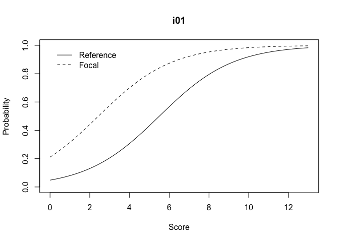<!-- -->

    ## The plot was not captured!

``` r
plot(dif_results, plot = "itemCurve", item = 2, itemFit = "null")
```

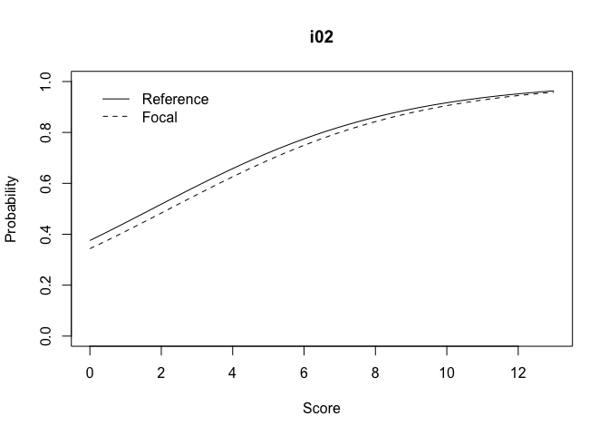<!-- -->

    ## The plot was not captured!

``` r
plot(dif_results, plot = "itemCurve", item = 3, itemFit = "null")
```

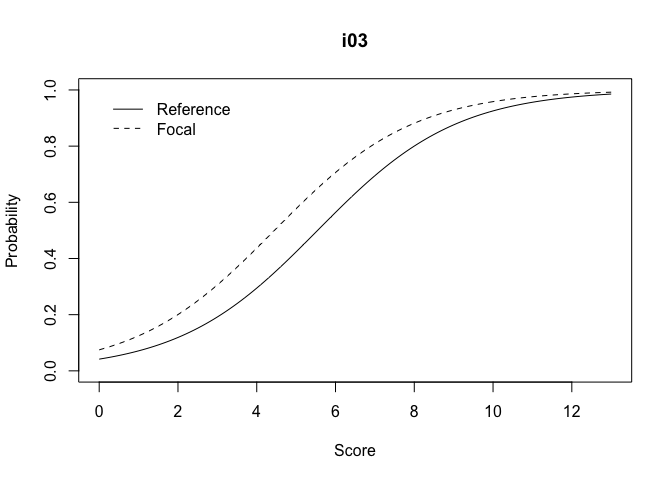<!-- -->

    ## The plot was not captured!

``` r
plot(dif_results, plot = "itemCurve", item = 4, itemFit = "null")
```

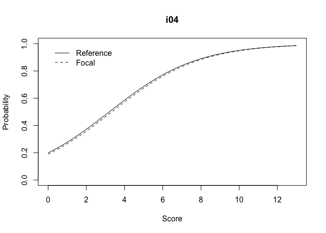<!-- -->

    ## The plot was not captured!

``` r
plot(dif_results, plot = "itemCurve", item = 5, itemFit = "null")
```

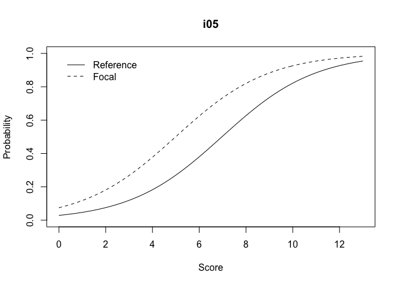<!-- -->

    ## The plot was not captured!

``` r
# geometry items
plot(dif_results, plot = "itemCurve", item = 6, itemFit = "null")
```

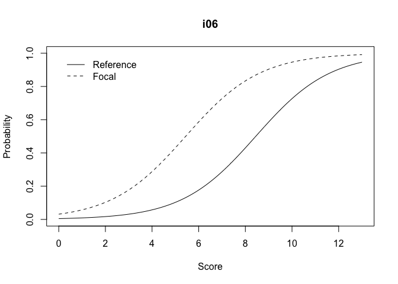<!-- -->

    ## The plot was not captured!

``` r
plot(dif_results, plot = "itemCurve", item = 7, itemFit = "null")
```

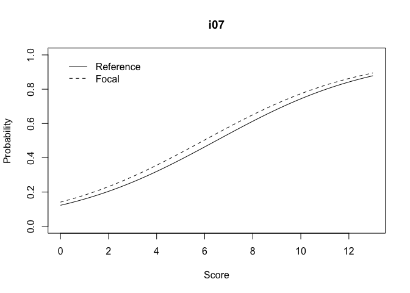<!-- -->

    ## The plot was not captured!

``` r
plot(dif_results, plot = "itemCurve", item = 8, itemFit = "null")
```

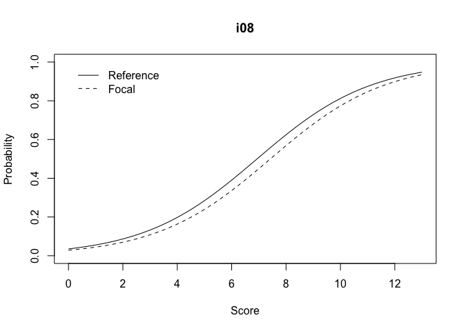<!-- -->

    ## The plot was not captured!

``` r
plot(dif_results, plot = "itemCurve", item = 9, itemFit = "null")
```

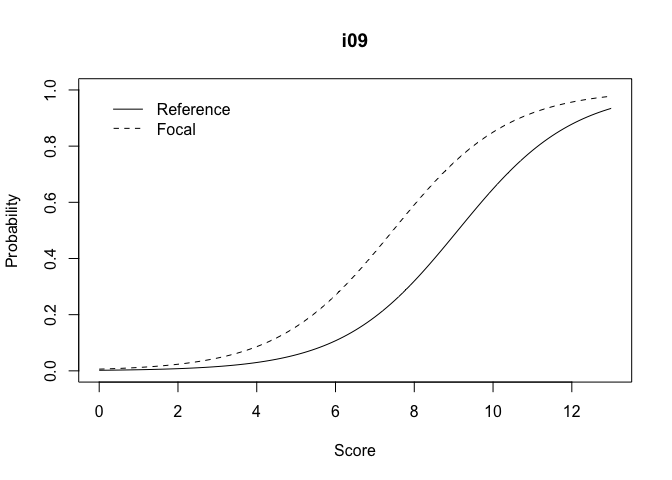<!-- -->

    ## The plot was not captured!

``` r
# algebra items
plot(dif_results, plot = "itemCurve", item = 10, itemFit = "null")
```

<!-- -->

    ## The plot was not captured!

``` r
plot(dif_results, plot = "itemCurve", item = 11, itemFit = "null")
```

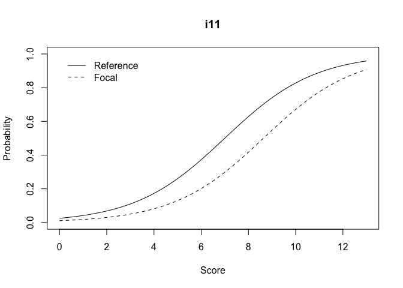<!-- -->

    ## The plot was not captured!

``` r
plot(dif_results, plot = "itemCurve", item = 12, itemFit = "null")
```

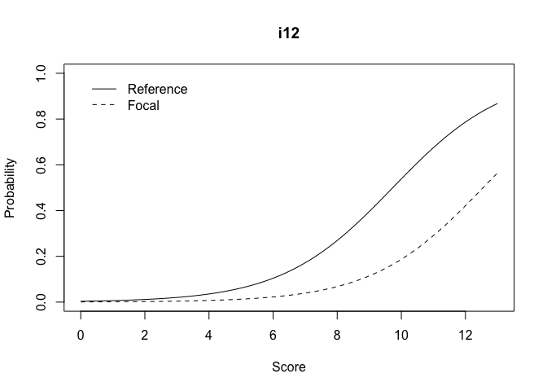<!-- -->

    ## The plot was not captured!

``` r
plot(dif_results, plot = "itemCurve", item = 13, itemFit = "null")
```

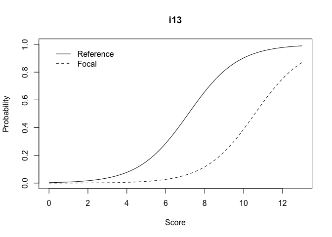<!-- -->

    ## The plot was not captured!

## Replicate statistics manually

``` r
#--------------------------------------------------------------------
# item bias
#--------------------------------------------------------------------

# ----------------------------------------------- 
# separate response matrix
# -----------------------------------------------

items_data <- dplyr::select(data_wide, i01:i13)

# ----------------------------------------------- 
# create total score
# -----------------------------------------------

data_dif <- data_wide %>%
            mutate(score = r4sda::mean_score(items_data)) %>%
            mutate(z_score = r4sda::z_score(score))

#-------------------------------------------------
# fit logistic method for uniform dif manually
#-------------------------------------------------

m0 <- glm(i13 ~ z_score, data = data_dif, family = "binomial")
m1 <- glm(i13 ~ z_score + u, data = data_dif, family = "binomial")

# ----------------------------------------------- 
# display results
# -----------------------------------------------

texreg::screenreg(list(m0, m1), 
    type = 'un',
    star.symbol = "*", 
    center = TRUE, 
    doctype = FALSE,
    dcolumn = TRUE, 
    booktabs = TRUE,
    single.row = TRUE)
```

    ## 
    ## ====================================================
    ##                 Model 1            Model 2          
    ## ----------------------------------------------------
    ## (Intercept)      -2.18 (0.54) ***   -3.06 (0.73) ***
    ## z_score           2.43 (0.58) ***    2.62 (0.68) ***
    ## u                                    2.68 (0.96) ** 
    ## ----------------------------------------------------
    ## AIC              56.16              48.29           
    ## BIC              60.92              55.43           
    ## Log Likelihood  -26.08             -21.14           
    ## Deviance         52.16              42.29           
    ## Num. obs.        80                 80              
    ## ====================================================
    ## *** p < 0.001; ** p < 0.01; * p < 0.05

``` r
# ----------------------------------------------- 
# replicate lrt stat
# -----------------------------------------------

# get LRT for null model
d0 <- broom::glance(m0) %>%
dplyr::select(deviance) %>%
dplyr::pull()

# get LRT for model 1
d1 <- broom::glance(m1) %>%
dplyr::select(deviance) %>%
dplyr::pull()

# replicate stat
d0-d1
```

    ## [1] 9.870616

``` r
# ----------------------------------------------- 
# replicate r2 effect size
# -----------------------------------------------

DescTools::PseudoR2(m1, "Nagel") - DescTools::PseudoR2(m0, "Nagel")
```

    ## Nagelkerke 
    ##  0.1071505

## Item bias with anchors

``` r
#--------------------------------------------------------------------
# item bias
#--------------------------------------------------------------------

# ----------------------------------------------- 
# display results
# -----------------------------------------------

difR::difLogistic(
  Data = data_wide, 
  group = 'u', 
  focal.name = 0, 
  alpha = .05, 
  type = 'udif', 
  criterion = 'LRT'
  )
```

    ## 
    ## Detection of uniform Differential Item Functioning
    ## using Logistic regression method, without item purification
    ## and with LRT DIF statistic
    ## 
    ## Matching variable: test score 
    ##  
    ## No set of anchor items was provided 
    ##  
    ## No p-value adjustment for multiple comparisons 
    ##  
    ## Logistic regression DIF statistic: 
    ##  
    ##     Stat.  P-value   
    ## i01 4.0945 0.0430  * 
    ## i02 0.0348 0.8520    
    ## i03 0.6406 0.4235    
    ## i04 0.0052 0.9426    
    ## i05 1.9280 0.1650    
    ## i06 5.9003 0.0151  * 
    ## i07 0.0680 0.7943    
    ## i08 0.1173 0.7320    
    ## i09 2.0562 0.1516    
    ## i10 3.4581 0.0629  . 
    ## i11 1.5006 0.2206    
    ## i12 4.2026 0.0404  * 
    ## i13 9.8706 0.0017  **
    ## 
    ## Signif. codes: 0 '***' 0.001 '**' 0.01 '*' 0.05 '.' 0.1 ' ' 1  
    ## 
    ## Detection threshold: 3.8415 (significance level: 0.05)
    ## 
    ## Items detected as uniform DIF items:
    ##     
    ##  i01
    ##  i06
    ##  i12
    ##  i13
    ## 
    ##  
    ## Effect size (Nagelkerke's R^2): 
    ##  
    ## Effect size code: 
    ##  'A': negligible effect 
    ##  'B': moderate effect 
    ##  'C': large effect 
    ##  
    ##     R^2    ZT JG
    ## i01 0.0586 A  B 
    ## i02 0.0006 A  A 
    ## i03 0.0073 A  A 
    ## i04 0.0001 A  A 
    ## i05 0.0223 A  A 
    ## i06 0.0611 A  B 
    ## i07 0.0009 A  A 
    ## i08 0.0013 A  A 
    ## i09 0.0203 A  A 
    ## i10 0.0317 A  A 
    ## i11 0.0165 A  A 
    ## i12 0.0683 A  B 
    ## i13 0.1072 A  C 
    ## 
    ## Effect size codes: 
    ##  Zumbo & Thomas (ZT): 0 'A' 0.13 'B' 0.26 'C' 1 
    ##  Jodoin & Gierl (JG): 0 'A' 0.035 'B' 0.07 'C' 1 
    ## 
    ##  Output was not captured!

``` r
# Note: focal group is Friday, the gruoup without
#       without the oportunity to learn.


# ----------------------------------------------- 
# create dif object
# -----------------------------------------------

dif_anchored <- difR::difLogistic(
  Data = data_wide, 
  anchor = 1:9,
  group = 'u', 
  focal.name = 0, 
  alpha = .05, 
  type = 'udif', 
  criterion = 'LRT'
  )

# ----------------------------------------------- 
# plot per item
# -----------------------------------------------

# algebra items
plot(dif_anchored, plot = "itemCurve", item = 10, itemFit = "null")
```

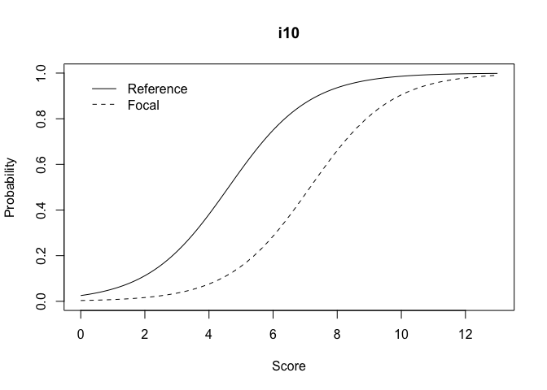<!-- -->

    ## The plot was not captured!

``` r
plot(dif_anchored, plot = "itemCurve", item = 11, itemFit = "null")
```

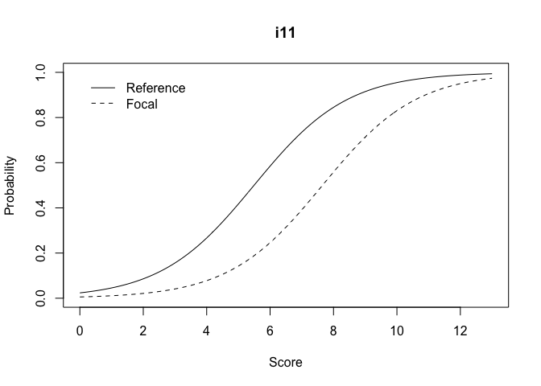<!-- -->

    ## The plot was not captured!

``` r
plot(dif_anchored, plot = "itemCurve", item = 12, itemFit = "null")
```

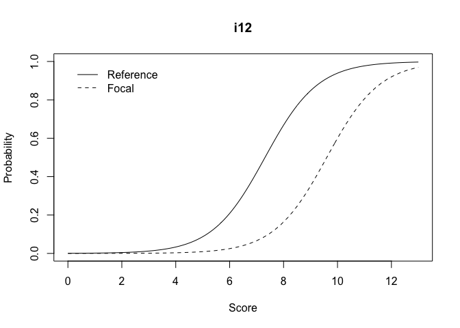<!-- -->

    ## The plot was not captured!

``` r
plot(dif_anchored, plot = "itemCurve", item = 13, itemFit = "null")
```

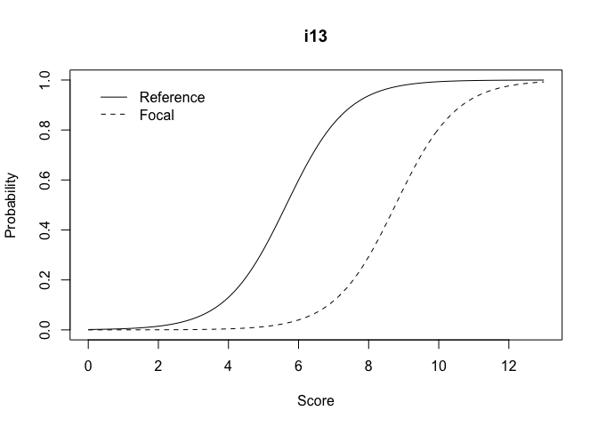<!-- -->

    ## The plot was not captured!

# Item bias as an special case of explanatory response model problem

## Fit Rasch model as a mixed model

$$ln[Pr(y_{ip} = 1)] = \theta_{.p} - \delta_{1-13}item$$

``` r
#--------------------------------------------------------------------
# fit rasch model
#--------------------------------------------------------------------

glm_00 <- lme4::glmer(resp ~ -1 + item + (1|id_i), data = data_stack, family = binomial('logit'), nAGQ = 15)

# ----------------------------------------------- 
# display results
# -----------------------------------------------

broom.mixed::tidy(glm_00) %>%
knitr::kable(., digits = 2)
```

| effect   | group | term              | estimate | std.error | statistic | p.value |
|:---------|:------|:------------------|---------:|----------:|----------:|--------:|
| fixed    | NA    | itemi01           |     1.69 |      0.35 |      4.82 |    0.00 |
| fixed    | NA    | itemi02           |     1.51 |      0.34 |      4.41 |    0.00 |
| fixed    | NA    | itemi03           |     0.94 |      0.32 |      2.92 |    0.00 |
| fixed    | NA    | itemi04           |     1.42 |      0.34 |      4.20 |    0.00 |
| fixed    | NA    | itemi05           |     0.57 |      0.31 |      1.82 |    0.07 |
| fixed    | NA    | itemi06           |     0.29 |      0.31 |      0.92 |    0.36 |
| fixed    | NA    | itemi07           |     0.22 |      0.31 |      0.70 |    0.48 |
| fixed    | NA    | itemi08           |    -0.27 |      0.31 |     -0.87 |    0.38 |
| fixed    | NA    | itemi09           |    -0.56 |      0.31 |     -1.77 |    0.08 |
| fixed    | NA    | itemi10           |    -0.34 |      0.31 |     -1.10 |    0.27 |
| fixed    | NA    | itemi11           |    -0.70 |      0.32 |     -2.22 |    0.03 |
| fixed    | NA    | itemi12           |    -2.33 |      0.40 |     -5.89 |    0.00 |
| fixed    | NA    | itemi13           |    -1.50 |      0.34 |     -4.38 |    0.00 |
| ran_pars | id_i  | sd\_\_(Intercept) |     1.43 |        NA |        NA |      NA |

# Item bias as mixed model

## Fit Rasch model as a mixed model

$$ln[Pr(y_{ip} = 1)] = \theta_{.p} - \delta_{1-13}item$$

``` r
#--------------------------------------------------------------------
# fit rasch model
#--------------------------------------------------------------------

glm_00 <- lme4::glmer(resp ~ -1 + item + (1|id_i), data = data_stack, family = binomial('logit'), nAGQ = 15)

# ----------------------------------------------- 
# display results
# -----------------------------------------------

broom.mixed::tidy(glm_00) %>%
knitr::kable(., digits = 2)
```

| effect   | group | term              | estimate | std.error | statistic | p.value |
|:---------|:------|:------------------|---------:|----------:|----------:|--------:|
| fixed    | NA    | itemi01           |     1.69 |      0.35 |      4.82 |    0.00 |
| fixed    | NA    | itemi02           |     1.51 |      0.34 |      4.41 |    0.00 |
| fixed    | NA    | itemi03           |     0.94 |      0.32 |      2.92 |    0.00 |
| fixed    | NA    | itemi04           |     1.42 |      0.34 |      4.20 |    0.00 |
| fixed    | NA    | itemi05           |     0.57 |      0.31 |      1.82 |    0.07 |
| fixed    | NA    | itemi06           |     0.29 |      0.31 |      0.92 |    0.36 |
| fixed    | NA    | itemi07           |     0.22 |      0.31 |      0.70 |    0.48 |
| fixed    | NA    | itemi08           |    -0.27 |      0.31 |     -0.87 |    0.38 |
| fixed    | NA    | itemi09           |    -0.56 |      0.31 |     -1.77 |    0.08 |
| fixed    | NA    | itemi10           |    -0.34 |      0.31 |     -1.10 |    0.27 |
| fixed    | NA    | itemi11           |    -0.70 |      0.32 |     -2.22 |    0.03 |
| fixed    | NA    | itemi12           |    -2.33 |      0.40 |     -5.89 |    0.00 |
| fixed    | NA    | itemi13           |    -1.50 |      0.34 |     -4.38 |    0.00 |
| ran_pars | id_i  | sd\_\_(Intercept) |     1.43 |        NA |        NA |      NA |

## Fit Rasch model as a latent regression

$$ln[Pr(y_{ip} = 1)] = \theta_{.p} - \delta_{1-13}item + \beta_{.p}u_{.p}$$

``` r
#--------------------------------------------------------------------
# latent regression main effect
#--------------------------------------------------------------------

glm_01 <- lme4::glmer(resp ~ -1 + item + u + (1|id_i), data = data_stack, family = binomial('logit'), nAGQ = 15)
```

    ## Warning in checkConv(attr(opt, "derivs"), opt$par, ctrl = control$checkConv, :
    ## Model failed to converge with max|grad| = 0.0047381 (tol = 0.002, component 1)

``` r
# ----------------------------------------------- 
# display results
# -----------------------------------------------

broom.mixed::tidy(glm_01) %>%
knitr::kable(., digits = 2)
```

| effect   | group | term              | estimate | std.error | statistic | p.value |
|:---------|:------|:------------------|---------:|----------:|----------:|--------:|
| fixed    | NA    | itemi01           |     1.47 |      0.36 |      4.12 |    0.00 |
| fixed    | NA    | itemi02           |     1.29 |      0.35 |      3.70 |    0.00 |
| fixed    | NA    | itemi03           |     0.72 |      0.33 |      2.19 |    0.03 |
| fixed    | NA    | itemi04           |     1.20 |      0.35 |      3.48 |    0.00 |
| fixed    | NA    | itemi05           |     0.35 |      0.32 |      1.10 |    0.27 |
| fixed    | NA    | itemi06           |     0.07 |      0.32 |      0.22 |    0.83 |
| fixed    | NA    | itemi07           |     0.00 |      0.32 |      0.00 |    1.00 |
| fixed    | NA    | itemi08           |    -0.49 |      0.32 |     -1.52 |    0.13 |
| fixed    | NA    | itemi09           |    -0.77 |      0.33 |     -2.38 |    0.02 |
| fixed    | NA    | itemi10           |    -0.56 |      0.32 |     -1.73 |    0.08 |
| fixed    | NA    | itemi11           |    -0.92 |      0.33 |     -2.80 |    0.01 |
| fixed    | NA    | itemi12           |    -2.55 |      0.41 |     -6.26 |    0.00 |
| fixed    | NA    | itemi13           |    -1.72 |      0.36 |     -4.84 |    0.00 |
| fixed    | NA    | u                 |     0.97 |      0.42 |      2.33 |    0.02 |
| ran_pars | id_i  | sd\_\_(Intercept) |     1.37 |        NA |        NA |      NA |

## Fit Rasch model as a latent regression including the DIF effects

$$ln[Pr(y_{ip} = 1)] = \theta_{.p} - \delta_{1-13}item + \beta_{.p}u_{.p} + \gamma_{ip}(item_{i.}u_{.p})$$

``` r
#--------------------------------------------------------------------
# model with bias
#--------------------------------------------------------------------

glm_02 <- lme4::glmer(resp ~ -1 + item + u + item:u + (1|id_i), data = data_stack, family = binomial('logit'), nAGQ = 15)
```

    ## Warning in checkConv(attr(opt, "derivs"), opt$par, ctrl = control$checkConv, :
    ## Model failed to converge with max|grad| = 0.0445554 (tol = 0.002, component 1)

``` r
# ----------------------------------------------- 
# display results
# -----------------------------------------------

broom.mixed::tidy(glm_02) %>%
knitr::kable(., digits = 2)
```

| effect   | group | term              | estimate | std.error | statistic | p.value |
|:---------|:------|:------------------|---------:|----------:|----------:|--------:|
| fixed    | NA    | itemi01           |     1.80 |      0.41 |      4.44 |    0.00 |
| fixed    | NA    | itemi02           |     1.34 |      0.38 |      3.52 |    0.00 |
| fixed    | NA    | itemi03           |     0.83 |      0.36 |      2.29 |    0.02 |
| fixed    | NA    | itemi04           |     1.24 |      0.38 |      3.29 |    0.00 |
| fixed    | NA    | itemi05           |     0.55 |      0.36 |      1.55 |    0.12 |
| fixed    | NA    | itemi06           |     0.37 |      0.36 |      1.03 |    0.30 |
| fixed    | NA    | itemi07           |     0.09 |      0.35 |      0.26 |    0.79 |
| fixed    | NA    | itemi08           |    -0.54 |      0.36 |     -1.51 |    0.13 |
| fixed    | NA    | itemi09           |    -0.64 |      0.36 |     -1.78 |    0.08 |
| fixed    | NA    | itemi10           |    -0.84 |      0.37 |     -2.29 |    0.02 |
| fixed    | NA    | itemi11           |    -1.14 |      0.38 |     -3.04 |    0.00 |
| fixed    | NA    | itemi12           |    -3.24 |      0.56 |     -5.78 |    0.00 |
| fixed    | NA    | itemi13           |    -2.43 |      0.46 |     -5.28 |    0.00 |
| fixed    | NA    | u                 |    -0.48 |      0.81 |     -0.60 |    0.55 |
| fixed    | NA    | itemi02:u         |     1.23 |      1.05 |      1.18 |    0.24 |
| fixed    | NA    | itemi03:u         |     0.91 |      0.98 |      0.94 |    0.35 |
| fixed    | NA    | itemi04:u         |     1.33 |      1.04 |      1.28 |    0.20 |
| fixed    | NA    | itemi05:u         |     0.53 |      0.95 |      0.55 |    0.58 |
| fixed    | NA    | itemi06:u         |     0.10 |      0.94 |      0.11 |    0.92 |
| fixed    | NA    | itemi07:u         |     0.99 |      0.95 |      1.04 |    0.30 |
| fixed    | NA    | itemi08:u         |     1.62 |      0.95 |      1.70 |    0.09 |
| fixed    | NA    | itemi09:u         |     0.81 |      0.95 |      0.85 |    0.40 |
| fixed    | NA    | itemi10:u         |     2.58 |      0.98 |      2.63 |    0.01 |
| fixed    | NA    | itemi11:u         |     2.23 |      0.96 |      2.31 |    0.02 |
| fixed    | NA    | itemi12:u         |     3.10 |      1.05 |      2.94 |    0.00 |
| fixed    | NA    | itemi13:u         |     3.51 |      1.00 |      3.50 |    0.00 |
| ran_pars | id_i  | sd\_\_(Intercept) |     1.44 |        NA |        NA |      NA |

## Compare fitted models

``` r
#--------------------------------------------------------------------
# model comparison
#--------------------------------------------------------------------

# ----------------------------------------------- 
# variables names
# -----------------------------------------------

texreg::screenreg(list(glm_00, glm_01, glm_02), 
  star.symbol = "\\*",
  single.row = TRUE, 
  center = TRUE, 
  doctype = FALSE,
  dcolumn = TRUE, 
  booktabs = TRUE)
```

    ## 
    ## ==========================================================================================
    ##                        Model 1                Model 2                Model 3              
    ## ------------------------------------------------------------------------------------------
    ## itemi01                   1.69 (0.35) \*\*\*     1.47 (0.36) \*\*\*     1.80 (0.41) \*\*\*
    ## itemi02                   1.51 (0.34) \*\*\*     1.29 (0.35) \*\*\*     1.34 (0.38) \*\*\*
    ## itemi03                   0.94 (0.32) \*\*       0.72 (0.33) \*         0.83 (0.36) \*    
    ## itemi04                   1.42 (0.34) \*\*\*     1.20 (0.35) \*\*\*     1.24 (0.38) \*\*  
    ## itemi05                   0.57 (0.31)            0.35 (0.32)            0.55 (0.36)       
    ## itemi06                   0.29 (0.31)            0.07 (0.32)            0.37 (0.36)       
    ## itemi07                   0.22 (0.31)           -0.00 (0.32)            0.09 (0.35)       
    ## itemi08                  -0.27 (0.31)           -0.49 (0.32)           -0.54 (0.36)       
    ## itemi09                  -0.56 (0.31)           -0.77 (0.33) \*        -0.64 (0.36)       
    ## itemi10                  -0.34 (0.31)           -0.56 (0.32)           -0.84 (0.37) \*    
    ## itemi11                  -0.70 (0.32) \*        -0.92 (0.33) \*\*      -1.14 (0.38) \*\*  
    ## itemi12                  -2.33 (0.40) \*\*\*    -2.55 (0.41) \*\*\*    -3.24 (0.56) \*\*\*
    ## itemi13                  -1.50 (0.34) \*\*\*    -1.72 (0.36) \*\*\*    -2.43 (0.46) \*\*\*
    ## u                                                0.97 (0.42) \*        -0.48 (0.81)       
    ## itemi02:u                                                               1.23 (1.05)       
    ## itemi03:u                                                               0.91 (0.98)       
    ## itemi04:u                                                               1.33 (1.04)       
    ## itemi05:u                                                               0.53 (0.95)       
    ## itemi06:u                                                               0.10 (0.94)       
    ## itemi07:u                                                               0.99 (0.95)       
    ## itemi08:u                                                               1.62 (0.95)       
    ## itemi09:u                                                               0.81 (0.95)       
    ## itemi10:u                                                               2.58 (0.98) \*\*  
    ## itemi11:u                                                               2.23 (0.96) \*    
    ## itemi12:u                                                               3.10 (1.05) \*\*  
    ## itemi13:u                                                               3.51 (1.00) \*\*\*
    ## ------------------------------------------------------------------------------------------
    ## AIC                    1156.68                1153.37                1146.94              
    ## BIC                    1225.94                1227.57                1280.50              
    ## Log Likelihood         -564.34                -561.68                -546.47              
    ## Num. obs.              1040                   1040                   1040                 
    ## Num. groups: id_i        80                     80                     80                 
    ## Var: id_i (Intercept)     2.05                   1.89                   2.07              
    ## ==========================================================================================
    ## \*\*\* p < 0.001; \*\* p < 0.01; \* p < 0.05

## Commented output

``` text

=================================================================================
                       Model 1             Model 2             Model 3           
---------------------------------------------------------------------------------
itemi01                   1.69 (0.35) ***     1.47 (0.36) ***     1.80 (0.41) *** # these are deltas
itemi02                   1.51 (0.34) ***     1.29 (0.35) ***     1.34 (0.38) ***
itemi03                   0.94 (0.32) **      0.72 (0.33) *       0.83 (0.36) *  
itemi04                   1.42 (0.34) ***     1.20 (0.35) ***     1.24 (0.38) ** 
itemi05                   0.57 (0.31)         0.35 (0.32)         0.55 (0.36)    
itemi06                   0.29 (0.31)         0.07 (0.32)         0.37 (0.36)    
itemi07                   0.22 (0.31)        -0.00 (0.32)         0.09 (0.35)    
itemi08                  -0.27 (0.31)        -0.49 (0.32)        -0.54 (0.36)    
itemi09                  -0.56 (0.31)        -0.77 (0.33) *      -0.64 (0.36)    
itemi10                  -0.34 (0.31)        -0.56 (0.32)        -0.84 (0.37) *  
itemi11                  -0.70 (0.32) *      -0.92 (0.33) **     -1.14 (0.38) ** 
itemi12                  -2.33 (0.40) ***    -2.55 (0.41) ***    -3.24 (0.56) ***
itemi13                  -1.50 (0.34) ***    -1.72 (0.36) ***    -2.43 (0.46) ***
u                                             0.97 (0.42) *      -0.48 (0.81)     # <- measure of impact
itemi02:u                                                         1.23 (1.05)     #    this is beta
itemi03:u                                                         0.91 (0.98)    
itemi04:u                                                         1.33 (1.04)    
itemi05:u                                                         0.53 (0.95)    
itemi06:u                                                         0.10 (0.94)    
itemi07:u                                                         0.99 (0.95)    
itemi08:u                                                         1.62 (0.95)    
itemi09:u                                                         0.81 (0.95)    
itemi10:u                                                         2.58 (0.98) **  # items with diff
itemi11:u                                                         2.23 (0.96) *   # these are gamma
itemi12:u                                                         3.10 (1.05) **  #
itemi13:u                                                         3.51 (1.00) *** #
---------------------------------------------------------------------------------
AIC                    1156.68             1153.37             1146.94           
BIC                    1225.94             1227.57             1280.50           
Log Likelihood         -564.34             -561.68             -546.47           
Num. obs.              1040                1040                1040              
Num. groups: id_i        80                  80                  80              
Var: id_i (Intercept)     2.05                1.89                2.07           
=================================================================================
*** p < 0.001, ** p < 0.01, * p < 0.05
```

> Note: when a mixed model is fitted, to retrieve a Rasch Model, the
> delta parameters are “reverse”. The easier items are “positive”, and
> the most difficult items are “negative” (i.e. preceded with a “-”
> sign).

## References

-   De Boeck, P., Bakker, M., Zwitser, R., Nivard, M., Hofman, A.,
    Tuerlinckx, F., & Partchev, I. (2011). The Estimation of Item
    Response Models with the lmer Function from the lme4 Package in R.
    Journal Of Statistical Software, 39(12), 1–28.
    <https://doi.org/10.18637/jss.v039.i12>

# Overall DIF detection

``` r
#--------------------------------------------------------------------
# diff detection
#--------------------------------------------------------------------

# ----------------------------------------------- 
# no anchor
# -----------------------------------------------

# Note: DIF is assess without specifying comparable items.

difR::dichoDif(
  Data=data_wide, 
  group="u", 
  focal.name=1, 
  method=c("MH","LRT"),
  model="1PL",
  nrIter=20)


# ----------------------------------------------- 
# with anchor
# -----------------------------------------------

# Note: DIF is assess using items i01-i09 as comparable items

difR::dichoDif(
  Data=data_wide, 
  group="u", 
  focal.name=1, 
  method=c("MH","LRT"),
  model="1PL",
  anchor = 1:9,
  nrIter=20)


# ----------------------------------------------- 
# with purify
# -----------------------------------------------

# Note: DIF is assess letting the library searching for "comparable" items.

difR::dichoDif(
  Data=data_wide, 
  group="u", 
  focal.name=1, 
  method=c("MH","LRT"),
  model="1PL",
  purify=TRUE,
  nrIter=20)

# ----------------------------------------------- 
# shortened version
# -----------------------------------------------

# Note: DIF is assess only among the comparable items.

selected_data <- dplyr::select(raw_data, i01:i09, u)

difR::dichoDif(
  Data=selected_data, 
  group="u", 
  focal.name=1, 
  method=c("MH","LRT"),
  model="1PL",
  purify=TRUE,
  nrIter=20)
```

## References

Magis, D., Béland, S., Tuerlinckx, F., & de Boeck, P. (2010). A general
framework and an R package for the detection of dichotomous differential
item functioning. Behavior Research Methods, 42(3), 847–862.
<https://doi.org/10.3758/BRM.42.3.847>
