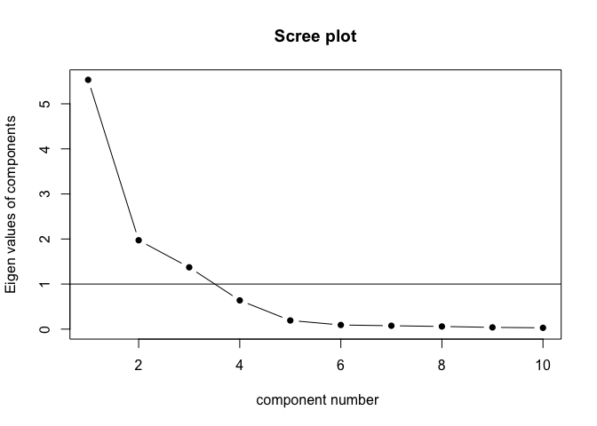
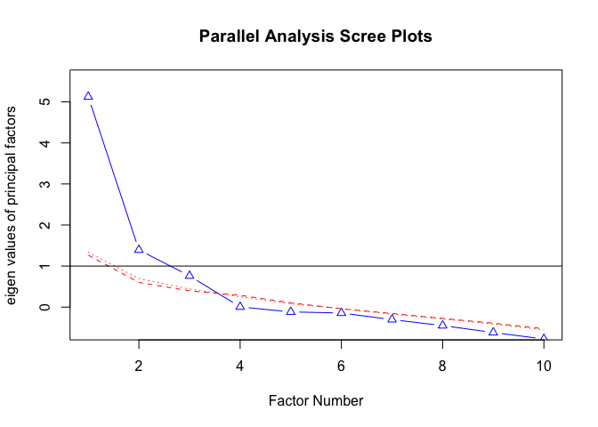
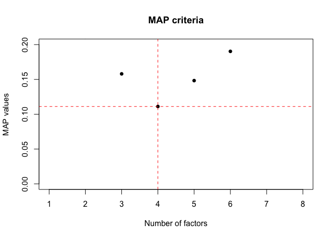

Thurstone’s Box Problem
================
dacarras

# Case Description

-   Empleamos la variante del Thurstone’s Box Problem de Kaiser & Horst
    (1975).
-   Los autores generan una base de datos de 10 indicadores, de cuarenta
    cajas diferentes, agregandoles error aleatorio a las medidas.
-   Sobre esta matriz de datos, se espera ajustar un modelo con tres
    factores.

# Cargar datos

## Abrir datos

``` r
#--------------------------------------------------------------------
# load data from url
#--------------------------------------------------------------------

box_data<-read.csv("https://www.evernote.com/shard/s42/sh/d0f20791-c8e5-4627-972e-5c76625f0ffb/695007b60806fd4ecfa7dbb73c67f8d1/res/4ac06b03-0a8e-4c3d-8d57-29f6e71a6598/box_prob.csv")

# ----------------------------------------------- 
# check data format
# -----------------------------------------------

library(dplyr)
```

    ## 
    ## Attaching package: 'dplyr'

    ## The following objects are masked from 'package:stats':
    ## 
    ##     filter, lag

    ## The following objects are masked from 'package:base':
    ## 
    ##     intersect, setdiff, setequal, union

``` r
r4sda::variables_table(box_data) %>%
knitr::kable()
```

    ## Loading required package: purrr

    ## Loading required package: stringr

| variable | type | values                        | labels                    |
|:---------|:-----|:------------------------------|:--------------------------|
| box      | int  | 13, 14, 15, 16, 17, 18, 19,…  | === no variable label === |
| i1       | dbl  | 8, 18.2318, 16.6585, 16.8795… | === no variable label === |
| i2       | dbl  | 1, 1.5926, 4.7423, 11.0320, … | === no variable label === |
| i3       | dbl  | , 0.0842, 2.9603, 0.2534, 4.… | === no variable label === |
| i4       | dbl  | 8, 0.5529, 6.9657, 11.7508, … | === no variable label === |
| i5       | dbl  | , 3.6512, 7.7142, 4.5251, 7.… | === no variable label === |
| i6       | dbl  | , 1.9995, 3.6429, 2.9000, 4.… | === no variable label === |
| i7       | dbl  | , 4.5791, 4.2420, 5.1726, 4.… | === no variable label === |
| i8       | dbl  | , 3.9062, 4.5081, 4.1261, 4.… | === no variable label === |
| i9       | dbl  | , 2.1230, 2.7371, 3.0306, 3.… | === no variable label === |
| i10      | dbl  | 551, 12.4624, 11.8370, 14.20… | === no variable label === |

``` r
# ----------------------------------------------- 
# check data format
# -----------------------------------------------

dplyr::count(box_data, i1)
```

    ##          i1 n
    ## 1    6.8644 1
    ## 2    8.1373 1
    ## 3    8.1753 1
    ## 4    8.2808 1
    ## 5    8.8348 1
    ## 6    8.9451 1
    ## 7    9.0675 1
    ## 8    9.4011 1
    ## 9    9.7058 1
    ## 10  12.1873 1
    ## 11  12.2439 1
    ## 12  13.6259 1
    ## 13  15.0945 1
    ## 14  15.7092 1
    ## 15  15.7529 1
    ## 16  15.7908 1
    ## 17  15.8756 1
    ## 18  16.4200 1
    ## 19  16.4916 1
    ## 20  16.6585 1
    ## 21  16.8795 1
    ## 22  17.0639 1
    ## 23  17.4209 1
    ## 24  18.2318 1
    ## 25  18.5256 1
    ## 26  21.4984 1
    ## 27  22.8731 1
    ## 28  23.1491 1
    ## 29  23.5001 1
    ## 30  24.6375 1
    ## 31  24.7799 1
    ## 32  24.9122 1
    ## 33  25.1631 1
    ## 34  25.1676 1
    ## 35  25.2887 1
    ## 36  25.3243 1
    ## 37  25.6121 1
    ## 38  26.3386 1
    ## 39  26.5447 1
    ## 40 116.6115 1

``` r
# ----------------------------------------------- 
# isolate data from indicators
# -----------------------------------------------

box_items <- dplyr::select(box_data, i1:i10)


# ----------------------------------------------- 
# display data
# -----------------------------------------------

knitr::kable(box_items, digits = 2)
```

|     i1 |    i2 |    i3 |    i4 |    i5 |    i6 |   i7 |   i8 |   i9 |   i10 |
|-------:|------:|------:|------:|------:|------:|-----:|-----:|-----:|------:|
|   8.95 |  4.98 |  2.71 |  5.60 |  3.39 |  2.14 | 4.00 | 3.29 | 2.53 |  9.76 |
|   9.40 |  4.48 |  3.75 |  5.43 |  8.10 |  3.42 | 3.46 | 3.89 | 2.87 |  9.24 |
|   6.86 | 10.19 |  0.75 | 10.29 |  4.19 |  3.23 | 4.30 | 2.85 | 3.08 | 11.87 |
|  12.24 |  9.58 |  4.07 |  7.78 |  6.09 |  6.65 | 4.27 | 3.46 | 3.90 | 11.67 |
|   8.83 |  9.12 |  9.18 |  9.00 |  9.57 |  8.24 | 4.20 | 4.65 | 4.25 | 12.06 |
|  18.23 |  1.59 |  0.08 |  0.55 |  3.65 |  2.00 | 4.58 | 3.91 | 2.12 | 12.46 |
|  16.66 |  4.74 |  2.96 |  6.97 |  7.71 |  3.64 | 4.24 | 4.51 | 2.74 | 11.84 |
|  16.88 | 11.03 |  0.25 | 11.75 |  4.53 |  2.90 | 5.17 | 4.13 | 3.03 | 14.21 |
|  18.53 |  8.72 |  4.03 | 13.72 |  7.67 |  4.82 | 4.91 | 4.30 | 3.63 | 14.67 |
|  15.79 |  8.94 | 10.42 | 11.77 | 11.60 |  9.43 | 4.84 | 4.76 | 4.48 | 13.43 |
|  13.63 | 15.80 |  0.17 | 14.89 |  4.68 |  3.90 | 5.88 | 4.13 | 4.56 | 15.75 |
|  15.09 | 14.40 |  4.12 | 13.43 |  7.70 |  8.46 | 5.89 | 4.81 | 4.49 | 16.56 |
|  16.42 | 14.01 |  9.35 | 14.26 | 11.71 | 11.71 | 5.81 | 4.99 | 5.23 | 16.61 |
|  26.54 |  3.60 |  1.55 | 10.00 |  4.27 |  1.71 | 5.89 | 5.33 | 1.91 | 13.79 |
|  25.32 |  4.12 |  3.66 |  9.86 | 10.14 |  2.63 | 5.23 | 5.12 | 2.59 | 13.07 |
|  22.87 | 10.71 |  3.82 | 14.34 | 12.16 |  5.62 | 5.77 | 5.61 | 3.61 | 16.35 |
|  25.16 |  7.47 |  9.24 | 15.03 | 13.78 | 10.41 | 5.46 | 5.89 | 3.89 | 15.24 |
|  25.61 | 15.79 |  0.39 | 19.43 |  4.75 |  4.33 | 6.31 | 5.12 | 4.21 | 18.44 |
|  24.91 | 15.98 |  3.29 | 22.56 |  8.66 |  7.29 | 6.50 | 5.68 | 4.15 | 17.83 |
|  25.29 | 16.49 |  8.49 | 19.58 | 15.14 | 13.16 | 6.45 | 5.82 | 5.18 | 18.65 |
|   9.71 |  2.89 |  1.75 |  5.18 |  2.65 |  2.81 | 3.38 | 3.04 | 2.52 |  9.83 |
|   9.07 |  3.86 |  4.49 |  5.69 |  6.50 |  3.32 | 3.46 | 3.62 | 2.97 | 10.31 |
|   8.14 |  7.96 |  1.01 | 10.98 |  2.82 |  1.63 | 4.53 | 3.16 | 3.23 | 12.00 |
|   8.28 |  7.48 |  3.91 |  8.31 |  6.17 |  6.29 | 4.35 | 3.69 | 3.53 | 13.59 |
|   8.18 | 10.78 |  9.44 |  9.11 |  9.59 |  9.65 | 4.16 | 4.38 | 4.35 | 12.50 |
|  15.88 |  2.95 |  0.75 |  8.79 |  4.13 |  1.61 | 4.54 | 3.95 | 2.32 | 11.74 |
| 116.61 |  5.65 |  4.25 |  8.60 |  9.44 |  4.51 | 4.66 | 4.42 | 2.89 | 12.74 |
|  15.71 |  8.97 |  0.60 | 11.72 |  4.68 |  2.80 | 5.13 | 4.05 | 3.09 | 13.71 |
|  12.19 |  8.51 |  3.49 | 11.21 |  7.45 |  6.26 | 5.21 | 4.31 | 4.02 | 14.37 |
|  17.06 |  8.01 | 10.14 | 11.38 | 12.99 |  9.28 | 4.81 | 4.85 | 4.10 | 14.44 |
|  17.42 | 16.30 |  1.82 | 17.26 |  3.93 |  5.36 | 5.17 | 3.91 | 3.90 | 15.46 |
|  15.75 | 14.77 |  4.87 | 15.76 |  8.02 |  8.81 | 5.69 | 4.33 | 4.77 | 16.60 |
|  16.49 | 14.23 |  8.64 | 14.62 | 10.10 | 11.44 | 5.80 | 4.88 | 4.89 | 15.95 |
|  24.64 |  4.56 |  1.33 | 11.34 |  5.24 |  0.41 | 5.21 | 4.99 | 2.11 | 15.07 |
|  26.34 |  3.79 |  5.79 |  8.73 | 11.04 |  3.67 | 5.53 | 5.23 | 2.66 | 14.42 |
|  21.50 |  8.53 |  4.07 | 14.85 | 10.08 |  6.49 | 5.99 | 5.24 | 3.63 | 15.66 |
|  23.15 |  8.66 |  8.31 | 14.41 | 14.38 |  8.17 | 5.79 | 6.13 | 4.36 | 14.87 |
|  23.50 | 17.56 |  2.08 | 18.50 |  4.80 |  3.53 | 6.60 | 5.32 | 3.95 | 17.50 |
|  25.17 | 15.95 |  4.33 | 19.89 |  9.05 |  7.91 | 6.43 | 5.21 | 4.60 | 18.48 |
|  24.78 | 15.69 |  8.32 | 19.90 | 13.88 | 12.39 | 6.25 | 5.71 | 4.78 | 11.70 |

# Dimensionalidad

## Scree test

``` r
#--------------------------------------------------------------------
# dimensionality
#--------------------------------------------------------------------

# ----------------------------------------------- 
# scree test
# -----------------------------------------------

psych::scree(box_items, factors = FALSE, pc = TRUE, hline = 1)
```

<!-- -->

``` r
# Nota: scree test generado sobre los eigenvalues de un 
#       análisis de componentes principales.
```

## Parallel

``` r
#--------------------------------------------------------------------
# dimensionality
#--------------------------------------------------------------------

# ----------------------------------------------- 
# parallel
# -----------------------------------------------

psych::fa.parallel(box_items, fa = "fa", show.legend = FALSE, fm = "ml")
```

<!-- -->

    ## Parallel analysis suggests that the number of factors =  3  and the number of components =  NA

## MAP

``` r
#--------------------------------------------------------------------
# dimensionality
#--------------------------------------------------------------------

# ----------------------------------------------- 
# traditional output
# -----------------------------------------------

psych::VSS(x=box_items,fm="mle", plot = FALSE)
```

    ## 
    ## Very Simple Structure
    ## Call: vss(x = x, n = n, rotate = rotate, diagonal = diagonal, fm = fm, 
    ##     n.obs = n.obs, plot = plot, title = title, use = use, cor = cor)
    ## VSS complexity 1 achieves a maximimum of 0.78  with  1  factors
    ## VSS complexity 2 achieves a maximimum of 0.96  with  7  factors
    ## 
    ## The Velicer MAP achieves a minimum of 0.11  with  4  factors 
    ## BIC achieves a minimum of  -50.93  with  3  factors
    ## Sample Size adjusted BIC achieves a minimum of  -0.23  with  5  factors
    ## 
    ## Statistics by number of factors 
    ##   vss1 vss2  map dof   chisq    prob sqresid  fit RMSEA BIC  SABIC complex
    ## 1 0.78 0.00 0.25  35 2.8e+02 7.3e-41    8.18 0.78  0.42 155 264.94     1.0
    ## 2 0.68 0.93 0.21  26 1.5e+02 4.2e-20    2.44 0.93  0.35  58 139.25     1.3
    ## 3 0.64 0.93 0.16  18 1.5e+01 6.3e-01    0.82 0.98  0.00 -51   5.40     1.5
    ## 4 0.64 0.93 0.11  11 6.5e+00 8.4e-01    0.80 0.98  0.00 -34   0.35     1.5
    ## 5 0.64 0.92 0.15   5 2.6e+00 7.7e-01    0.69 0.98  0.00 -16  -0.23     1.6
    ## 6 0.64 0.85 0.19   0 2.9e-01      NA    0.65 0.98    NA  NA     NA     1.7
    ## 7 0.57 0.96 0.27  -4 9.6e-09      NA    0.13 1.00    NA  NA     NA     1.6
    ## 8 0.64 0.84 0.45  -7 6.5e-08      NA    0.58 0.98    NA  NA     NA     1.7
    ##    eChisq    SRMR eCRMS eBIC
    ## 1 1.9e+02 2.3e-01 0.259   58
    ## 2 3.9e+01 1.0e-01 0.138  -57
    ## 3 6.3e-01 1.3e-02 0.021  -66
    ## 4 4.4e-01 1.1e-02 0.022  -40
    ## 5 2.1e-01 7.6e-03 0.023  -18
    ## 6 7.8e-02 4.7e-03    NA   NA
    ## 7 2.0e-10 2.3e-07    NA   NA
    ## 8 1.2e-08 1.8e-06    NA   NA

``` r
# ----------------------------------------------- 
# output as plot
# -----------------------------------------------

map_out <- psych::VSS(box_items, rotate ="varimax", plot = FALSE)
```

    ## Warning in fa.stats(r = r, f = f, phi = phi, n.obs = n.obs, np.obs = np.obs, :
    ## The estimated weights for the factor scores are probably incorrect. Try a
    ## different factor score estimation method.

    ## Warning in fac(r = r, nfactors = nfactors, n.obs = n.obs, rotate = rotate, : An
    ## ultra-Heywood case was detected. Examine the results carefully

``` r
# extract MAP values and create vector of factors
map_vector  <- data.frame(map=map_out$map)
map_factors <- data.frame(factors=c(1:nrow(map_vector)))

# create data for plot
map_data <- dplyr::bind_cols(map_factors, map_vector)

# get values
map_value    <- min(map_vector, na.rm = TRUE)
map_retained <- dplyr::filter(map_data, map == min(map_vector, na.rm=TRUE)) %>% 
                dplyr::select(factors) %>% 
                as.numeric()

# plot MAP results
plot(map_data, 
  main = 'MAP criteria', 
  ylab = 'MAP values', 
  xlab = 'Number of factors', 
  ylim = c(0,.20), 
  type = 'p', 
  col = 'black', 
  pch=16)
abline(
  h = map_value, 
  v = map_retained, 
  col = "red", 
  lty=2, 
  lwd=1)
```

<!-- -->

## EFA

``` r
#--------------------------------------------------------------------
# dimensionality
#--------------------------------------------------------------------

# ----------------------------------------------- 
# exploratory factor analysis
# -----------------------------------------------

library(psych)
library(GPArotation)
efa_fit <- fa(box_items, fm="mle", nfactors=3, rotate="varimax")

# ----------------------------------------------- 
# exploratory factor analysis
# -----------------------------------------------

efa_fit
```

    ## Factor Analysis using method =  ml
    ## Call: fa(r = box_items, nfactors = 3, rotate = "varimax", fm = "mle")
    ## Standardized loadings (pattern matrix) based upon correlation matrix
    ##       ML1  ML2   ML3   h2    u2 com
    ## i1   0.01 0.00  0.38 0.14 0.856 1.0
    ## i2   0.94 0.21 -0.18 0.95 0.045 1.2
    ## i3  -0.01 0.97  0.09 0.95 0.050 1.0
    ## i4   0.90 0.18  0.23 0.88 0.116 1.2
    ## i5   0.12 0.85  0.42 0.91 0.094 1.5
    ## i6   0.41 0.88 -0.04 0.94 0.061 1.4
    ## i7   0.82 0.07  0.51 0.93 0.067 1.7
    ## i8   0.42 0.42  0.78 0.97 0.032 2.1
    ## i9   0.70 0.65 -0.21 0.97 0.035 2.2
    ## i10  0.83 0.09  0.34 0.80 0.197 1.4
    ## 
    ##                        ML1  ML2  ML3
    ## SS loadings           3.89 3.12 1.44
    ## Proportion Var        0.39 0.31 0.14
    ## Cumulative Var        0.39 0.70 0.84
    ## Proportion Explained  0.46 0.37 0.17
    ## Cumulative Proportion 0.46 0.83 1.00
    ## 
    ## Mean item complexity =  1.5
    ## Test of the hypothesis that 3 factors are sufficient.
    ## 
    ## The degrees of freedom for the null model are  45  and the objective function was  13.99 with Chi Square of  487.19
    ## The degrees of freedom for the model are 18  and the objective function was  0.47 
    ## 
    ## The root mean square of the residuals (RMSR) is  0.01 
    ## The df corrected root mean square of the residuals is  0.02 
    ## 
    ## The harmonic number of observations is  40 with the empirical chi square  0.63  with prob <  1 
    ## The total number of observations was  40  with Likelihood Chi Square =  15.47  with prob <  0.63 
    ## 
    ## Tucker Lewis Index of factoring reliability =  1.015
    ## RMSEA index =  0  and the 90 % confidence intervals are  0 0.122
    ## BIC =  -50.93
    ## Fit based upon off diagonal values = 1
    ## Measures of factor score adequacy             
    ##                                                    ML1  ML2  ML3
    ## Correlation of (regression) scores with factors   0.99 0.99 0.98
    ## Multiple R square of scores with factors          0.98 0.98 0.96
    ## Minimum correlation of possible factor scores     0.96 0.95 0.92

## References

Kaiser, H. F., & Horst, P. (1975). A Score Matrix for Thurstone’s Box
Problem. Multivariate Behavioral Research, 10(1), 17–26. <http://>
doi.org/10.1207/s15327906mbr1001\_2
