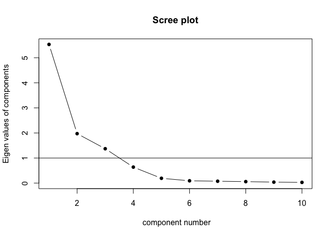

Thurstone’s Box Problem
================
dacarras

# Case Description

-   Empleamos la variante del Thurstone’s Box Problem de Kaiser & Horst
    (1975).
-   Los autores generan una base de datos de 10 indicadores, de cuarenta
    cajas diferentes, agregandoles error aleatorio a las medidas.
-   Sobre esta matriz de datos, se espera ajustar un modelo con tres
    factores.

# Cargar datos

## Abrir datos

``` r
#--------------------------------------------------------------------
# load data from url
#--------------------------------------------------------------------

box_data<-read.csv("https://www.evernote.com/shard/s42/sh/d0f20791-c8e5-4627-972e-5c76625f0ffb/695007b60806fd4ecfa7dbb73c67f8d1/res/4ac06b03-0a8e-4c3d-8d57-29f6e71a6598/box_prob.csv")

# ----------------------------------------------- 
# check data format
# -----------------------------------------------

library(dplyr)
```

    ## 
    ## Attaching package: 'dplyr'

    ## The following objects are masked from 'package:stats':
    ## 
    ##     filter, lag

    ## The following objects are masked from 'package:base':
    ## 
    ##     intersect, setdiff, setequal, union

``` r
r4sda::variables_table(box_data) %>%
knitr::kable()
```

    ## Loading required package: purrr

    ## Loading required package: stringr

| variable | type | values                        | labels                    |
|:---------|:-----|:------------------------------|:--------------------------|
| box      | int  | 13, 14, 15, 16, 17, 18, 19,…  | === no variable label === |
| i1       | dbl  | 8, 18.2318, 16.6585, 16.8795… | === no variable label === |
| i2       | dbl  | 1, 1.5926, 4.7423, 11.0320, … | === no variable label === |
| i3       | dbl  | , 0.0842, 2.9603, 0.2534, 4.… | === no variable label === |
| i4       | dbl  | 8, 0.5529, 6.9657, 11.7508, … | === no variable label === |
| i5       | dbl  | , 3.6512, 7.7142, 4.5251, 7.… | === no variable label === |
| i6       | dbl  | , 1.9995, 3.6429, 2.9000, 4.… | === no variable label === |
| i7       | dbl  | , 4.5791, 4.2420, 5.1726, 4.… | === no variable label === |
| i8       | dbl  | , 3.9062, 4.5081, 4.1261, 4.… | === no variable label === |
| i9       | dbl  | , 2.1230, 2.7371, 3.0306, 3.… | === no variable label === |
| i10      | dbl  | 551, 12.4624, 11.8370, 14.20… | === no variable label === |

``` r
# ----------------------------------------------- 
# isolate data from indicators
# -----------------------------------------------

box_items <- dplyr::select(box_data, i1:i10)


# ----------------------------------------------- 
# display first ten cases
# -----------------------------------------------

knitr::kable(box_items[1:10,], digits = 2)
```

|    i1 |    i2 |    i3 |    i4 |    i5 |   i6 |   i7 |   i8 |   i9 |   i10 |
|------:|------:|------:|------:|------:|-----:|-----:|-----:|-----:|------:|
|  8.95 |  4.98 |  2.71 |  5.60 |  3.39 | 2.14 | 4.00 | 3.29 | 2.53 |  9.76 |
|  9.40 |  4.48 |  3.75 |  5.43 |  8.10 | 3.42 | 3.46 | 3.89 | 2.87 |  9.24 |
|  6.86 | 10.19 |  0.75 | 10.29 |  4.19 | 3.23 | 4.30 | 2.85 | 3.08 | 11.87 |
| 12.24 |  9.58 |  4.07 |  7.78 |  6.09 | 6.65 | 4.27 | 3.46 | 3.90 | 11.67 |
|  8.83 |  9.12 |  9.18 |  9.00 |  9.57 | 8.24 | 4.20 | 4.65 | 4.25 | 12.06 |
| 18.23 |  1.59 |  0.08 |  0.55 |  3.65 | 2.00 | 4.58 | 3.91 | 2.12 | 12.46 |
| 16.66 |  4.74 |  2.96 |  6.97 |  7.71 | 3.64 | 4.24 | 4.51 | 2.74 | 11.84 |
| 16.88 | 11.03 |  0.25 | 11.75 |  4.53 | 2.90 | 5.17 | 4.13 | 3.03 | 14.21 |
| 18.53 |  8.72 |  4.03 | 13.72 |  7.67 | 4.82 | 4.91 | 4.30 | 3.63 | 14.67 |
| 15.79 |  8.94 | 10.42 | 11.77 | 11.60 | 9.43 | 4.84 | 4.76 | 4.48 | 13.43 |

# Dimensionalidad

## Scree test

``` r
#--------------------------------------------------------------------
# dimensionality
#--------------------------------------------------------------------

# ----------------------------------------------- 
# load data
# -----------------------------------------------

box_data<-read.csv("https://www.evernote.com/shard/s42/sh/d0f20791-c8e5-4627-972e-5c76625f0ffb/695007b60806fd4ecfa7dbb73c67f8d1/res/4ac06b03-0a8e-4c3d-8d57-29f6e71a6598/box_prob.csv")

# ----------------------------------------------- 
# isolate data from indicators
# -----------------------------------------------

box_items <- dplyr::select(box_data, i1:i10)

# ----------------------------------------------- 
# scree test
# -----------------------------------------------

psych::scree(box_items, factors = FALSE, pc = TRUE, hline = 1)
```

<!-- -->

``` r
# Nota: scree test generado sobre los eigenvalues de un 
#       análisis de componentes principales.
```

## Parallel

``` r
#--------------------------------------------------------------------
# dimensionality
#--------------------------------------------------------------------

# ----------------------------------------------- 
# load data
# -----------------------------------------------

box_data<-read.csv("https://www.evernote.com/shard/s42/sh/d0f20791-c8e5-4627-972e-5c76625f0ffb/695007b60806fd4ecfa7dbb73c67f8d1/res/4ac06b03-0a8e-4c3d-8d57-29f6e71a6598/box_prob.csv")

# ----------------------------------------------- 
# isolate data from indicators
# -----------------------------------------------

box_items <- dplyr::select(box_data, i1:i10)

# ----------------------------------------------- 
# parallel
# -----------------------------------------------

psych::fa.parallel(box_items, fa = "fa", show.legend = FALSE, fm = "ml")
```

<!-- -->

    ## Parallel analysis suggests that the number of factors =  3  and the number of components =  NA

## MAP

``` r
#--------------------------------------------------------------------
# dimensionality
#--------------------------------------------------------------------

# ----------------------------------------------- 
# load data
# -----------------------------------------------

box_data<-read.csv("https://www.evernote.com/shard/s42/sh/d0f20791-c8e5-4627-972e-5c76625f0ffb/695007b60806fd4ecfa7dbb73c67f8d1/res/4ac06b03-0a8e-4c3d-8d57-29f6e71a6598/box_prob.csv")

# ----------------------------------------------- 
# isolate data from indicators
# -----------------------------------------------

box_items <- dplyr::select(box_data, i1:i10)

# ----------------------------------------------- 
# traditional output
# -----------------------------------------------

psych::VSS(x=box_items,fm="mle", plot = FALSE)
```

    ## 
    ## Very Simple Structure
    ## Call: vss(x = x, n = n, rotate = rotate, diagonal = diagonal, fm = fm, 
    ##     n.obs = n.obs, plot = plot, title = title, use = use, cor = cor)
    ## VSS complexity 1 achieves a maximimum of 0.78  with  1  factors
    ## VSS complexity 2 achieves a maximimum of 0.96  with  7  factors
    ## 
    ## The Velicer MAP achieves a minimum of 0.11  with  4  factors 
    ## BIC achieves a minimum of  -50.93  with  3  factors
    ## Sample Size adjusted BIC achieves a minimum of  -0.23  with  5  factors
    ## 
    ## Statistics by number of factors 
    ##   vss1 vss2  map dof   chisq    prob sqresid  fit RMSEA BIC  SABIC complex
    ## 1 0.78 0.00 0.25  35 2.8e+02 7.3e-41    8.18 0.78  0.42 155 264.94     1.0
    ## 2 0.68 0.93 0.21  26 1.5e+02 4.2e-20    2.44 0.93  0.35  58 139.25     1.3
    ## 3 0.64 0.93 0.16  18 1.5e+01 6.3e-01    0.82 0.98  0.00 -51   5.40     1.5
    ## 4 0.64 0.93 0.11  11 6.5e+00 8.4e-01    0.80 0.98  0.00 -34   0.35     1.5
    ## 5 0.64 0.92 0.15   5 2.6e+00 7.7e-01    0.69 0.98  0.00 -16  -0.23     1.6
    ## 6 0.64 0.85 0.19   0 2.9e-01      NA    0.65 0.98    NA  NA     NA     1.7
    ## 7 0.57 0.96 0.27  -4 9.6e-09      NA    0.13 1.00    NA  NA     NA     1.6
    ## 8 0.64 0.84 0.45  -7 6.5e-08      NA    0.58 0.98    NA  NA     NA     1.7
    ##    eChisq    SRMR eCRMS eBIC
    ## 1 1.9e+02 2.3e-01 0.259   58
    ## 2 3.9e+01 1.0e-01 0.138  -57
    ## 3 6.3e-01 1.3e-02 0.021  -66
    ## 4 4.4e-01 1.1e-02 0.022  -40
    ## 5 2.1e-01 7.6e-03 0.023  -18
    ## 6 7.8e-02 4.7e-03    NA   NA
    ## 7 2.0e-10 2.3e-07    NA   NA
    ## 8 1.2e-08 1.8e-06    NA   NA

``` r
# ----------------------------------------------- 
# output as plot
# -----------------------------------------------

map_out <- psych::VSS(box_items, rotate ="varimax", plot = FALSE)
```

    ## Warning in fa.stats(r = r, f = f, phi = phi, n.obs = n.obs, np.obs = np.obs, :
    ## The estimated weights for the factor scores are probably incorrect. Try a
    ## different factor score estimation method.

    ## Warning in fac(r = r, nfactors = nfactors, n.obs = n.obs, rotate = rotate, : An
    ## ultra-Heywood case was detected. Examine the results carefully

``` r
# extract MAP values and create vector of factors
map_vector  <- data.frame(map=map_out$map)
map_factors <- data.frame(factors=c(1:nrow(map_vector)))

# create data for plot
map_data <- dplyr::bind_cols(map_factors, map_vector)

# get values
map_value    <- min(map_vector, na.rm = TRUE)
map_retained <- dplyr::filter(map_data, map == min(map_vector, na.rm=TRUE)) %>% 
                dplyr::select(factors) %>% 
                as.numeric()

# plot MAP results
plot(map_data, 
  main = 'MAP criteria', 
  ylab = 'MAP values', 
  xlab = 'Number of factors', 
  ylim = c(0,.20), 
  type = 'p', 
  col = 'black', 
  pch=16)
abline(
  h = map_value, 
  v = map_retained, 
  col = "red", 
  lty=2, 
  lwd=1)
```

<!-- -->

## EFA

``` r
#--------------------------------------------------------------------
# dimensionality
#--------------------------------------------------------------------

# ----------------------------------------------- 
# load data
# -----------------------------------------------

box_data<-read.csv("https://www.evernote.com/shard/s42/sh/d0f20791-c8e5-4627-972e-5c76625f0ffb/695007b60806fd4ecfa7dbb73c67f8d1/res/4ac06b03-0a8e-4c3d-8d57-29f6e71a6598/box_prob.csv")

# ----------------------------------------------- 
# isolate data from indicators
# -----------------------------------------------

box_items <- dplyr::select(box_data, i1:i10)

# ----------------------------------------------- 
# exploratory factor analysis
# -----------------------------------------------

library(psych)
library(GPArotation)
efa_fit <- fa(box_items, fm="mle", nfactors=3, rotate="varimax")

# ----------------------------------------------- 
# exploratory factor analysis
# -----------------------------------------------

efa_fit
```

    ## Factor Analysis using method =  ml
    ## Call: fa(r = box_items, nfactors = 3, rotate = "varimax", fm = "mle")
    ## Standardized loadings (pattern matrix) based upon correlation matrix
    ##       ML1  ML2   ML3   h2    u2 com
    ## i1   0.01 0.00  0.38 0.14 0.856 1.0
    ## i2   0.94 0.21 -0.18 0.95 0.045 1.2
    ## i3  -0.01 0.97  0.09 0.95 0.050 1.0
    ## i4   0.90 0.18  0.23 0.88 0.116 1.2
    ## i5   0.12 0.85  0.42 0.91 0.094 1.5
    ## i6   0.41 0.88 -0.04 0.94 0.061 1.4
    ## i7   0.82 0.07  0.51 0.93 0.067 1.7
    ## i8   0.42 0.42  0.78 0.97 0.032 2.1
    ## i9   0.70 0.65 -0.21 0.97 0.035 2.2
    ## i10  0.83 0.09  0.34 0.80 0.197 1.4
    ## 
    ##                        ML1  ML2  ML3
    ## SS loadings           3.89 3.12 1.44
    ## Proportion Var        0.39 0.31 0.14
    ## Cumulative Var        0.39 0.70 0.84
    ## Proportion Explained  0.46 0.37 0.17
    ## Cumulative Proportion 0.46 0.83 1.00
    ## 
    ## Mean item complexity =  1.5
    ## Test of the hypothesis that 3 factors are sufficient.
    ## 
    ## The degrees of freedom for the null model are  45  and the objective function was  13.99 with Chi Square of  487.19
    ## The degrees of freedom for the model are 18  and the objective function was  0.47 
    ## 
    ## The root mean square of the residuals (RMSR) is  0.01 
    ## The df corrected root mean square of the residuals is  0.02 
    ## 
    ## The harmonic number of observations is  40 with the empirical chi square  0.63  with prob <  1 
    ## The total number of observations was  40  with Likelihood Chi Square =  15.47  with prob <  0.63 
    ## 
    ## Tucker Lewis Index of factoring reliability =  1.015
    ## RMSEA index =  0  and the 90 % confidence intervals are  0 0.122
    ## BIC =  -50.93
    ## Fit based upon off diagonal values = 1
    ## Measures of factor score adequacy             
    ##                                                    ML1  ML2  ML3
    ## Correlation of (regression) scores with factors   0.99 0.99 0.98
    ## Multiple R square of scores with factors          0.98 0.98 0.96
    ## Minimum correlation of possible factor scores     0.96 0.95 0.92

## CFA

``` r
#--------------------------------------------------------------------
# dimensionality
#--------------------------------------------------------------------

# ----------------------------------------------- 
# load data
# -----------------------------------------------

box_data<-read.csv("https://www.evernote.com/shard/s42/sh/d0f20791-c8e5-4627-972e-5c76625f0ffb/695007b60806fd4ecfa7dbb73c67f8d1/res/4ac06b03-0a8e-4c3d-8d57-29f6e71a6598/box_prob.csv")

# ----------------------------------------------- 
# isolate data from indicators
# -----------------------------------------------

box_items <- dplyr::select(box_data, i1:i10)

# ----------------------------------------------- 
# confirmatory factor analysis
# -----------------------------------------------

lavaan_model <- '

axis_x =~ start( 0.01)*i1 
axis_x =~ start( 0.94)*i2 
axis_x =~ start(-0.01)*i3 
axis_x =~ start( 0.90)*i4 
axis_x =~ start( 0.12)*i5 
axis_x =~ start( 0.41)*i6 
axis_x =~ start( 0.82)*i7 
axis_x =~ start( 0.42)*i8 
axis_x =~ start( 0.70)*i9 
axis_x =~ start( 0.83)*i10

axis_y =~ start(0.00)*i1 
axis_y =~ start(0.21)*i2 
axis_y =~ start(0.97)*i3 
axis_y =~ start(0.18)*i4 
axis_y =~ start(0.85)*i5 
axis_y =~ start(0.88)*i6 
axis_y =~ start(0.07)*i7 
axis_y =~ start(0.42)*i8 
axis_y =~ start(0.65)*i9 
axis_y =~ start(0.09)*i10


axis_z =~ start( 0.38)*i1 
axis_z =~ start(-0.18)*i2 
axis_z =~ start( 0.09)*i3 
axis_z =~ start( 0.23)*i4 
axis_z =~ start( 0.42)*i5 
axis_z =~ start(-0.04)*i6 
axis_z =~ start( 0.51)*i7 
axis_z =~ start( 0.78)*i8 
axis_z =~ start(-0.21)*i9 
axis_z =~ start( 0.34)*i10


axis_x ~~ 0*axis_y
axis_x ~~ 0*axis_z
axis_y ~~ 0*axis_z

'
# ----------------------------------------------- 
# fit lavaan model
# -----------------------------------------------

cfa_fit <- lavaan::sem(lavaan_model, 
            data = box_items,
            mimic='mplus',
            estimator = 'MLR')
```

    ## Warning in lav_model_vcov(lavmodel = lavmodel, lavsamplestats = lavsamplestats, : lavaan WARNING:
    ##     The variance-covariance matrix of the estimated parameters (vcov)
    ##     does not appear to be positive definite! The smallest eigenvalue
    ##     (= -2.180182e+02) is smaller than zero. This may be a symptom that
    ##     the model is not identified.

``` r
# ----------------------------------------------- 
# display results
# -----------------------------------------------

lavaan::summary(cfa_fit, fit.measures=TRUE, standardized=TRUE, rsquare=TRUE)
```

    ## lavaan 0.6-8 ended normally after 255 iterations
    ## 
    ##   Estimator                                         ML
    ##   Optimization method                           NLMINB
    ##   Number of model parameters                        50
    ##                                                       
    ##   Number of observations                            40
    ##   Number of missing patterns                         1
    ##                                                       
    ## Model Test User Model:
    ##                                                Standard      Robust
    ##   Test Statistic                                 18.849      24.945
    ##   Degrees of freedom                                 15          15
    ##   P-value (Chi-square)                            0.221       0.051
    ##   Scaling correction factor                                   0.756
    ##        Yuan-Bentler correction (Mplus variant)                     
    ## 
    ## Model Test Baseline Model:
    ## 
    ##   Test statistic                               559.448     516.656
    ##   Degrees of freedom                                45          45
    ##   P-value                                        0.000       0.000
    ##   Scaling correction factor                                  1.083
    ## 
    ## User Model versus Baseline Model:
    ## 
    ##   Comparative Fit Index (CFI)                    0.993       0.979
    ##   Tucker-Lewis Index (TLI)                       0.978       0.937
    ##                                                                   
    ##   Robust Comparative Fit Index (CFI)                         0.985
    ##   Robust Tucker-Lewis Index (TLI)                            0.956
    ## 
    ## Loglikelihood and Information Criteria:
    ## 
    ##   Loglikelihood user model (H0)               -697.299    -697.299
    ##   Scaling correction factor                                  1.324
    ##       for the MLR correction                                      
    ##   Loglikelihood unrestricted model (H1)       -687.875    -687.875
    ##   Scaling correction factor                                  1.193
    ##       for the MLR correction                                      
    ##                                                                   
    ##   Akaike (AIC)                                1494.599    1494.599
    ##   Bayesian (BIC)                              1579.043    1579.043
    ##   Sample-size adjusted Bayesian (BIC)         1422.580    1422.580
    ## 
    ## Root Mean Square Error of Approximation:
    ## 
    ##   RMSEA                                          0.080       0.129
    ##   90 Percent confidence interval - lower         0.000       0.000
    ##   90 Percent confidence interval - upper         0.179       0.228
    ##   P-value RMSEA <= 0.05                          0.311       0.116
    ##                                                                   
    ##   Robust RMSEA                                               0.112
    ##   90 Percent confidence interval - lower                     0.000
    ##   90 Percent confidence interval - upper                     0.187
    ## 
    ## Standardized Root Mean Square Residual:
    ## 
    ##   SRMR                                           0.011       0.011
    ## 
    ## Parameter Estimates:
    ## 
    ##   Standard errors                             Sandwich
    ##   Information bread                           Observed
    ##   Observed information based on                Hessian
    ## 
    ## Latent Variables:
    ##                    Estimate  Std.Err  z-value  P(>|z|)   Std.lv  Std.all
    ##   axis_x =~                                                             
    ##     i1                0.010                               0.007    0.000
    ##     i2                6.182  705.218    0.009    0.993    4.084    0.879
    ##     i3                2.719  594.148    0.005    0.996    1.796    0.568
    ##     i4                5.906  692.855    0.009    0.993    3.902    0.819
    ##     i5                3.148  486.139    0.006    0.995    2.079    0.596
    ##     i6                4.331  278.134    0.016    0.988    2.861    0.855
    ##     i7                0.913  131.037    0.007    0.994    0.603    0.686
    ##     i8                0.713    0.949    0.751    0.452    0.471    0.568
    ##     i9                1.304   16.926    0.077    0.939    0.861    0.958
    ##     i10               2.631  362.323    0.007    0.994    1.738    0.707
    ##   axis_y =~                                                             
    ##     i1                0.000                               0.000    0.000
    ##     i2              -16.326 5456.956   -0.003    0.998   -1.855   -0.399
    ##     i3               21.919 4264.084    0.005    0.996    2.490    0.787
    ##     i4              -16.218 5171.369   -0.003    0.997   -1.842   -0.387
    ##     i5               18.886 4516.674    0.004    0.997    2.146    0.615
    ##     i6               13.406 5408.479    0.002    0.998    1.523    0.455
    ##     i7               -3.280  749.819   -0.004    0.997   -0.373   -0.424
    ##     i8                0.757  796.357    0.001    0.999    0.086    0.104
    ##     i9                0.799 1421.354    0.001    1.000    0.091    0.101
    ##     i10              -8.960 2192.742   -0.004    0.997   -1.018   -0.414
    ##   axis_z =~                                                             
    ##     i1                0.380                               6.342    0.380
    ##     i2               -0.041    0.098   -0.421    0.674   -0.689   -0.148
    ##     i3                0.016    0.046    0.353    0.724    0.273    0.086
    ##     i4                0.073    0.105    0.692    0.489    1.215    0.255
    ##     i5                0.087    0.049    1.764    0.078    1.455    0.417
    ##     i6               -0.006    0.052   -0.122    0.903   -0.105   -0.032
    ##     i7                0.028    0.019    1.460    0.144    0.468    0.533
    ##     i8                0.040    0.015    2.697    0.007    0.661    0.797
    ##     i9               -0.010    0.016   -0.661    0.509   -0.174   -0.194
    ##     i10               0.054    0.052    1.031    0.302    0.896    0.364
    ## 
    ## Covariances:
    ##                    Estimate  Std.Err  z-value  P(>|z|)   Std.lv  Std.all
    ##   axis_x ~~                                                             
    ##     axis_y            0.000                               0.000    0.000
    ##     axis_z            0.000                               0.000    0.000
    ##   axis_y ~~                                                             
    ##     axis_z            0.000                               0.000    0.000
    ## 
    ## Intercepts:
    ##                    Estimate  Std.Err  z-value  P(>|z|)   Std.lv  Std.all
    ##    .i1               19.820    2.641    7.506    0.000   19.820    1.187
    ##    .i2                9.471    0.734   12.897    0.000    9.471    2.039
    ##    .i3                4.292    0.500    8.580    0.000    4.292    1.357
    ##    .i4               12.062    0.754   16.004    0.000   12.062    2.530
    ##    .i5                7.911    0.552   14.334    0.000    7.911    2.266
    ##    .i6                5.801    0.529   10.962    0.000    5.801    1.733
    ##    .i7                5.146    0.139   37.011    0.000    5.146    5.852
    ##    .i8                4.566    0.131   34.822    0.000    4.566    5.506
    ##    .i9                3.628    0.142   25.519    0.000    3.628    4.035
    ##    .i10              14.112    0.389   36.290    0.000   14.112    5.738
    ##     axis_x            0.000                               0.000    0.000
    ##     axis_y            0.000                               0.000    0.000
    ##     axis_z            0.000                               0.000    0.000
    ## 
    ## Variances:
    ##                    Estimate  Std.Err  z-value  P(>|z|)   Std.lv  Std.all
    ##    .i1              238.700  220.807    1.081    0.280  238.700    0.856
    ##    .i2                0.978    0.462    2.117    0.034    0.978    0.045
    ##    .i3                0.505    0.170    2.974    0.003    0.505    0.050
    ##    .i4                2.627    0.952    2.759    0.006    2.627    0.116
    ##    .i5                1.140    0.355    3.212    0.001    1.140    0.094
    ##    .i6                0.687    0.151    4.553    0.000    0.687    0.061
    ##    .i7                0.051    0.018    2.936    0.003    0.051    0.067
    ##    .i8                0.022    0.020    1.107    0.268    0.022    0.032
    ##    .i9                0.028    0.017    1.678    0.093    0.028    0.035
    ##    .i10               1.189    0.776    1.533    0.125    1.189    0.197
    ##     axis_x            0.436   27.902    0.016    0.988    1.000    1.000
    ##     axis_y            0.013    1.676    0.008    0.994    1.000    1.000
    ##     axis_z          278.499   92.399    3.014    0.003    1.000    1.000
    ## 
    ## R-Square:
    ##                    Estimate
    ##     i1                0.144
    ##     i2                0.955
    ##     i3                0.950
    ##     i4                0.884
    ##     i5                0.906
    ##     i6                0.939
    ##     i7                0.933
    ##     i8                0.968
    ##     i9                0.965
    ##     i10               0.803

## References

Kaiser, H. F., & Horst, P. (1975). A Score Matrix for Thurstone’s Box
Problem. Multivariate Behavioral Research, 10(1), 17–26. <http://>
doi.org/10.1207/s15327906mbr1001\_2
