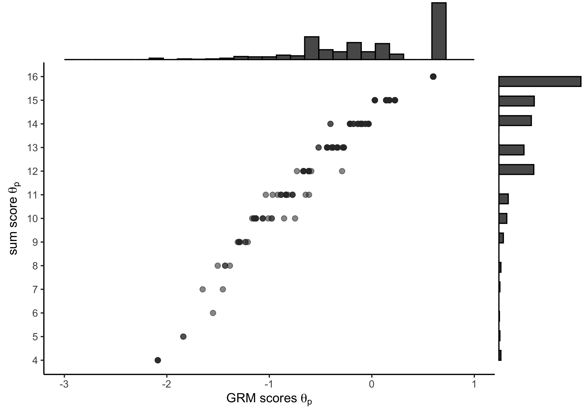

Code: ejemplos de CFA
================
dacarras
Mon Nov 14, 2022

# CFA tradicional

-   Ejemplo desarollado empleando los datos de Canivez et al., 2009

> Canivez, G. L., Konold, T. R., Collins, J. M., & Wilson, G. (2009).
> Construct validity of the Wechsler Abbreviated Scale of Intelligence
> and Wide Range Intelligence Test: Convergent and structural validity.
> School Psychology Quarterly, 24(4), 252–265.
> <https://doi.org/10.1037/a0018030>

-   El proposito general del estudio es mostrar que el Wechsler
    Abbreviated Scale of Intelligence (WISC) y el Wide Range
    Intelligence Test (WRIT) evalúan las mismas habilidades (i.e.,
    validez convergente).

-   Este ejemplo se encuentra desarollado en articulo de Beaujean
    (2013):

> Beaujean, A. A. (2013). Factor Analysis using R. Practical Assessment,
> Research and Evaluation, 18(4), 1–11.
> <https://doi.org/10.1177/1548051812471724>

## Cargar datos

``` r
#------------------------------------------------------------------------------
# CFA with correlation matrix
#------------------------------------------------------------------------------

#------------------------------------------------
# input correlation matrix
#------------------------------------------------

correlation_input <- '
1.00
0.57    1.00
0.79    0.57     1.00
0.62    0.65     0.60    1.00
0.69    0.51     0.70    0.53        1.00
0.83    0.54     0.74    0.57        0.71     1.00
0.56    0.59     0.58    0.71        0.65     0.58     1.00     
0.51    0.66     0.55    0.62        0.51     0.53     0.62     1.00
'

#------------------------------------------------
# turn into covariance matrix
#------------------------------------------------


correlation_matrix <- lavaan::getCov(correlation_input)

#------------------------------------------------
# add standard deviations
#------------------------------------------------

standard_deviations <- c(
17.37, 14.49, 17.26, 16.61, 14.77, 16.42, 16.17, 13.92
)

#------------------------------------------------
# sample means
#------------------------------------------------

sample_means <- c(
97.75, 97.87, 103.81, 99.81, 101.51, 100.63, 101.45, 100.64
)

#------------------------------------------------
# add variable names
#------------------------------------------------

variable_names <- c(
'wasi_voc',
'wasi_blc',
'wasi_sim',
'wasi_mat',
'writ_veb',
'writ_voc',
'writ_mat',
'writ_dia'
)

#------------------------------------------------
# generate covariance matrix
#------------------------------------------------

covariance_matrix <- lavaan::cor2cov(
                     R = correlation_matrix, 
                     sds = standard_deviations,
                     names = variable_names)

#------------------------------------------------
# display table
#------------------------------------------------

knitr::kable(covariance_matrix, digits = 2)
```

|          | wasi_voc | wasi_blc | wasi_sim | wasi_mat | writ_veb | writ_voc | writ_mat | writ_dia |
|:---------|---------:|---------:|---------:|---------:|---------:|---------:|---------:|---------:|
| wasi_voc |      302 |      143 |      237 |      179 |      177 |      237 |      157 |      123 |
| wasi_blc |      143 |      210 |      143 |      156 |      109 |      128 |      138 |      133 |
| wasi_sim |      237 |      143 |      298 |      172 |      178 |      210 |      162 |      132 |
| wasi_mat |      179 |      156 |      172 |      276 |      130 |      155 |      191 |      143 |
| writ_veb |      177 |      109 |      178 |      130 |      218 |      172 |      155 |      105 |
| writ_voc |      237 |      128 |      210 |      155 |      172 |      270 |      154 |      121 |
| writ_mat |      157 |      138 |      162 |      191 |      155 |      154 |      261 |      140 |
| writ_dia |      123 |      133 |      132 |      143 |      105 |      121 |      140 |      194 |

## Modelo de factor común

``` r
#------------------------------------------------------------------------------
# general factor model
#------------------------------------------------------------------------------

#------------------------------------------------
# define cfa model
#------------------------------------------------

lavaan_model <- '
# measurement model
g_factor =~ wasi_voc
g_factor =~ wasi_sim
g_factor =~ writ_veb
g_factor =~ writ_voc
g_factor =~ wasi_blc
g_factor =~ wasi_mat
g_factor =~ writ_mat
g_factor =~ writ_dia
'


#------------------------------------------------
# fit model
#------------------------------------------------

library(lavaan)
```

    ## This is lavaan 0.6-12
    ## lavaan is FREE software! Please report any bugs.

``` r
cfa_1 <- lavaan::sem(lavaan_model, 
         sample.cov  = covariance_matrix, 
         sample.mean = sample_means,
         sample.nobs = 152,
         mimic = 'Mplus')

#------------------------------------------------
# display results
#------------------------------------------------

lavaan::summary(cfa_1, 
  fit.measures=TRUE, 
  standardized=TRUE, 
  rsquare=TRUE)
```

    ## lavaan 0.6-12 ended normally after 63 iterations
    ## 
    ##   Estimator                                         ML
    ##   Optimization method                           NLMINB
    ##   Number of model parameters                        24
    ## 
    ##   Number of observations                           152
    ## 
    ## Model Test User Model:
    ##                                                       
    ##   Test statistic                               121.483
    ##   Degrees of freedom                                20
    ##   P-value (Chi-square)                           0.000
    ## 
    ## Model Test Baseline Model:
    ## 
    ##   Test statistic                               918.115
    ##   Degrees of freedom                                28
    ##   P-value                                        0.000
    ## 
    ## User Model versus Baseline Model:
    ## 
    ##   Comparative Fit Index (CFI)                    0.886
    ##   Tucker-Lewis Index (TLI)                       0.840
    ## 
    ## Loglikelihood and Information Criteria:
    ## 
    ##   Loglikelihood user model (H0)              -4681.416
    ##   Loglikelihood unrestricted model (H1)      -4620.674
    ##                                                       
    ##   Akaike (AIC)                                9410.832
    ##   Bayesian (BIC)                              9483.405
    ##   Sample-size adjusted Bayesian (BIC)         9407.445
    ## 
    ## Root Mean Square Error of Approximation:
    ## 
    ##   RMSEA                                          0.183
    ##   90 Percent confidence interval - lower         0.152
    ##   90 Percent confidence interval - upper         0.215
    ##   P-value RMSEA <= 0.05                          0.000
    ## 
    ## Standardized Root Mean Square Residual:
    ## 
    ##   SRMR                                           0.062
    ## 
    ## Parameter Estimates:
    ## 
    ##   Standard errors                             Standard
    ##   Information                                 Observed
    ##   Observed information based on                Hessian
    ## 
    ## Latent Variables:
    ##                    Estimate  Std.Err  z-value  P(>|z|)   Std.lv  Std.all
    ##   g_factor =~                                                           
    ##     wasi_voc          1.000                              15.192    0.877
    ##     wasi_sim          0.968    0.067   14.441    0.000   14.701    0.855
    ##     writ_veb          0.772    0.062   12.505    0.000   11.735    0.797
    ##     writ_voc          0.927    0.063   14.833    0.000   14.088    0.861
    ##     wasi_blc          0.665    0.067    9.980    0.000   10.107    0.700
    ##     wasi_mat          0.809    0.074   10.897    0.000   12.284    0.742
    ##     writ_mat          0.781    0.073   10.644    0.000   11.866    0.736
    ##     writ_dia          0.618    0.065    9.435    0.000    9.387    0.677
    ## 
    ## Intercepts:
    ##                    Estimate  Std.Err  z-value  P(>|z|)   Std.lv  Std.all
    ##    .wasi_voc         97.750    1.404   69.610    0.000   97.750    5.646
    ##    .wasi_sim        103.810    1.395   74.397    0.000  103.810    6.034
    ##    .writ_veb        101.510    1.194   85.013    0.000  101.510    6.895
    ##    .writ_voc        100.630    1.327   75.807    0.000  100.630    6.149
    ##    .wasi_blc         97.870    1.171   83.548    0.000   97.870    6.777
    ##    .wasi_mat         99.810    1.343   74.329    0.000   99.810    6.029
    ##    .writ_mat        101.450    1.307   77.606    0.000  101.450    6.295
    ##    .writ_dia        100.640    1.125   89.431    0.000  100.640    7.254
    ##     g_factor          0.000                               0.000    0.000
    ## 
    ## Variances:
    ##                    Estimate  Std.Err  z-value  P(>|z|)   Std.lv  Std.all
    ##    .wasi_voc         68.947   10.784    6.394    0.000   68.947    0.230
    ##    .wasi_sim         79.832   11.317    7.054    0.000   79.832    0.270
    ##    .writ_veb         79.000   10.313    7.660    0.000   79.000    0.365
    ##    .writ_voc         69.380   10.258    6.764    0.000   69.380    0.259
    ##    .wasi_blc        106.433   13.260    8.026    0.000  106.433    0.510
    ##    .wasi_mat        123.170   15.776    7.807    0.000  123.170    0.449
    ##    .writ_mat        118.942   15.277    7.786    0.000  118.942    0.458
    ##    .writ_dia        104.382   12.921    8.078    0.000  104.382    0.542
    ##     g_factor        230.785   34.253    6.738    0.000    1.000    1.000
    ## 
    ## R-Square:
    ##                    Estimate
    ##     wasi_voc          0.770
    ##     wasi_sim          0.730
    ##     writ_veb          0.635
    ##     writ_voc          0.741
    ##     wasi_blc          0.490
    ##     wasi_mat          0.551
    ##     writ_mat          0.542
    ##     writ_dia          0.458

## Modelo bidimensional o de dos factores

``` r
#------------------------------------------------------------------------------
# two dimensional model
#------------------------------------------------------------------------------

#------------------------------------------------
# define cfa model
#------------------------------------------------

lavaan_model <- '
# measurement model
verb =~ wasi_voc
verb =~ wasi_sim
verb =~ writ_veb
verb =~ writ_voc
nonv =~ wasi_blc
nonv =~ wasi_mat
nonv =~ writ_mat
nonv =~ writ_dia
'


#------------------------------------------------
# fit model
#------------------------------------------------

library(lavaan)
cfa_2 <- lavaan::sem(lavaan_model, 
         sample.cov  = covariance_matrix,
         sample.mean = sample_means, 
         sample.nobs = 152,
         mimic = 'Mplus')

#------------------------------------------------
# display results
#------------------------------------------------

lavaan::summary(cfa_2, 
  fit.measures=TRUE, 
  standardized=TRUE, 
  rsquare=TRUE)
```

    ## lavaan 0.6-12 ended normally after 96 iterations
    ## 
    ##   Estimator                                         ML
    ##   Optimization method                           NLMINB
    ##   Number of model parameters                        25
    ## 
    ##   Number of observations                           152
    ## 
    ## Model Test User Model:
    ##                                                       
    ##   Test statistic                                38.714
    ##   Degrees of freedom                                19
    ##   P-value (Chi-square)                           0.005
    ## 
    ## Model Test Baseline Model:
    ## 
    ##   Test statistic                               918.115
    ##   Degrees of freedom                                28
    ##   P-value                                        0.000
    ## 
    ## User Model versus Baseline Model:
    ## 
    ##   Comparative Fit Index (CFI)                    0.978
    ##   Tucker-Lewis Index (TLI)                       0.967
    ## 
    ## Loglikelihood and Information Criteria:
    ## 
    ##   Loglikelihood user model (H0)              -4640.032
    ##   Loglikelihood unrestricted model (H1)      -4620.674
    ##                                                       
    ##   Akaike (AIC)                                9330.063
    ##   Bayesian (BIC)                              9405.660
    ##   Sample-size adjusted Bayesian (BIC)         9326.536
    ## 
    ## Root Mean Square Error of Approximation:
    ## 
    ##   RMSEA                                          0.083
    ##   90 Percent confidence interval - lower         0.044
    ##   90 Percent confidence interval - upper         0.120
    ##   P-value RMSEA <= 0.05                          0.075
    ## 
    ## Standardized Root Mean Square Residual:
    ## 
    ##   SRMR                                           0.028
    ## 
    ## Parameter Estimates:
    ## 
    ##   Standard errors                             Standard
    ##   Information                                 Observed
    ##   Observed information based on                Hessian
    ## 
    ## Latent Variables:
    ##                    Estimate  Std.Err  z-value  P(>|z|)   Std.lv  Std.all
    ##   verb =~                                                               
    ##     wasi_voc          1.000                              15.773    0.911
    ##     wasi_sim          0.939    0.061   15.492    0.000   14.818    0.861
    ##     writ_veb          0.739    0.057   12.858    0.000   11.658    0.792
    ##     writ_voc          0.923    0.055   16.904    0.000   14.552    0.889
    ##   nonv =~                                                               
    ##     wasi_blc          1.000                              11.267    0.780
    ##     wasi_mat          1.235    0.114   10.828    0.000   13.911    0.840
    ##     writ_mat          1.164    0.113   10.298    0.000   13.110    0.813
    ##     writ_dia          0.947    0.094   10.019    0.000   10.665    0.769
    ## 
    ## Covariances:
    ##                    Estimate  Std.Err  z-value  P(>|z|)   Std.lv  Std.all
    ##   verb ~~                                                               
    ##     nonv            142.447   22.086    6.450    0.000    0.802    0.802
    ## 
    ## Intercepts:
    ##                    Estimate  Std.Err  z-value  P(>|z|)   Std.lv  Std.all
    ##    .wasi_voc         97.750    1.404   69.610    0.000   97.750    5.646
    ##    .wasi_sim        103.810    1.395   74.397    0.000  103.810    6.034
    ##    .writ_veb        101.510    1.194   85.013    0.000  101.510    6.895
    ##    .writ_voc        100.630    1.327   75.807    0.000  100.630    6.149
    ##    .wasi_blc         97.870    1.171   83.548    0.000   97.870    6.777
    ##    .wasi_mat         99.810    1.343   74.329    0.000   99.810    6.029
    ##    .writ_mat        101.450    1.307   77.606    0.000  101.450    6.295
    ##    .writ_dia        100.640    1.125   89.431    0.000  100.640    7.254
    ##     verb              0.000                               0.000    0.000
    ##     nonv              0.000                               0.000    0.000
    ## 
    ## Variances:
    ##                    Estimate  Std.Err  z-value  P(>|z|)   Std.lv  Std.all
    ##    .wasi_voc         50.950    9.039    5.637    0.000   50.950    0.170
    ##    .wasi_sim         76.363   11.163    6.841    0.000   76.363    0.258
    ##    .writ_veb         80.801   10.639    7.595    0.000   80.801    0.373
    ##    .writ_voc         56.074    8.871    6.321    0.000   56.074    0.209
    ##    .wasi_blc         81.627   11.577    7.051    0.000   81.627    0.391
    ##    .wasi_mat         80.570   12.917    6.238    0.000   80.570    0.294
    ##    .writ_mat         87.886   13.148    6.684    0.000   87.886    0.338
    ##    .writ_dia         78.753   10.962    7.184    0.000   78.753    0.409
    ##     verb            248.782   34.576    7.195    0.000    1.000    1.000
    ##     nonv            126.951   23.046    5.509    0.000    1.000    1.000
    ## 
    ## R-Square:
    ##                    Estimate
    ##     wasi_voc          0.830
    ##     wasi_sim          0.742
    ##     writ_veb          0.627
    ##     writ_voc          0.791
    ##     wasi_blc          0.609
    ##     wasi_mat          0.706
    ##     writ_mat          0.662
    ##     writ_dia          0.591

## Schmid-Leiman transformation

``` r
#------------------------------------------------------------------------------
# Schmid-Leiman transformation
#------------------------------------------------------------------------------

psych::schmid(correlation_matrix,nfactors=2)
```

    ## Loading required namespace: GPArotation

    ## 
    ## Three factors are required for identification -- general factor loadings set to be equal. 
    ## Proceed with caution. 
    ## Think about redoing the analysis with alternative values of the 'option' setting.

    ## Schmid-Leiman analysis 
    ## Call: psych::schmid(model = correlation_matrix, nfactors = 2)
    ## 
    ## Schmid Leiman Factor loadings greater than  0.2 
    ##       g   F1*   F2*   h2   u2   p2
    ## V1 0.80  0.45       0.84 0.16 0.76
    ## V2 0.70        0.36 0.62 0.38 0.79
    ## V3 0.78  0.36       0.74 0.26 0.82
    ## V4 0.74        0.37 0.68 0.32 0.80
    ## V5 0.73  0.31       0.63 0.37 0.84
    ## V6 0.78  0.43       0.80 0.20 0.77
    ## V7 0.73        0.34 0.66 0.34 0.82
    ## V8 0.68        0.39 0.62 0.38 0.75
    ## 
    ## With eigenvalues of:
    ##    g  F1*  F2* 
    ## 4.42 0.61 0.55 
    ## 
    ## general/max  7.3   max/min =   1.1
    ## mean percent general =  0.79    with sd =  0.03 and cv of  0.04 
    ## 
    ##  The orthogonal loadings were 
    ## Unstandardized loadings based upon covariance matrix
    ##      F1   F2   h2   u2   H2   U2
    ## V1 0.84 0.37 0.84 0.16 0.84 0.16
    ## V2 0.34 0.71 0.62 0.38 0.62 0.38
    ## V3 0.74 0.44 0.74 0.26 0.74 0.26
    ## V4 0.38 0.73 0.68 0.32 0.68 0.32
    ## V5 0.67 0.44 0.63 0.37 0.63 0.37
    ## V6 0.81 0.37 0.80 0.20 0.80 0.20
    ## V7 0.40 0.70 0.66 0.34 0.66 0.34
    ## V8 0.30 0.73 0.62 0.38 0.62 0.38
    ## 
    ##                  F1   F2
    ## SS loadings    2.86 2.72
    ## Proportion Var 0.36 0.34
    ## Cumulative Var 0.36 0.70
    ## 
    ## The degrees of freedom are 13  and the fit is  0.22 
    ## 
    ## The root mean square of the residuals is  0.03 
    ## The df corrected root mean square of the residuals is  0.04

## Modelo bidimensional por instrumento

``` r
#------------------------------------------------------------------------------
# two dimensional model by instrument
#------------------------------------------------------------------------------

#------------------------------------------------
# define cfa model
#------------------------------------------------

lavaan_model <- '
# measurement model
writ =~ writ_veb
writ =~ writ_voc
writ =~ writ_mat
writ =~ writ_dia

wasi =~ wasi_blc
wasi =~ wasi_mat
wasi =~ wasi_voc
wasi =~ wasi_sim

'


#------------------------------------------------
# fit model
#------------------------------------------------

library(lavaan)
cfa_3 <- lavaan::sem(lavaan_model, 
         sample.cov  = covariance_matrix, 
         sample.mean = sample_means,
         sample.nobs = 152,
         mimic = 'Mplus')

#------------------------------------------------
# display results
#------------------------------------------------

lavaan::summary(cfa_3, 
  fit.measures=TRUE, 
  standardized=TRUE, 
  rsquare=TRUE)
```

    ## lavaan 0.6-12 ended normally after 96 iterations
    ## 
    ##   Estimator                                         ML
    ##   Optimization method                           NLMINB
    ##   Number of model parameters                        25
    ## 
    ##   Number of observations                           152
    ## 
    ## Model Test User Model:
    ##                                                       
    ##   Test statistic                               121.397
    ##   Degrees of freedom                                19
    ##   P-value (Chi-square)                           0.000
    ## 
    ## Model Test Baseline Model:
    ## 
    ##   Test statistic                               918.115
    ##   Degrees of freedom                                28
    ##   P-value                                        0.000
    ## 
    ## User Model versus Baseline Model:
    ## 
    ##   Comparative Fit Index (CFI)                    0.885
    ##   Tucker-Lewis Index (TLI)                       0.830
    ## 
    ## Loglikelihood and Information Criteria:
    ## 
    ##   Loglikelihood user model (H0)              -4681.373
    ##   Loglikelihood unrestricted model (H1)      -4620.674
    ##                                                       
    ##   Akaike (AIC)                                9412.746
    ##   Bayesian (BIC)                              9488.343
    ##   Sample-size adjusted Bayesian (BIC)         9409.218
    ## 
    ## Root Mean Square Error of Approximation:
    ## 
    ##   RMSEA                                          0.188
    ##   90 Percent confidence interval - lower         0.157
    ##   90 Percent confidence interval - upper         0.221
    ##   P-value RMSEA <= 0.05                          0.000
    ## 
    ## Standardized Root Mean Square Residual:
    ## 
    ##   SRMR                                           0.062
    ## 
    ## Parameter Estimates:
    ## 
    ##   Standard errors                             Standard
    ##   Information                                 Observed
    ##   Observed information based on                Hessian
    ## 
    ## Latent Variables:
    ##                    Estimate  Std.Err  z-value  P(>|z|)   Std.lv  Std.all
    ##   writ =~                                                               
    ##     writ_veb          1.000                              11.773    0.800
    ##     writ_voc          1.198    0.098   12.278    0.000   14.108    0.862
    ##     writ_mat          1.010    0.101    9.963    0.000   11.888    0.738
    ##     writ_dia          0.797    0.090    8.825    0.000    9.388    0.677
    ##   wasi =~                                                               
    ##     wasi_blc          1.000                              10.104    0.700
    ##     wasi_mat          1.216    0.138    8.799    0.000   12.282    0.742
    ##     wasi_voc          1.506    0.151    9.949    0.000   15.220    0.879
    ##     wasi_sim          1.458    0.149    9.804    0.000   14.730    0.856
    ## 
    ## Covariances:
    ##                    Estimate  Std.Err  z-value  P(>|z|)   Std.lv  Std.all
    ##   writ ~~                                                               
    ##     wasi            118.337   18.599    6.362    0.000    0.995    0.995
    ## 
    ## Intercepts:
    ##                    Estimate  Std.Err  z-value  P(>|z|)   Std.lv  Std.all
    ##    .writ_veb        101.510    1.194   85.013    0.000  101.510    6.895
    ##    .writ_voc        100.630    1.327   75.807    0.000  100.630    6.149
    ##    .writ_mat        101.450    1.307   77.606    0.000  101.450    6.295
    ##    .writ_dia        100.640    1.125   89.431    0.000  100.640    7.254
    ##    .wasi_blc         97.870    1.171   83.548    0.000   97.870    6.777
    ##    .wasi_mat         99.810    1.343   74.329    0.000   99.810    6.029
    ##    .wasi_voc         97.750    1.404   69.610    0.000   97.750    5.646
    ##    .wasi_sim        103.810    1.395   74.397    0.000  103.810    6.034
    ##     writ              0.000                               0.000    0.000
    ##     wasi              0.000                               0.000    0.000
    ## 
    ## Variances:
    ##                    Estimate  Std.Err  z-value  P(>|z|)   Std.lv  Std.all
    ##    .writ_veb         78.105   10.691    7.306    0.000   78.105    0.360
    ##    .writ_voc         68.796   10.484    6.562    0.000   68.796    0.257
    ##    .writ_mat        118.424   15.371    7.704    0.000  118.424    0.456
    ##    .writ_dia        104.358   12.949    8.059    0.000  104.358    0.542
    ##    .wasi_blc        106.484   13.293    8.011    0.000  106.484    0.511
    ##    .wasi_mat        123.222   15.820    7.789    0.000  123.222    0.450
    ##    .wasi_voc         68.081   11.141    6.111    0.000   68.081    0.227
    ##    .wasi_sim         78.983   11.626    6.794    0.000   78.983    0.267
    ##     writ            138.613   23.911    5.797    0.000    1.000    1.000
    ##     wasi            102.095   21.231    4.809    0.000    1.000    1.000
    ## 
    ## R-Square:
    ##                    Estimate
    ##     writ_veb          0.640
    ##     writ_voc          0.743
    ##     writ_mat          0.544
    ##     writ_dia          0.458
    ##     wasi_blc          0.489
    ##     wasi_mat          0.550
    ##     wasi_voc          0.773
    ##     wasi_sim          0.733

# CFA con indicadores categóricos

## Cargar datos

``` r
#------------------------------------------------------------------------------
# preparar datos
#------------------------------------------------------------------------------

#----------------------------------------------------------
# instalar libreria que contiene los datos
#----------------------------------------------------------

# devtools::install_github("dacarras/psi2301", force = TRUE)

#----------------------------------------------------------
# función de recodificación
#----------------------------------------------------------

recode_likert <- function(x){
require(dplyr)

rec <- dplyr::case_when(
       x == 1 ~ 4,
       x == 2 ~ 3,
       x == 3 ~ 2,
       x == 4 ~ 1,
       )

return(rec)
}

#----------------------------------------------------------
# preparar datos para CFA
#----------------------------------------------------------

set.seed(20221103)

data_model <- psi2301::iccs_09_chl %>%
              # remover meta data de los datos
              r4sda::remove_labels() %>%
              # items de actitudes hacia el propio país
              mutate(pa1 = recode_likert(IS2P28A)) %>%
              mutate(pa2 = recode_likert(IS2P28B)) %>%
              mutate(pa3 = recode_likert(IS2P28C)) %>%
              mutate(pa4 = recode_likert(IS2P28D)) %>%
              mutate(pa5 = recode_likert(IS2P28E)) %>%
              mutate(pa6 = recode_likert(IS2P28F)) %>%
              mutate(pa7 = recode_likert(IS2P28G)) %>%
              mutate(pa8 = recode_likert(IS2P28H)) %>%
              # muestra aleatoria de 500 casos
              dplyr::sample_n(size = 500, weights = TOTWGTS) %>%
              mutate(id_i = seq(1:nrow(.))) %>%
              dplyr::select(id_i, pa1:pa8) %>%
              dplyr::glimpse()
```

    ## Rows: 500
    ## Columns: 9
    ## $ id_i <int> 1, 2, 3, 4, 5, 6, 7, 8, 9, 10, 11, 12, 13, 14, 15, 16, 17, 18, 19…
    ## $ pa1  <dbl> 4, 4, 4, 3, 3, 4, 4, 2, 4, 3, 4, 3, 4, 4, 4, 4, 4, 4, 4, 4, 3, 3,…
    ## $ pa2  <dbl> 2, 3, 2, 3, 2, 1, 4, 2, 3, 3, 3, 4, 2, 4, 1, 4, 3, 2, 2, 2, 3, 3,…
    ## $ pa3  <dbl> 3, 4, 4, 3, 3, 4, 4, 2, 4, 4, 4, 4, 4, 4, 3, 4, 4, 3, 4, 4, 4, 3,…
    ## $ pa4  <dbl> 3, 4, 4, 4, 2, 4, 4, 3, 4, 4, 4, 4, 4, 4, 3, 4, 3, 4, 3, 3, 3, 3,…
    ## $ pa5  <dbl> 4, 1, 1, 2, 2, 4, 2, 4, 2, 1, 2, 4, 1, 2, 3, 3, 3, 1, 1, 1, 2, 2,…
    ## $ pa6  <dbl> 4, 4, 4, 4, 3, 2, 4, 2, 4, 4, 4, 4, 4, 4, 3, 4, 3, 4, 4, 3, 3, 3,…
    ## $ pa7  <dbl> 2, 2, 2, 2, 3, 3, 2, 1, 3, 3, 1, 2, 1, 3, 3, 1, 2, 2, 3, 2, 2, 2,…
    ## $ pa8  <dbl> 3, 4, 3, 2, 2, 1, 3, 2, 3, 4, 3, 4, 2, 4, 3, 1, 2, 3, 4, 3, 3, 2,…

## Descriptivos de los items

``` r
#------------------------------------------------------------------------------
# descriptivos de items
#------------------------------------------------------------------------------

#------------------------------------------------
# sparsity check
#------------------------------------------------

data_model %>%
dplyr::select(pa1:pa8) %>%
r4sda::wide_resp() %>%
knitr::kable(., digits = 2)
```

| variable |   01 |   02 |   03 |   04 |   NA | hist     |
|:---------|-----:|-----:|-----:|-----:|-----:|:---------|
| pa1      | 0.02 | 0.03 | 0.30 | 0.64 | 0.01 | ▁▁▁▁▁▃▁▇ |
| pa2      | 0.08 | 0.32 | 0.47 | 0.12 | 0.01 | ▂▁▆▁▁▇▁▂ |
| pa3      | 0.02 | 0.05 | 0.32 | 0.59 | 0.02 | ▁▁▁▁▁▅▁▇ |
| pa4      | 0.02 | 0.05 | 0.41 | 0.50 | 0.02 | ▁▁▁▁▁▆▁▇ |
| pa5      | 0.30 | 0.38 | 0.19 | 0.12 | 0.01 | ▆▁▇▁▁▅▁▂ |
| pa6      | 0.02 | 0.09 | 0.35 | 0.52 | 0.02 | ▁▁▂▁▁▆▁▇ |
| pa7      | 0.16 | 0.47 | 0.27 | 0.08 | 0.02 | ▃▁▇▁▁▅▁▁ |
| pa8      | 0.11 | 0.28 | 0.35 | 0.23 | 0.02 | ▂▁▆▁▁▇▁▅ |

## Modelo 1: CFA tradicional

``` r
#------------------------------------------------------------------------------
# fit CFA
#------------------------------------------------------------------------------

#------------------------------------------------
# model
#------------------------------------------------

library(lavaan)
lavaan_model <-
'
nat =~ pa1
nat =~ pa2
nat =~ pa3
nat =~ pa4
nat =~ pa5
nat =~ pa6
nat =~ pa7
nat =~ pa8
'


#------------------------------------------------
# fit model
#------------------------------------------------

lavaan_fit <- lavaan::sem(lavaan_model, 
              data = data_model, 
              mimic='mplus',
              estimator = 'MLR')

#------------------------------------------------
# get summary
#------------------------------------------------

summary(lavaan_fit, fit.measures=TRUE, standardized=TRUE, rsquare=TRUE)
```

    ## lavaan 0.6-12 ended normally after 43 iterations
    ## 
    ##   Estimator                                         ML
    ##   Optimization method                           NLMINB
    ##   Number of model parameters                        24
    ## 
    ##                                                   Used       Total
    ##   Number of observations                           496         500
    ##   Number of missing patterns                        11            
    ## 
    ## Model Test User Model:
    ##                                               Standard      Robust
    ##   Test Statistic                               132.741     106.469
    ##   Degrees of freedom                                20          20
    ##   P-value (Chi-square)                           0.000       0.000
    ##   Scaling correction factor                                  1.247
    ##     Yuan-Bentler correction (Mplus variant)                       
    ## 
    ## Model Test Baseline Model:
    ## 
    ##   Test statistic                              1277.429     951.328
    ##   Degrees of freedom                                28          28
    ##   P-value                                        0.000       0.000
    ##   Scaling correction factor                                  1.343
    ## 
    ## User Model versus Baseline Model:
    ## 
    ##   Comparative Fit Index (CFI)                    0.910       0.906
    ##   Tucker-Lewis Index (TLI)                       0.874       0.869
    ##                                                                   
    ##   Robust Comparative Fit Index (CFI)                         0.913
    ##   Robust Tucker-Lewis Index (TLI)                            0.878
    ## 
    ## Loglikelihood and Information Criteria:
    ## 
    ##   Loglikelihood user model (H0)              -4060.986   -4060.986
    ##   Scaling correction factor                                  1.306
    ##       for the MLR correction                                      
    ##   Loglikelihood unrestricted model (H1)      -3994.615   -3994.615
    ##   Scaling correction factor                                  1.279
    ##       for the MLR correction                                      
    ##                                                                   
    ##   Akaike (AIC)                                8169.971    8169.971
    ##   Bayesian (BIC)                              8270.929    8270.929
    ##   Sample-size adjusted Bayesian (BIC)         8194.752    8194.752
    ## 
    ## Root Mean Square Error of Approximation:
    ## 
    ##   RMSEA                                          0.107       0.093
    ##   90 Percent confidence interval - lower         0.090       0.078
    ##   90 Percent confidence interval - upper         0.124       0.109
    ##   P-value RMSEA <= 0.05                          0.000       0.000
    ##                                                                   
    ##   Robust RMSEA                                               0.104
    ##   90 Percent confidence interval - lower                     0.085
    ##   90 Percent confidence interval - upper                     0.124
    ## 
    ## Standardized Root Mean Square Residual:
    ## 
    ##   SRMR                                           0.052       0.052
    ## 
    ## Parameter Estimates:
    ## 
    ##   Standard errors                             Sandwich
    ##   Information bread                           Observed
    ##   Observed information based on                Hessian
    ## 
    ## Latent Variables:
    ##                    Estimate  Std.Err  z-value  P(>|z|)   Std.lv  Std.all
    ##   nat =~                                                                
    ##     pa1               1.000                               0.432    0.658
    ##     pa2               0.867    0.091    9.483    0.000    0.374    0.467
    ##     pa3               1.240    0.113   10.992    0.000    0.536    0.782
    ##     pa4               1.228    0.119   10.340    0.000    0.530    0.769
    ##     pa5              -0.940    0.138   -6.824    0.000   -0.406   -0.413
    ##     pa6               1.435    0.143   10.014    0.000    0.620    0.817
    ##     pa7               0.677    0.127    5.338    0.000    0.293    0.354
    ##     pa8               1.149    0.143    8.007    0.000    0.496    0.522
    ## 
    ## Intercepts:
    ##                    Estimate  Std.Err  z-value  P(>|z|)   Std.lv  Std.all
    ##    .pa1               3.576    0.030  121.026    0.000    3.576    5.453
    ##    .pa2               2.631    0.036   72.989    0.000    2.631    3.285
    ##    .pa3               3.510    0.031  113.616    0.000    3.510    5.125
    ##    .pa4               3.411    0.031  109.512    0.000    3.411    4.944
    ##    .pa5               2.136    0.044   48.299    0.000    2.136    2.175
    ##    .pa6               3.379    0.034   98.700    0.000    3.379    4.454
    ##    .pa7               2.265    0.037   60.771    0.000    2.265    2.740
    ##    .pa8               2.723    0.043   63.540    0.000    2.723    2.868
    ##     nat               0.000                               0.000    0.000
    ## 
    ## Variances:
    ##                    Estimate  Std.Err  z-value  P(>|z|)   Std.lv  Std.all
    ##    .pa1               0.244    0.027    8.901    0.000    0.244    0.567
    ##    .pa2               0.501    0.035   14.463    0.000    0.501    0.782
    ##    .pa3               0.182    0.024    7.482    0.000    0.182    0.389
    ##    .pa4               0.195    0.021    9.486    0.000    0.195    0.409
    ##    .pa5               0.799    0.050   15.877    0.000    0.799    0.829
    ##    .pa6               0.192    0.025    7.653    0.000    0.192    0.333
    ##    .pa7               0.598    0.040   14.969    0.000    0.598    0.875
    ##    .pa8               0.655    0.044   14.776    0.000    0.655    0.727
    ##     nat               0.186    0.039    4.790    0.000    1.000    1.000
    ## 
    ## R-Square:
    ##                    Estimate
    ##     pa1               0.433
    ##     pa2               0.218
    ##     pa3               0.611
    ##     pa4               0.591
    ##     pa5               0.171
    ##     pa6               0.667
    ##     pa7               0.125
    ##     pa8               0.273

## Modelo 2: CFA ordinal

``` r
#------------------------------------------------------------------------------
# fit CFA
#------------------------------------------------------------------------------

#------------------------------------------------
# model
#------------------------------------------------

library(lavaan)
lavaan_model <-
'
nat =~ pa1
nat =~ pa2
nat =~ pa3
nat =~ pa4
nat =~ pa5
nat =~ pa6
nat =~ pa7
nat =~ pa8
'

#------------------------------------------------
# items
#------------------------------------------------

ordered_items <- data_model %>%
                 dplyr::select(pa1:pa8) %>%
                 names()

#------------------------------------------------
# fit model
#------------------------------------------------


lavaan_fit <- lavaan::sem(lavaan_model, 
              data = data_model, 
              mimic='mplus',
              ordered =  ordered_items,
              estimator = 'WLSMV')

#------------------------------------------------
# get summary
#------------------------------------------------

summary(lavaan_fit, fit.measures=TRUE, standardized=TRUE, rsquare=TRUE)
```

    ## lavaan 0.6-12 ended normally after 20 iterations
    ## 
    ##   Estimator                                       DWLS
    ##   Optimization method                           NLMINB
    ##   Number of model parameters                        32
    ## 
    ##                                                   Used       Total
    ##   Number of observations                           482         500
    ## 
    ## Model Test User Model:
    ##                                               Standard      Robust
    ##   Test Statistic                                94.228     163.843
    ##   Degrees of freedom                                20          20
    ##   P-value (Chi-square)                           0.000       0.000
    ##   Scaling correction factor                                  0.587
    ##   Shift parameter                                            3.193
    ##     simple second-order correction (WLSMV)                        
    ## 
    ## Model Test Baseline Model:
    ## 
    ##   Test statistic                              5258.700    3187.799
    ##   Degrees of freedom                                28          28
    ##   P-value                                        0.000       0.000
    ##   Scaling correction factor                                  1.655
    ## 
    ## User Model versus Baseline Model:
    ## 
    ##   Comparative Fit Index (CFI)                    0.986       0.954
    ##   Tucker-Lewis Index (TLI)                       0.980       0.936
    ##                                                                   
    ##   Robust Comparative Fit Index (CFI)                            NA
    ##   Robust Tucker-Lewis Index (TLI)                               NA
    ## 
    ## Root Mean Square Error of Approximation:
    ## 
    ##   RMSEA                                          0.088       0.122
    ##   90 Percent confidence interval - lower         0.070       0.105
    ##   90 Percent confidence interval - upper         0.106       0.140
    ##   P-value RMSEA <= 0.05                          0.000       0.000
    ##                                                                   
    ##   Robust RMSEA                                                  NA
    ##   90 Percent confidence interval - lower                        NA
    ##   90 Percent confidence interval - upper                        NA
    ## 
    ## Standardized Root Mean Square Residual:
    ## 
    ##   SRMR                                           0.067       0.067
    ## 
    ## Weighted Root Mean Square Residual:
    ## 
    ##   WRMR                                           1.346       1.346
    ## 
    ## Parameter Estimates:
    ## 
    ##   Standard errors                           Robust.sem
    ##   Information                                 Expected
    ##   Information saturated (h1) model        Unstructured
    ## 
    ## Latent Variables:
    ##                    Estimate  Std.Err  z-value  P(>|z|)   Std.lv  Std.all
    ##   nat =~                                                                
    ##     pa1               1.000                               0.761    0.761
    ##     pa2               0.692    0.049   14.268    0.000    0.527    0.527
    ##     pa3               1.137    0.051   22.396    0.000    0.866    0.866
    ##     pa4               1.105    0.046   24.125    0.000    0.841    0.841
    ##     pa5              -0.622    0.055  -11.314    0.000   -0.473   -0.473
    ##     pa6               1.154    0.047   24.456    0.000    0.879    0.879
    ##     pa7               0.587    0.060    9.741    0.000    0.447    0.447
    ##     pa8               0.818    0.050   16.441    0.000    0.623    0.623
    ## 
    ## Intercepts:
    ##                    Estimate  Std.Err  z-value  P(>|z|)   Std.lv  Std.all
    ##    .pa1               0.000                               0.000    0.000
    ##    .pa2               0.000                               0.000    0.000
    ##    .pa3               0.000                               0.000    0.000
    ##    .pa4               0.000                               0.000    0.000
    ##    .pa5               0.000                               0.000    0.000
    ##    .pa6               0.000                               0.000    0.000
    ##    .pa7               0.000                               0.000    0.000
    ##    .pa8               0.000                               0.000    0.000
    ##     nat               0.000                               0.000    0.000
    ## 
    ## Thresholds:
    ##                    Estimate  Std.Err  z-value  P(>|z|)   Std.lv  Std.all
    ##     pa1|t1           -1.999    0.126  -15.874    0.000   -1.999   -1.999
    ##     pa1|t2           -1.647    0.097  -17.051    0.000   -1.647   -1.647
    ##     pa1|t3           -0.389    0.059   -6.619    0.000   -0.389   -0.389
    ##     pa2|t1           -1.385    0.082  -16.814    0.000   -1.385   -1.385
    ##     pa2|t2           -0.236    0.058   -4.087    0.000   -0.236   -0.236
    ##     pa2|t3            1.184    0.074   15.901    0.000    1.184    1.184
    ##     pa3|t1           -2.039    0.130  -15.650    0.000   -2.039   -2.039
    ##     pa3|t2           -1.487    0.087  -17.031    0.000   -1.487   -1.487
    ##     pa3|t3           -0.263    0.058   -4.540    0.000   -0.263   -0.263
    ##     pa4|t1           -1.999    0.126  -15.874    0.000   -1.999   -1.999
    ##     pa4|t2           -1.457    0.086  -16.983    0.000   -1.457   -1.457
    ##     pa4|t3           -0.021    0.057   -0.364    0.716   -0.021   -0.021
    ##     pa5|t1           -0.510    0.060   -8.503    0.000   -0.510   -0.510
    ##     pa5|t2            0.492    0.060    8.235    0.000    0.492    0.492
    ##     pa5|t3            1.173    0.074   15.836    0.000    1.173    1.173
    ##     pa6|t1           -1.962    0.122  -16.066    0.000   -1.962   -1.962
    ##     pa6|t2           -1.173    0.074  -15.836    0.000   -1.173   -1.173
    ##     pa6|t3           -0.068    0.057   -1.182    0.237   -0.068   -0.068
    ##     pa7|t1           -0.979    0.068  -14.314    0.000   -0.979   -0.979
    ##     pa7|t2            0.367    0.059    6.258    0.000    0.367    0.367
    ##     pa7|t3            1.427    0.084   16.923    0.000    1.427    1.427
    ##     pa8|t1           -1.227    0.076  -16.150    0.000   -1.227   -1.227
    ##     pa8|t2           -0.258    0.058   -4.450    0.000   -0.258   -0.258
    ##     pa8|t3            0.711    0.063   11.323    0.000    0.711    0.711
    ## 
    ## Variances:
    ##                    Estimate  Std.Err  z-value  P(>|z|)   Std.lv  Std.all
    ##    .pa1               0.420                               0.420    0.420
    ##    .pa2               0.722                               0.722    0.722
    ##    .pa3               0.251                               0.251    0.251
    ##    .pa4               0.292                               0.292    0.292
    ##    .pa5               0.776                               0.776    0.776
    ##    .pa6               0.228                               0.228    0.228
    ##    .pa7               0.800                               0.800    0.800
    ##    .pa8               0.612                               0.612    0.612
    ##     nat               0.580    0.046   12.568    0.000    1.000    1.000
    ## 
    ## Scales y*:
    ##                    Estimate  Std.Err  z-value  P(>|z|)   Std.lv  Std.all
    ##     pa1               1.000                               1.000    1.000
    ##     pa2               1.000                               1.000    1.000
    ##     pa3               1.000                               1.000    1.000
    ##     pa4               1.000                               1.000    1.000
    ##     pa5               1.000                               1.000    1.000
    ##     pa6               1.000                               1.000    1.000
    ##     pa7               1.000                               1.000    1.000
    ##     pa8               1.000                               1.000    1.000
    ## 
    ## R-Square:
    ##                    Estimate
    ##     pa1               0.580
    ##     pa2               0.278
    ##     pa3               0.749
    ##     pa4               0.708
    ##     pa5               0.224
    ##     pa6               0.772
    ##     pa7               0.200
    ##     pa8               0.388

## Modelo 3: selección de items de IEA

``` r
#------------------------------------------------------------------------------
# fit CFA
#------------------------------------------------------------------------------

#------------------------------------------------
# model
#------------------------------------------------

library(lavaan)
lavaan_model <-
'
nat =~ pa1
nat =~ pa2
nat =~ pa3
nat =~ pa4
# nat =~ pa5
nat =~ pa6
nat =~ pa7
nat =~ pa8
'

#------------------------------------------------
# items
#------------------------------------------------

ordered_items <- data_model %>%
                 dplyr::select(pa1:pa8) %>%
                 names()

#------------------------------------------------
# fit model
#------------------------------------------------


lavaan_fit <- lavaan::sem(lavaan_model, 
              data = data_model, 
              mimic='mplus',
              ordered =  ordered_items,
              estimator = 'WLSMV')

#------------------------------------------------
# get summary
#------------------------------------------------

summary(lavaan_fit, fit.measures=TRUE, standardized=TRUE, rsquare=TRUE)
```

    ## lavaan 0.6-12 ended normally after 19 iterations
    ## 
    ##   Estimator                                       DWLS
    ##   Optimization method                           NLMINB
    ##   Number of model parameters                        28
    ## 
    ##                                                   Used       Total
    ##   Number of observations                           482         500
    ## 
    ## Model Test User Model:
    ##                                               Standard      Robust
    ##   Test Statistic                                54.420     102.123
    ##   Degrees of freedom                                14          14
    ##   P-value (Chi-square)                           0.000       0.000
    ##   Scaling correction factor                                  0.543
    ##   Shift parameter                                            1.925
    ##     simple second-order correction (WLSMV)                        
    ## 
    ## Model Test Baseline Model:
    ## 
    ##   Test statistic                              4805.647    2932.704
    ##   Degrees of freedom                                21          21
    ##   P-value                                        0.000       0.000
    ##   Scaling correction factor                                  1.643
    ## 
    ## User Model versus Baseline Model:
    ## 
    ##   Comparative Fit Index (CFI)                    0.992       0.970
    ##   Tucker-Lewis Index (TLI)                       0.987       0.955
    ##                                                                   
    ##   Robust Comparative Fit Index (CFI)                            NA
    ##   Robust Tucker-Lewis Index (TLI)                               NA
    ## 
    ## Root Mean Square Error of Approximation:
    ## 
    ##   RMSEA                                          0.077       0.114
    ##   90 Percent confidence interval - lower         0.056       0.094
    ##   90 Percent confidence interval - upper         0.100       0.136
    ##   P-value RMSEA <= 0.05                          0.017       0.000
    ##                                                                   
    ##   Robust RMSEA                                                  NA
    ##   90 Percent confidence interval - lower                        NA
    ##   90 Percent confidence interval - upper                        NA
    ## 
    ## Standardized Root Mean Square Residual:
    ## 
    ##   SRMR                                           0.057       0.057
    ## 
    ## Weighted Root Mean Square Residual:
    ## 
    ##   WRMR                                           1.138       1.138
    ## 
    ## Parameter Estimates:
    ## 
    ##   Standard errors                           Robust.sem
    ##   Information                                 Expected
    ##   Information saturated (h1) model        Unstructured
    ## 
    ## Latent Variables:
    ##                    Estimate  Std.Err  z-value  P(>|z|)   Std.lv  Std.all
    ##   nat =~                                                                
    ##     pa1               1.000                               0.771    0.771
    ##     pa2               0.705    0.047   14.959    0.000    0.543    0.543
    ##     pa3               1.131    0.049   23.223    0.000    0.872    0.872
    ##     pa4               1.101    0.044   25.038    0.000    0.848    0.848
    ##     pa6               1.123    0.045   24.996    0.000    0.865    0.865
    ##     pa7               0.592    0.060    9.905    0.000    0.456    0.456
    ##     pa8               0.770    0.049   15.773    0.000    0.593    0.593
    ## 
    ## Intercepts:
    ##                    Estimate  Std.Err  z-value  P(>|z|)   Std.lv  Std.all
    ##    .pa1               0.000                               0.000    0.000
    ##    .pa2               0.000                               0.000    0.000
    ##    .pa3               0.000                               0.000    0.000
    ##    .pa4               0.000                               0.000    0.000
    ##    .pa6               0.000                               0.000    0.000
    ##    .pa7               0.000                               0.000    0.000
    ##    .pa8               0.000                               0.000    0.000
    ##     nat               0.000                               0.000    0.000
    ## 
    ## Thresholds:
    ##                    Estimate  Std.Err  z-value  P(>|z|)   Std.lv  Std.all
    ##     pa1|t1           -1.999    0.126  -15.874    0.000   -1.999   -1.999
    ##     pa1|t2           -1.647    0.097  -17.051    0.000   -1.647   -1.647
    ##     pa1|t3           -0.389    0.059   -6.619    0.000   -0.389   -0.389
    ##     pa2|t1           -1.385    0.082  -16.814    0.000   -1.385   -1.385
    ##     pa2|t2           -0.236    0.058   -4.087    0.000   -0.236   -0.236
    ##     pa2|t3            1.184    0.074   15.901    0.000    1.184    1.184
    ##     pa3|t1           -2.039    0.130  -15.650    0.000   -2.039   -2.039
    ##     pa3|t2           -1.487    0.087  -17.031    0.000   -1.487   -1.487
    ##     pa3|t3           -0.263    0.058   -4.540    0.000   -0.263   -0.263
    ##     pa4|t1           -1.999    0.126  -15.874    0.000   -1.999   -1.999
    ##     pa4|t2           -1.457    0.086  -16.983    0.000   -1.457   -1.457
    ##     pa4|t3           -0.021    0.057   -0.364    0.716   -0.021   -0.021
    ##     pa6|t1           -1.962    0.122  -16.066    0.000   -1.962   -1.962
    ##     pa6|t2           -1.173    0.074  -15.836    0.000   -1.173   -1.173
    ##     pa6|t3           -0.068    0.057   -1.182    0.237   -0.068   -0.068
    ##     pa7|t1           -0.979    0.068  -14.314    0.000   -0.979   -0.979
    ##     pa7|t2            0.367    0.059    6.258    0.000    0.367    0.367
    ##     pa7|t3            1.427    0.084   16.923    0.000    1.427    1.427
    ##     pa8|t1           -1.227    0.076  -16.150    0.000   -1.227   -1.227
    ##     pa8|t2           -0.258    0.058   -4.450    0.000   -0.258   -0.258
    ##     pa8|t3            0.711    0.063   11.323    0.000    0.711    0.711
    ## 
    ## Variances:
    ##                    Estimate  Std.Err  z-value  P(>|z|)   Std.lv  Std.all
    ##    .pa1               0.406                               0.406    0.406
    ##    .pa2               0.705                               0.705    0.705
    ##    .pa3               0.240                               0.240    0.240
    ##    .pa4               0.281                               0.281    0.281
    ##    .pa6               0.252                               0.252    0.252
    ##    .pa7               0.792                               0.792    0.792
    ##    .pa8               0.648                               0.648    0.648
    ##     nat               0.594    0.045   13.115    0.000    1.000    1.000
    ## 
    ## Scales y*:
    ##                    Estimate  Std.Err  z-value  P(>|z|)   Std.lv  Std.all
    ##     pa1               1.000                               1.000    1.000
    ##     pa2               1.000                               1.000    1.000
    ##     pa3               1.000                               1.000    1.000
    ##     pa4               1.000                               1.000    1.000
    ##     pa6               1.000                               1.000    1.000
    ##     pa7               1.000                               1.000    1.000
    ##     pa8               1.000                               1.000    1.000
    ## 
    ## R-Square:
    ##                    Estimate
    ##     pa1               0.594
    ##     pa2               0.295
    ##     pa3               0.760
    ##     pa4               0.719
    ##     pa6               0.748
    ##     pa7               0.208
    ##     pa8               0.352

## Modelo 4: items de patriotismo

``` r
#------------------------------------------------------------------------------
# fit CFA
#------------------------------------------------------------------------------

#------------------------------------------------
# model
#------------------------------------------------

library(lavaan)
lavaan_model <-
'
nat =~ pa1
nat =~ pa3
nat =~ pa4
nat =~ pa6
'

#------------------------------------------------
# items
#------------------------------------------------

ordered_items <- data_model %>%
                 dplyr::select(pa1:pa8) %>%
                 names()

#------------------------------------------------
# fit model
#------------------------------------------------


lavaan_fit <- lavaan::sem(lavaan_model, 
              data = data_model, 
              mimic='mplus',
              ordered =  ordered_items,
              estimator = 'WLSMV')

#------------------------------------------------
# get summary
#------------------------------------------------

summary(lavaan_fit, fit.measures=TRUE, standardized=TRUE, rsquare=TRUE)
```

    ## lavaan 0.6-12 ended normally after 15 iterations
    ## 
    ##   Estimator                                       DWLS
    ##   Optimization method                           NLMINB
    ##   Number of model parameters                        16
    ## 
    ##                                                   Used       Total
    ##   Number of observations                           484         500
    ## 
    ## Model Test User Model:
    ##                                               Standard      Robust
    ##   Test Statistic                                 3.069       9.697
    ##   Degrees of freedom                                 2           2
    ##   P-value (Chi-square)                           0.216       0.008
    ##   Scaling correction factor                                  0.317
    ##   Shift parameter                                            0.013
    ##     simple second-order correction (WLSMV)                        
    ## 
    ## Model Test Baseline Model:
    ## 
    ##   Test statistic                              3370.490    2311.477
    ##   Degrees of freedom                                 6           6
    ##   P-value                                        0.000       0.000
    ##   Scaling correction factor                                  1.459
    ## 
    ## User Model versus Baseline Model:
    ## 
    ##   Comparative Fit Index (CFI)                    1.000       0.997
    ##   Tucker-Lewis Index (TLI)                       0.999       0.990
    ##                                                                   
    ##   Robust Comparative Fit Index (CFI)                            NA
    ##   Robust Tucker-Lewis Index (TLI)                               NA
    ## 
    ## Root Mean Square Error of Approximation:
    ## 
    ##   RMSEA                                          0.033       0.089
    ##   90 Percent confidence interval - lower         0.000       0.039
    ##   90 Percent confidence interval - upper         0.102       0.149
    ##   P-value RMSEA <= 0.05                          0.551       0.092
    ##                                                                   
    ##   Robust RMSEA                                                  NA
    ##   90 Percent confidence interval - lower                        NA
    ##   90 Percent confidence interval - upper                        NA
    ## 
    ## Standardized Root Mean Square Residual:
    ## 
    ##   SRMR                                           0.019       0.019
    ## 
    ## Weighted Root Mean Square Residual:
    ## 
    ##   WRMR                                           0.413       0.413
    ## 
    ## Parameter Estimates:
    ## 
    ##   Standard errors                           Robust.sem
    ##   Information                                 Expected
    ##   Information saturated (h1) model        Unstructured
    ## 
    ## Latent Variables:
    ##                    Estimate  Std.Err  z-value  P(>|z|)   Std.lv  Std.all
    ##   nat =~                                                                
    ##     pa1               1.000                               0.758    0.758
    ##     pa3               1.196    0.055   21.822    0.000    0.907    0.907
    ##     pa4               1.132    0.046   24.365    0.000    0.858    0.858
    ##     pa6               1.104    0.048   23.236    0.000    0.837    0.837
    ## 
    ## Intercepts:
    ##                    Estimate  Std.Err  z-value  P(>|z|)   Std.lv  Std.all
    ##    .pa1               0.000                               0.000    0.000
    ##    .pa3               0.000                               0.000    0.000
    ##    .pa4               0.000                               0.000    0.000
    ##    .pa6               0.000                               0.000    0.000
    ##     nat               0.000                               0.000    0.000
    ## 
    ## Thresholds:
    ##                    Estimate  Std.Err  z-value  P(>|z|)   Std.lv  Std.all
    ##     pa1|t1           -2.000    0.126  -15.897    0.000   -2.000   -2.000
    ##     pa1|t2           -1.649    0.097  -17.085    0.000   -1.649   -1.649
    ##     pa1|t3           -0.382    0.059   -6.515    0.000   -0.382   -0.382
    ##     pa3|t1           -2.040    0.130  -15.673    0.000   -2.040   -2.040
    ##     pa3|t2           -1.489    0.087  -17.069    0.000   -1.489   -1.489
    ##     pa3|t3           -0.257    0.058   -4.441    0.000   -0.257   -0.257
    ##     pa4|t1           -2.000    0.126  -15.897    0.000   -2.000   -2.000
    ##     pa4|t2           -1.459    0.086  -17.022    0.000   -1.459   -1.459
    ##     pa4|t3           -0.021    0.057   -0.363    0.717   -0.021   -0.021
    ##     pa6|t1           -1.964    0.122  -16.090    0.000   -1.964   -1.964
    ##     pa6|t2           -1.176    0.074  -15.885    0.000   -1.176   -1.176
    ##     pa6|t3           -0.062    0.057   -1.089    0.276   -0.062   -0.062
    ## 
    ## Variances:
    ##                    Estimate  Std.Err  z-value  P(>|z|)   Std.lv  Std.all
    ##    .pa1               0.425                               0.425    0.425
    ##    .pa3               0.178                               0.178    0.178
    ##    .pa4               0.264                               0.264    0.264
    ##    .pa6               0.299                               0.299    0.299
    ##     nat               0.575    0.046   12.388    0.000    1.000    1.000
    ## 
    ## Scales y*:
    ##                    Estimate  Std.Err  z-value  P(>|z|)   Std.lv  Std.all
    ##     pa1               1.000                               1.000    1.000
    ##     pa3               1.000                               1.000    1.000
    ##     pa4               1.000                               1.000    1.000
    ##     pa6               1.000                               1.000    1.000
    ## 
    ## R-Square:
    ##                    Estimate
    ##     pa1               0.575
    ##     pa3               0.822
    ##     pa4               0.736
    ##     pa6               0.701

## Extracción de realizaciones del modelo

``` r
#------------------------------------------------------------------------------
# extraer realizaciones del modelo
#------------------------------------------------------------------------------

#------------------------------------------------
# factor scores
#------------------------------------------------


lav_theta <- tibble::tibble(
             patr = as.numeric(lavaan::lavPredict(lavaan_fit, method = 'EBM', type = 'lv')),
             id_i = lavaan_fit@Data@case.idx[[1]]) %>%
             dplyr::select(id_i, patr) %>%
             dplyr::glimpse()
```

    ## Rows: 484
    ## Columns: 2
    ## $ id_i <int> 1, 2, 3, 4, 5, 6, 7, 8, 9, 10, 11, 12, 13, 14, 15, 16, 17, 18, 19…
    ## $ patr <dbl> -0.213, 0.599, 0.599, -0.137, -0.886, -0.095, 0.599, -1.233, 0.59…

``` r
#------------------------------------------------
# data para plot
#------------------------------------------------

data_plot  <- data_model %>%
              mutate(sum_score = r4sda::sum_score(pa1, pa3, pa4, pa6)) %>%
              dplyr::left_join(., lav_theta, by = 'id_i') %>%
              dplyr::select(pa1, pa3, pa4, pa6, patr, sum_score) %>%
              na.omit() %>%
              dplyr::glimpse()
```

    ## Rows: 484
    ## Columns: 6
    ## $ pa1       <dbl> 4, 4, 4, 3, 3, 4, 4, 2, 4, 3, 4, 3, 4, 4, 4, 4, 4, 4, 4, 4, …
    ## $ pa3       <dbl> 3, 4, 4, 3, 3, 4, 4, 2, 4, 4, 4, 4, 4, 4, 3, 4, 4, 3, 4, 4, …
    ## $ pa4       <dbl> 3, 4, 4, 4, 2, 4, 4, 3, 4, 4, 4, 4, 4, 4, 3, 4, 3, 4, 3, 3, …
    ## $ pa6       <dbl> 4, 4, 4, 4, 3, 2, 4, 2, 4, 4, 4, 4, 4, 4, 3, 4, 3, 4, 4, 3, …
    ## $ patr      <dbl> -0.213, 0.599, 0.599, -0.137, -0.886, -0.095, 0.599, -1.233,…
    ## $ sum_score <dbl> 14, 16, 16, 14, 11, 14, 16, 9, 16, 15, 16, 15, 16, 16, 13, 1…

``` r
#------------------------------------------------
# scatter entre eta y sum score
#------------------------------------------------

library(ggplot2)
scatter_plot <- data_plot %>%
dplyr::select(
sum_score,
patr
) %>%
na.omit() %>%
ggplot(., aes(
  y = sum_score, 
  x = patr
  )) + geom_point(
      shape = 20,
      aes(alpha = .5),
      size = 3,
      colour = 'grey20',
      show.legend = FALSE
      ) + theme_classic() +
  scale_y_continuous(
    name = bquote("sum score" ~ theta[p]),
    limits = c(4, 16),
    breaks = seq(4, 16,1)) +
  scale_x_continuous(
    name = bquote("GRM scores" ~ theta[p]),
    limits = c(-3, 1),
    breaks = seq(-3, 1,1))


ggExtra::ggMarginal(scatter_plot, type = "histogram")
```

<!-- -->

``` r
#------------------------------------------------
# tabla de patrones de respuesta
#------------------------------------------------

arrange(data_plot, patr) %>%
knitr::kable()
```

| pa1 | pa3 | pa4 | pa6 |  patr | sum_score |
|----:|----:|----:|----:|------:|----------:|
|   1 |   1 |   1 |   1 | -2.09 |         4 |
|   1 |   1 |   1 |   1 | -2.09 |         4 |
|   1 |   1 |   1 |   1 | -2.09 |         4 |
|   1 |   1 |   1 |   1 | -2.09 |         4 |
|   1 |   1 |   1 |   2 | -1.84 |         5 |
|   1 |   1 |   2 |   1 | -1.84 |         5 |
|   3 |   1 |   2 |   1 | -1.65 |         7 |
|   1 |   3 |   1 |   1 | -1.55 |         6 |
|   4 |   1 |   2 |   1 | -1.50 |         8 |
|   1 |   2 |   2 |   2 | -1.45 |         7 |
|   2 |   1 |   3 |   2 | -1.43 |         8 |
|   3 |   2 |   1 |   2 | -1.43 |         8 |
|   2 |   2 |   2 |   2 | -1.38 |         8 |
|   4 |   2 |   2 |   1 | -1.31 |         9 |
|   4 |   2 |   1 |   2 | -1.30 |         9 |
|   3 |   2 |   2 |   2 | -1.29 |         9 |
|   3 |   2 |   2 |   2 | -1.29 |         9 |
|   3 |   2 |   2 |   2 | -1.29 |         9 |
|   3 |   2 |   3 |   1 | -1.28 |         9 |
|   2 |   2 |   3 |   2 | -1.23 |         9 |
|   2 |   2 |   3 |   2 | -1.23 |         9 |
|   3 |   3 |   1 |   2 | -1.21 |         9 |
|   4 |   2 |   2 |   2 | -1.17 |        10 |
|   4 |   2 |   1 |   3 | -1.15 |        10 |
|   3 |   2 |   2 |   3 | -1.15 |        10 |
|   3 |   2 |   2 |   3 | -1.15 |        10 |
|   3 |   2 |   3 |   2 | -1.13 |        10 |
|   3 |   2 |   3 |   2 | -1.13 |        10 |
|   3 |   2 |   3 |   2 | -1.13 |        10 |
|   3 |   2 |   3 |   2 | -1.13 |        10 |
|   3 |   3 |   2 |   2 | -1.06 |        10 |
|   3 |   3 |   2 |   2 | -1.06 |        10 |
|   4 |   3 |   1 |   2 | -1.06 |        10 |
|   4 |   1 |   3 |   3 | -1.03 |        11 |
|   2 |   3 |   2 |   3 | -1.01 |        10 |
|   2 |   3 |   3 |   2 | -0.98 |        10 |
|   2 |   3 |   3 |   2 | -0.98 |        10 |
|   3 |   2 |   3 |   3 | -0.97 |        11 |
|   4 |   3 |   2 |   2 | -0.92 |        11 |
|   3 |   3 |   2 |   3 | -0.89 |        11 |
|   3 |   3 |   2 |   3 | -0.89 |        11 |
|   3 |   3 |   2 |   3 | -0.89 |        11 |
|   1 |   3 |   3 |   3 | -0.86 |        10 |
|   3 |   3 |   3 |   2 | -0.84 |        11 |
|   3 |   3 |   3 |   2 | -0.84 |        11 |
|   3 |   3 |   3 |   2 | -0.84 |        11 |
|   3 |   3 |   3 |   2 | -0.84 |        11 |
|   3 |   3 |   3 |   2 | -0.84 |        11 |
|   3 |   3 |   3 |   2 | -0.84 |        11 |
|   3 |   3 |   3 |   2 | -0.84 |        11 |
|   2 |   2 |   4 |   3 | -0.82 |        11 |
|   2 |   3 |   3 |   3 | -0.77 |        11 |
|   2 |   3 |   3 |   3 | -0.77 |        11 |
|   2 |   3 |   3 |   3 | -0.77 |        11 |
|   1 |   3 |   4 |   2 | -0.75 |        10 |
|   4 |   3 |   2 |   3 | -0.73 |        12 |
|   3 |   3 |   2 |   4 | -0.67 |        12 |
|   4 |   3 |   3 |   2 | -0.67 |        12 |
|   4 |   3 |   3 |   2 | -0.67 |        12 |
|   4 |   3 |   3 |   2 | -0.67 |        12 |
|   4 |   3 |   3 |   2 | -0.67 |        12 |
|   4 |   3 |   3 |   2 | -0.67 |        12 |
|   3 |   4 |   3 |   1 | -0.65 |        11 |
|   3 |   3 |   3 |   3 | -0.61 |        12 |
|   3 |   3 |   3 |   3 | -0.61 |        12 |
|   3 |   3 |   3 |   3 | -0.61 |        12 |
|   3 |   3 |   3 |   3 | -0.61 |        12 |
|   3 |   3 |   3 |   3 | -0.61 |        12 |
|   3 |   3 |   3 |   3 | -0.61 |        12 |
|   3 |   3 |   3 |   3 | -0.61 |        12 |
|   3 |   3 |   3 |   3 | -0.61 |        12 |
|   3 |   3 |   3 |   3 | -0.61 |        12 |
|   3 |   3 |   3 |   3 | -0.61 |        12 |
|   3 |   3 |   3 |   3 | -0.61 |        12 |
|   3 |   3 |   3 |   3 | -0.61 |        12 |
|   3 |   3 |   3 |   3 | -0.61 |        12 |
|   3 |   3 |   3 |   3 | -0.61 |        12 |
|   3 |   3 |   3 |   3 | -0.61 |        12 |
|   3 |   3 |   3 |   3 | -0.61 |        12 |
|   3 |   3 |   3 |   3 | -0.61 |        12 |
|   3 |   3 |   3 |   3 | -0.61 |        12 |
|   3 |   3 |   3 |   3 | -0.61 |        12 |
|   3 |   3 |   3 |   3 | -0.61 |        12 |
|   3 |   3 |   3 |   3 | -0.61 |        12 |
|   3 |   3 |   3 |   3 | -0.61 |        12 |
|   3 |   3 |   3 |   3 | -0.61 |        12 |
|   3 |   3 |   3 |   3 | -0.61 |        12 |
|   3 |   3 |   3 |   3 | -0.61 |        12 |
|   3 |   3 |   3 |   3 | -0.61 |        12 |
|   3 |   3 |   3 |   3 | -0.61 |        12 |
|   3 |   3 |   3 |   3 | -0.61 |        12 |
|   3 |   3 |   3 |   3 | -0.61 |        12 |
|   3 |   3 |   3 |   3 | -0.61 |        12 |
|   3 |   3 |   3 |   3 | -0.61 |        12 |
|   3 |   3 |   3 |   3 | -0.61 |        12 |
|   3 |   3 |   3 |   3 | -0.61 |        12 |
|   3 |   3 |   3 |   3 | -0.61 |        12 |
|   3 |   3 |   3 |   3 | -0.61 |        12 |
|   3 |   3 |   3 |   3 | -0.61 |        12 |
|   3 |   3 |   3 |   3 | -0.61 |        12 |
|   3 |   3 |   3 |   3 | -0.61 |        12 |
|   3 |   3 |   3 |   3 | -0.61 |        12 |
|   3 |   3 |   3 |   3 | -0.61 |        12 |
|   3 |   3 |   3 |   3 | -0.61 |        12 |
|   3 |   3 |   3 |   3 | -0.61 |        12 |
|   3 |   3 |   3 |   3 | -0.61 |        12 |
|   3 |   3 |   3 |   3 | -0.61 |        12 |
|   3 |   3 |   3 |   3 | -0.61 |        12 |
|   3 |   3 |   3 |   3 | -0.61 |        12 |
|   3 |   3 |   3 |   3 | -0.61 |        12 |
|   3 |   3 |   3 |   3 | -0.61 |        12 |
|   3 |   3 |   3 |   3 | -0.61 |        12 |
|   3 |   3 |   3 |   3 | -0.61 |        12 |
|   3 |   3 |   3 |   3 | -0.61 |        12 |
|   3 |   3 |   3 |   3 | -0.61 |        12 |
|   3 |   3 |   3 |   3 | -0.61 |        12 |
|   3 |   3 |   3 |   3 | -0.61 |        12 |
|   3 |   3 |   3 |   3 | -0.61 |        12 |
|   3 |   3 |   3 |   3 | -0.61 |        12 |
|   3 |   3 |   3 |   3 | -0.61 |        12 |
|   3 |   3 |   3 |   3 | -0.61 |        12 |
|   3 |   3 |   3 |   3 | -0.61 |        12 |
|   3 |   3 |   3 |   3 | -0.61 |        12 |
|   3 |   3 |   3 |   3 | -0.61 |        12 |
|   3 |   3 |   3 |   3 | -0.61 |        12 |
|   2 |   4 |   3 |   2 | -0.61 |        11 |
|   4 |   4 |   2 |   2 | -0.59 |        12 |
|   4 |   3 |   2 |   4 | -0.52 |        13 |
|   4 |   3 |   2 |   4 | -0.52 |        13 |
|   4 |   3 |   3 |   3 | -0.44 |        13 |
|   4 |   3 |   3 |   3 | -0.44 |        13 |
|   4 |   3 |   3 |   3 | -0.44 |        13 |
|   4 |   3 |   3 |   3 | -0.44 |        13 |
|   4 |   3 |   3 |   3 | -0.44 |        13 |
|   4 |   3 |   3 |   3 | -0.44 |        13 |
|   4 |   3 |   3 |   3 | -0.44 |        13 |
|   4 |   3 |   3 |   3 | -0.44 |        13 |
|   4 |   3 |   3 |   3 | -0.44 |        13 |
|   4 |   3 |   3 |   3 | -0.44 |        13 |
|   4 |   3 |   3 |   3 | -0.44 |        13 |
|   4 |   3 |   3 |   3 | -0.44 |        13 |
|   4 |   3 |   3 |   3 | -0.44 |        13 |
|   4 |   3 |   3 |   3 | -0.44 |        13 |
|   4 |   3 |   3 |   3 | -0.44 |        13 |
|   4 |   3 |   3 |   3 | -0.44 |        13 |
|   4 |   3 |   3 |   3 | -0.44 |        13 |
|   4 |   2 |   4 |   4 | -0.40 |        14 |
|   4 |   2 |   4 |   4 | -0.40 |        14 |
|   4 |   3 |   4 |   2 | -0.39 |        13 |
|   4 |   3 |   4 |   2 | -0.39 |        13 |
|   4 |   3 |   4 |   2 | -0.39 |        13 |
|   3 |   3 |   3 |   4 | -0.38 |        13 |
|   3 |   3 |   3 |   4 | -0.38 |        13 |
|   3 |   3 |   3 |   4 | -0.38 |        13 |
|   3 |   3 |   3 |   4 | -0.38 |        13 |
|   3 |   3 |   3 |   4 | -0.38 |        13 |
|   3 |   3 |   3 |   4 | -0.38 |        13 |
|   3 |   3 |   3 |   4 | -0.38 |        13 |
|   3 |   3 |   4 |   3 | -0.34 |        13 |
|   3 |   3 |   4 |   3 | -0.34 |        13 |
|   3 |   3 |   4 |   3 | -0.34 |        13 |
|   3 |   3 |   4 |   3 | -0.34 |        13 |
|   3 |   3 |   4 |   3 | -0.34 |        13 |
|   3 |   3 |   4 |   3 | -0.34 |        13 |
|   3 |   3 |   4 |   3 | -0.34 |        13 |
|   4 |   4 |   3 |   2 | -0.33 |        13 |
|   1 |   4 |   3 |   4 | -0.29 |        12 |
|   2 |   3 |   4 |   4 | -0.29 |        13 |
|   3 |   4 |   3 |   3 | -0.28 |        13 |
|   3 |   4 |   3 |   3 | -0.28 |        13 |
|   3 |   4 |   3 |   3 | -0.28 |        13 |
|   3 |   4 |   3 |   3 | -0.28 |        13 |
|   3 |   4 |   3 |   3 | -0.28 |        13 |
|   3 |   4 |   3 |   3 | -0.28 |        13 |
|   3 |   4 |   3 |   3 | -0.28 |        13 |
|   3 |   4 |   3 |   3 | -0.28 |        13 |
|   3 |   4 |   3 |   3 | -0.28 |        13 |
|   3 |   4 |   3 |   3 | -0.28 |        13 |
|   3 |   4 |   3 |   3 | -0.28 |        13 |
|   3 |   4 |   3 |   3 | -0.28 |        13 |
|   4 |   4 |   4 |   1 | -0.27 |        13 |
|   4 |   3 |   3 |   4 | -0.21 |        14 |
|   4 |   3 |   3 |   4 | -0.21 |        14 |
|   4 |   3 |   3 |   4 | -0.21 |        14 |
|   4 |   3 |   3 |   4 | -0.21 |        14 |
|   4 |   3 |   3 |   4 | -0.21 |        14 |
|   4 |   3 |   3 |   4 | -0.21 |        14 |
|   4 |   3 |   3 |   4 | -0.21 |        14 |
|   4 |   3 |   3 |   4 | -0.21 |        14 |
|   4 |   3 |   3 |   4 | -0.21 |        14 |
|   4 |   3 |   3 |   4 | -0.21 |        14 |
|   4 |   3 |   3 |   4 | -0.21 |        14 |
|   4 |   3 |   3 |   4 | -0.21 |        14 |
|   4 |   3 |   3 |   4 | -0.21 |        14 |
|   4 |   3 |   3 |   4 | -0.21 |        14 |
|   4 |   3 |   4 |   3 | -0.18 |        14 |
|   4 |   3 |   4 |   3 | -0.18 |        14 |
|   4 |   3 |   4 |   3 | -0.18 |        14 |
|   3 |   3 |   4 |   4 | -0.14 |        14 |
|   3 |   3 |   4 |   4 | -0.14 |        14 |
|   3 |   3 |   4 |   4 | -0.14 |        14 |
|   3 |   3 |   4 |   4 | -0.14 |        14 |
|   4 |   4 |   3 |   3 | -0.11 |        14 |
|   4 |   4 |   3 |   3 | -0.11 |        14 |
|   4 |   4 |   3 |   3 | -0.11 |        14 |
|   4 |   4 |   3 |   3 | -0.11 |        14 |
|   4 |   4 |   3 |   3 | -0.11 |        14 |
|   4 |   4 |   3 |   3 | -0.11 |        14 |
|   4 |   4 |   3 |   3 | -0.11 |        14 |
|   4 |   4 |   3 |   3 | -0.11 |        14 |
|   4 |   4 |   3 |   3 | -0.11 |        14 |
|   4 |   4 |   3 |   3 | -0.11 |        14 |
|   4 |   4 |   3 |   3 | -0.11 |        14 |
|   4 |   4 |   3 |   3 | -0.11 |        14 |
|   4 |   4 |   3 |   3 | -0.11 |        14 |
|   4 |   4 |   3 |   3 | -0.11 |        14 |
|   4 |   4 |   3 |   3 | -0.11 |        14 |
|   4 |   4 |   3 |   3 | -0.11 |        14 |
|   4 |   4 |   3 |   3 | -0.11 |        14 |
|   4 |   4 |   3 |   3 | -0.11 |        14 |
|   4 |   4 |   3 |   3 | -0.11 |        14 |
|   4 |   4 |   3 |   3 | -0.11 |        14 |
|   4 |   4 |   3 |   3 | -0.11 |        14 |
|   4 |   4 |   3 |   3 | -0.11 |        14 |
|   4 |   4 |   3 |   3 | -0.11 |        14 |
|   4 |   4 |   3 |   3 | -0.11 |        14 |
|   4 |   4 |   3 |   3 | -0.11 |        14 |
|   4 |   4 |   3 |   3 | -0.11 |        14 |
|   4 |   4 |   3 |   3 | -0.11 |        14 |
|   4 |   4 |   3 |   3 | -0.11 |        14 |
|   4 |   4 |   3 |   3 | -0.11 |        14 |
|   4 |   4 |   4 |   2 | -0.09 |        14 |
|   4 |   4 |   4 |   2 | -0.09 |        14 |
|   4 |   4 |   4 |   2 | -0.09 |        14 |
|   4 |   4 |   4 |   2 | -0.09 |        14 |
|   3 |   4 |   3 |   4 | -0.06 |        14 |
|   3 |   4 |   3 |   4 | -0.06 |        14 |
|   3 |   4 |   3 |   4 | -0.06 |        14 |
|   3 |   4 |   4 |   3 | -0.03 |        14 |
|   3 |   4 |   4 |   3 | -0.03 |        14 |
|   3 |   4 |   4 |   3 | -0.03 |        14 |
|   3 |   4 |   4 |   3 | -0.03 |        14 |
|   3 |   4 |   4 |   3 | -0.03 |        14 |
|   3 |   4 |   4 |   3 | -0.03 |        14 |
|   3 |   4 |   4 |   3 | -0.03 |        14 |
|   4 |   3 |   4 |   4 |  0.03 |        15 |
|   4 |   3 |   4 |   4 |  0.03 |        15 |
|   4 |   3 |   4 |   4 |  0.03 |        15 |
|   4 |   3 |   4 |   4 |  0.03 |        15 |
|   4 |   3 |   4 |   4 |  0.03 |        15 |
|   4 |   3 |   4 |   4 |  0.03 |        15 |
|   4 |   3 |   4 |   4 |  0.03 |        15 |
|   4 |   3 |   4 |   4 |  0.03 |        15 |
|   4 |   3 |   4 |   4 |  0.03 |        15 |
|   4 |   4 |   3 |   4 |  0.14 |        15 |
|   4 |   4 |   3 |   4 |  0.14 |        15 |
|   4 |   4 |   3 |   4 |  0.14 |        15 |
|   4 |   4 |   3 |   4 |  0.14 |        15 |
|   4 |   4 |   3 |   4 |  0.14 |        15 |
|   4 |   4 |   3 |   4 |  0.14 |        15 |
|   4 |   4 |   3 |   4 |  0.14 |        15 |
|   4 |   4 |   3 |   4 |  0.14 |        15 |
|   4 |   4 |   3 |   4 |  0.14 |        15 |
|   4 |   4 |   3 |   4 |  0.14 |        15 |
|   4 |   4 |   3 |   4 |  0.14 |        15 |
|   4 |   4 |   3 |   4 |  0.14 |        15 |
|   4 |   4 |   3 |   4 |  0.14 |        15 |
|   4 |   4 |   3 |   4 |  0.14 |        15 |
|   4 |   4 |   3 |   4 |  0.14 |        15 |
|   4 |   4 |   3 |   4 |  0.14 |        15 |
|   4 |   4 |   3 |   4 |  0.14 |        15 |
|   4 |   4 |   3 |   4 |  0.14 |        15 |
|   4 |   4 |   3 |   4 |  0.14 |        15 |
|   4 |   4 |   3 |   4 |  0.14 |        15 |
|   4 |   4 |   3 |   4 |  0.14 |        15 |
|   4 |   4 |   3 |   4 |  0.14 |        15 |
|   4 |   4 |   3 |   4 |  0.14 |        15 |
|   4 |   4 |   3 |   4 |  0.14 |        15 |
|   4 |   4 |   3 |   4 |  0.14 |        15 |
|   4 |   4 |   3 |   4 |  0.14 |        15 |
|   4 |   4 |   3 |   4 |  0.14 |        15 |
|   4 |   4 |   4 |   3 |  0.17 |        15 |
|   4 |   4 |   4 |   3 |  0.17 |        15 |
|   4 |   4 |   4 |   3 |  0.17 |        15 |
|   4 |   4 |   4 |   3 |  0.17 |        15 |
|   4 |   4 |   4 |   3 |  0.17 |        15 |
|   4 |   4 |   4 |   3 |  0.17 |        15 |
|   4 |   4 |   4 |   3 |  0.17 |        15 |
|   4 |   4 |   4 |   3 |  0.17 |        15 |
|   4 |   4 |   4 |   3 |  0.17 |        15 |
|   4 |   4 |   4 |   3 |  0.17 |        15 |
|   4 |   4 |   4 |   3 |  0.17 |        15 |
|   4 |   4 |   4 |   3 |  0.17 |        15 |
|   4 |   4 |   4 |   3 |  0.17 |        15 |
|   4 |   4 |   4 |   3 |  0.17 |        15 |
|   4 |   4 |   4 |   3 |  0.17 |        15 |
|   4 |   4 |   4 |   3 |  0.17 |        15 |
|   4 |   4 |   4 |   3 |  0.17 |        15 |
|   4 |   4 |   4 |   3 |  0.17 |        15 |
|   4 |   4 |   4 |   3 |  0.17 |        15 |
|   4 |   4 |   4 |   3 |  0.17 |        15 |
|   3 |   4 |   4 |   4 |  0.23 |        15 |
|   3 |   4 |   4 |   4 |  0.23 |        15 |
|   3 |   4 |   4 |   4 |  0.23 |        15 |
|   3 |   4 |   4 |   4 |  0.23 |        15 |
|   3 |   4 |   4 |   4 |  0.23 |        15 |
|   3 |   4 |   4 |   4 |  0.23 |        15 |
|   3 |   4 |   4 |   4 |  0.23 |        15 |
|   3 |   4 |   4 |   4 |  0.23 |        15 |
|   3 |   4 |   4 |   4 |  0.23 |        15 |
|   3 |   4 |   4 |   4 |  0.23 |        15 |
|   3 |   4 |   4 |   4 |  0.23 |        15 |
|   3 |   4 |   4 |   4 |  0.23 |        15 |
|   3 |   4 |   4 |   4 |  0.23 |        15 |
|   3 |   4 |   4 |   4 |  0.23 |        15 |
|   3 |   4 |   4 |   4 |  0.23 |        15 |
|   3 |   4 |   4 |   4 |  0.23 |        15 |
|   4 |   4 |   4 |   4 |  0.60 |        16 |
|   4 |   4 |   4 |   4 |  0.60 |        16 |
|   4 |   4 |   4 |   4 |  0.60 |        16 |
|   4 |   4 |   4 |   4 |  0.60 |        16 |
|   4 |   4 |   4 |   4 |  0.60 |        16 |
|   4 |   4 |   4 |   4 |  0.60 |        16 |
|   4 |   4 |   4 |   4 |  0.60 |        16 |
|   4 |   4 |   4 |   4 |  0.60 |        16 |
|   4 |   4 |   4 |   4 |  0.60 |        16 |
|   4 |   4 |   4 |   4 |  0.60 |        16 |
|   4 |   4 |   4 |   4 |  0.60 |        16 |
|   4 |   4 |   4 |   4 |  0.60 |        16 |
|   4 |   4 |   4 |   4 |  0.60 |        16 |
|   4 |   4 |   4 |   4 |  0.60 |        16 |
|   4 |   4 |   4 |   4 |  0.60 |        16 |
|   4 |   4 |   4 |   4 |  0.60 |        16 |
|   4 |   4 |   4 |   4 |  0.60 |        16 |
|   4 |   4 |   4 |   4 |  0.60 |        16 |
|   4 |   4 |   4 |   4 |  0.60 |        16 |
|   4 |   4 |   4 |   4 |  0.60 |        16 |
|   4 |   4 |   4 |   4 |  0.60 |        16 |
|   4 |   4 |   4 |   4 |  0.60 |        16 |
|   4 |   4 |   4 |   4 |  0.60 |        16 |
|   4 |   4 |   4 |   4 |  0.60 |        16 |
|   4 |   4 |   4 |   4 |  0.60 |        16 |
|   4 |   4 |   4 |   4 |  0.60 |        16 |
|   4 |   4 |   4 |   4 |  0.60 |        16 |
|   4 |   4 |   4 |   4 |  0.60 |        16 |
|   4 |   4 |   4 |   4 |  0.60 |        16 |
|   4 |   4 |   4 |   4 |  0.60 |        16 |
|   4 |   4 |   4 |   4 |  0.60 |        16 |
|   4 |   4 |   4 |   4 |  0.60 |        16 |
|   4 |   4 |   4 |   4 |  0.60 |        16 |
|   4 |   4 |   4 |   4 |  0.60 |        16 |
|   4 |   4 |   4 |   4 |  0.60 |        16 |
|   4 |   4 |   4 |   4 |  0.60 |        16 |
|   4 |   4 |   4 |   4 |  0.60 |        16 |
|   4 |   4 |   4 |   4 |  0.60 |        16 |
|   4 |   4 |   4 |   4 |  0.60 |        16 |
|   4 |   4 |   4 |   4 |  0.60 |        16 |
|   4 |   4 |   4 |   4 |  0.60 |        16 |
|   4 |   4 |   4 |   4 |  0.60 |        16 |
|   4 |   4 |   4 |   4 |  0.60 |        16 |
|   4 |   4 |   4 |   4 |  0.60 |        16 |
|   4 |   4 |   4 |   4 |  0.60 |        16 |
|   4 |   4 |   4 |   4 |  0.60 |        16 |
|   4 |   4 |   4 |   4 |  0.60 |        16 |
|   4 |   4 |   4 |   4 |  0.60 |        16 |
|   4 |   4 |   4 |   4 |  0.60 |        16 |
|   4 |   4 |   4 |   4 |  0.60 |        16 |
|   4 |   4 |   4 |   4 |  0.60 |        16 |
|   4 |   4 |   4 |   4 |  0.60 |        16 |
|   4 |   4 |   4 |   4 |  0.60 |        16 |
|   4 |   4 |   4 |   4 |  0.60 |        16 |
|   4 |   4 |   4 |   4 |  0.60 |        16 |
|   4 |   4 |   4 |   4 |  0.60 |        16 |
|   4 |   4 |   4 |   4 |  0.60 |        16 |
|   4 |   4 |   4 |   4 |  0.60 |        16 |
|   4 |   4 |   4 |   4 |  0.60 |        16 |
|   4 |   4 |   4 |   4 |  0.60 |        16 |
|   4 |   4 |   4 |   4 |  0.60 |        16 |
|   4 |   4 |   4 |   4 |  0.60 |        16 |
|   4 |   4 |   4 |   4 |  0.60 |        16 |
|   4 |   4 |   4 |   4 |  0.60 |        16 |
|   4 |   4 |   4 |   4 |  0.60 |        16 |
|   4 |   4 |   4 |   4 |  0.60 |        16 |
|   4 |   4 |   4 |   4 |  0.60 |        16 |
|   4 |   4 |   4 |   4 |  0.60 |        16 |
|   4 |   4 |   4 |   4 |  0.60 |        16 |
|   4 |   4 |   4 |   4 |  0.60 |        16 |
|   4 |   4 |   4 |   4 |  0.60 |        16 |
|   4 |   4 |   4 |   4 |  0.60 |        16 |
|   4 |   4 |   4 |   4 |  0.60 |        16 |
|   4 |   4 |   4 |   4 |  0.60 |        16 |
|   4 |   4 |   4 |   4 |  0.60 |        16 |
|   4 |   4 |   4 |   4 |  0.60 |        16 |
|   4 |   4 |   4 |   4 |  0.60 |        16 |
|   4 |   4 |   4 |   4 |  0.60 |        16 |
|   4 |   4 |   4 |   4 |  0.60 |        16 |
|   4 |   4 |   4 |   4 |  0.60 |        16 |
|   4 |   4 |   4 |   4 |  0.60 |        16 |
|   4 |   4 |   4 |   4 |  0.60 |        16 |
|   4 |   4 |   4 |   4 |  0.60 |        16 |
|   4 |   4 |   4 |   4 |  0.60 |        16 |
|   4 |   4 |   4 |   4 |  0.60 |        16 |
|   4 |   4 |   4 |   4 |  0.60 |        16 |
|   4 |   4 |   4 |   4 |  0.60 |        16 |
|   4 |   4 |   4 |   4 |  0.60 |        16 |
|   4 |   4 |   4 |   4 |  0.60 |        16 |
|   4 |   4 |   4 |   4 |  0.60 |        16 |
|   4 |   4 |   4 |   4 |  0.60 |        16 |
|   4 |   4 |   4 |   4 |  0.60 |        16 |
|   4 |   4 |   4 |   4 |  0.60 |        16 |
|   4 |   4 |   4 |   4 |  0.60 |        16 |
|   4 |   4 |   4 |   4 |  0.60 |        16 |
|   4 |   4 |   4 |   4 |  0.60 |        16 |
|   4 |   4 |   4 |   4 |  0.60 |        16 |
|   4 |   4 |   4 |   4 |  0.60 |        16 |
|   4 |   4 |   4 |   4 |  0.60 |        16 |
|   4 |   4 |   4 |   4 |  0.60 |        16 |
|   4 |   4 |   4 |   4 |  0.60 |        16 |
|   4 |   4 |   4 |   4 |  0.60 |        16 |
|   4 |   4 |   4 |   4 |  0.60 |        16 |
|   4 |   4 |   4 |   4 |  0.60 |        16 |
|   4 |   4 |   4 |   4 |  0.60 |        16 |
|   4 |   4 |   4 |   4 |  0.60 |        16 |
|   4 |   4 |   4 |   4 |  0.60 |        16 |
|   4 |   4 |   4 |   4 |  0.60 |        16 |
|   4 |   4 |   4 |   4 |  0.60 |        16 |
|   4 |   4 |   4 |   4 |  0.60 |        16 |
|   4 |   4 |   4 |   4 |  0.60 |        16 |
|   4 |   4 |   4 |   4 |  0.60 |        16 |
|   4 |   4 |   4 |   4 |  0.60 |        16 |
|   4 |   4 |   4 |   4 |  0.60 |        16 |
|   4 |   4 |   4 |   4 |  0.60 |        16 |
|   4 |   4 |   4 |   4 |  0.60 |        16 |
|   4 |   4 |   4 |   4 |  0.60 |        16 |
|   4 |   4 |   4 |   4 |  0.60 |        16 |
|   4 |   4 |   4 |   4 |  0.60 |        16 |
|   4 |   4 |   4 |   4 |  0.60 |        16 |
|   4 |   4 |   4 |   4 |  0.60 |        16 |
|   4 |   4 |   4 |   4 |  0.60 |        16 |
|   4 |   4 |   4 |   4 |  0.60 |        16 |
|   4 |   4 |   4 |   4 |  0.60 |        16 |
|   4 |   4 |   4 |   4 |  0.60 |        16 |
|   4 |   4 |   4 |   4 |  0.60 |        16 |
|   4 |   4 |   4 |   4 |  0.60 |        16 |
|   4 |   4 |   4 |   4 |  0.60 |        16 |
|   4 |   4 |   4 |   4 |  0.60 |        16 |
|   4 |   4 |   4 |   4 |  0.60 |        16 |
|   4 |   4 |   4 |   4 |  0.60 |        16 |
|   4 |   4 |   4 |   4 |  0.60 |        16 |
|   4 |   4 |   4 |   4 |  0.60 |        16 |
|   4 |   4 |   4 |   4 |  0.60 |        16 |
|   4 |   4 |   4 |   4 |  0.60 |        16 |
|   4 |   4 |   4 |   4 |  0.60 |        16 |
|   4 |   4 |   4 |   4 |  0.60 |        16 |
|   4 |   4 |   4 |   4 |  0.60 |        16 |
|   4 |   4 |   4 |   4 |  0.60 |        16 |
|   4 |   4 |   4 |   4 |  0.60 |        16 |
|   4 |   4 |   4 |   4 |  0.60 |        16 |
|   4 |   4 |   4 |   4 |  0.60 |        16 |
|   4 |   4 |   4 |   4 |  0.60 |        16 |
|   4 |   4 |   4 |   4 |  0.60 |        16 |
|   4 |   4 |   4 |   4 |  0.60 |        16 |
|   4 |   4 |   4 |   4 |  0.60 |        16 |
|   4 |   4 |   4 |   4 |  0.60 |        16 |
|   4 |   4 |   4 |   4 |  0.60 |        16 |
|   4 |   4 |   4 |   4 |  0.60 |        16 |
|   4 |   4 |   4 |   4 |  0.60 |        16 |
|   4 |   4 |   4 |   4 |  0.60 |        16 |
|   4 |   4 |   4 |   4 |  0.60 |        16 |
|   4 |   4 |   4 |   4 |  0.60 |        16 |
|   4 |   4 |   4 |   4 |  0.60 |        16 |
|   4 |   4 |   4 |   4 |  0.60 |        16 |
|   4 |   4 |   4 |   4 |  0.60 |        16 |
|   4 |   4 |   4 |   4 |  0.60 |        16 |
|   4 |   4 |   4 |   4 |  0.60 |        16 |
|   4 |   4 |   4 |   4 |  0.60 |        16 |
|   4 |   4 |   4 |   4 |  0.60 |        16 |
|   4 |   4 |   4 |   4 |  0.60 |        16 |
|   4 |   4 |   4 |   4 |  0.60 |        16 |
|   4 |   4 |   4 |   4 |  0.60 |        16 |
|   4 |   4 |   4 |   4 |  0.60 |        16 |
|   4 |   4 |   4 |   4 |  0.60 |        16 |
|   4 |   4 |   4 |   4 |  0.60 |        16 |
|   4 |   4 |   4 |   4 |  0.60 |        16 |
