Code: ejemplos de IRT
================
dacarras
Mon Nov 14, 2022

## `r` IRT with lme4

``` r
# ----------------------------------------------- 
# read data
# -----------------------------------------------

data_resp <- readRDS('taller_4b.rds')

# ----------------------------------------------- 
# re-structure data
# -----------------------------------------------

library(dplyr)
data_stack <- data_resp %>%
              # create a unique case id
              mutate(id_i = seq(1:nrow(.))) %>%
              # re-estructure data as stacked
              tidyr::gather('item', 'resp', -sex, -id_i) %>%
              # re-arrange cases
              arrange(id_i, item) %>%
              dplyr::glimpse()
```

    ## Rows: 8,000
    ## Columns: 4
    ## $ sex  <dbl> 1, 1, 1, 1, 1, 1, 1, 1, 1, 1, 1, 1, 1, 1, 1, 1, 1, 1, 1, 1, 1, 1,…
    ## $ id_i <int> 1, 1, 1, 1, 1, 1, 1, 1, 1, 1, 1, 1, 1, 1, 1, 1, 2, 2, 2, 2, 2, 2,…
    ## $ item <chr> "d01", "d02", "d03", "d04", "d05", "d06", "d07", "d08", "d09", "d…
    ## $ resp <dbl> 1, 1, 1, 1, 1, 1, 1, 1, 1, 1, 1, 0, 1, 1, 1, 1, 0, 0, 0, 0, 0, 0,…

``` r
#--------------------------------------------------------------------
# fit rasch model
#--------------------------------------------------------------------

glm_00 <- lme4::glmer(
          resp ~ -1 + item + (1|id_i), # specify model formula
          data = data_stack,           # specify data
          family = binomial('logit'),  # specifying logit link
          nAGQ = 15)                   # number of quadrature points

# Note: the `-1` removes the intercept of the model.
#       It allows to include all items instead of using an intercept.

# ----------------------------------------------- 
# display results
# -----------------------------------------------

broom.mixed::tidy(glm_00) %>%
knitr::kable(., digits = 2)
```

| effect   | group | term              | estimate | std.error | statistic | p.value |
|:---------|:------|:------------------|---------:|----------:|----------:|--------:|
| fixed    |       | itemd01           |    -0.06 |      0.11 |     -0.57 |    0.57 |
| fixed    |       | itemd02           |     1.02 |      0.11 |      8.98 |    0.00 |
| fixed    |       | itemd03           |     1.38 |      0.12 |     11.46 |    0.00 |
| fixed    |       | itemd04           |     1.18 |      0.12 |     10.13 |    0.00 |
| fixed    |       | itemd05           |     0.24 |      0.11 |      2.27 |    0.02 |
| fixed    |       | itemd06           |    -1.26 |      0.12 |    -10.55 |    0.00 |
| fixed    |       | itemd07           |     0.03 |      0.11 |      0.31 |    0.75 |
| fixed    |       | itemd08           |     0.41 |      0.11 |      3.86 |    0.00 |
| fixed    |       | itemd09           |    -0.30 |      0.11 |     -2.86 |    0.00 |
| fixed    |       | itemd10           |    -0.47 |      0.11 |     -4.31 |    0.00 |
| fixed    |       | itemd11           |    -0.25 |      0.11 |     -2.34 |    0.02 |
| fixed    |       | itemd12           |    -0.84 |      0.11 |     -7.48 |    0.00 |
| fixed    |       | itemd13           |    -0.39 |      0.11 |     -3.63 |    0.00 |
| fixed    |       | itemd14           |     0.39 |      0.11 |      3.60 |    0.00 |
| fixed    |       | itemd15           |     0.89 |      0.11 |      7.91 |    0.00 |
| fixed    |       | itemd16           |     0.36 |      0.11 |      3.34 |    0.00 |
| ran_pars | id_i  | sd\_\_(Intercept) |     0.91 |           |           |         |

``` r
# note: this is a Rasch like model, 
#       with logit link, with reverse item difficulties.

# ----------------------------------------------- 
# extract theta
# -----------------------------------------------

glm_theta <- tibble::as_tibble(lme4::ranef(glm_00)) %>%
             dplyr::filter(term == '(Intercept)') %>%
             mutate(id_i = as.numeric(as.character(grp))) %>%
             mutate(theta = condval) %>%
             dplyr::select(id_i, theta) %>%
             rename(glm = theta) %>%
             dplyr::glimpse()
```

    ## Rows: 499
    ## Columns: 2
    ## $ id_i <dbl> 1, 2, 3, 4, 5, 6, 7, 8, 10, 11, 12, 13, 14, 15, 16, 17, 18, 19, 2…
    ## $ glm  <dbl> 1.53, -1.20, -0.32, -0.32, 0.10, -0.75, 1.00, 0.10, 0.53, -0.53, …

## `r` IRT with TAM

``` r
# ----------------------------------------------- 
# read data
# -----------------------------------------------

data_resp <- readRDS('taller_4b.rds')

# ----------------------------------------------- 
# re-structure data
# -----------------------------------------------

library(dplyr)
data_items <- data_resp %>%
              # create a unique case id
              mutate(id_i = seq(1:nrow(.))) %>%
              # select items
              dplyr::select(d01:d16) %>%
              dplyr::glimpse()
```

    ## Rows: 500
    ## Columns: 16
    ## $ d01 <dbl> 1, 0, 0, 0, 1, 0, 1, 0, NA, 1, 0, 1, 0, 0, 1, 0, 0, 1, 1, 1, 0, 1,…
    ## $ d02 <dbl> 1, 0, 1, 1, 1, 1, 1, 1, NA, 1, 1, 0, 1, 1, 1, 1, 0, 0, 0, 1, 0, 1,…
    ## $ d03 <dbl> 1, 0, 1, 0, 1, 1, 1, 1, NA, 1, 0, 0, 1, 1, 1, 0, 0, 1, 1, 1, 0, 1,…
    ## $ d04 <dbl> 1, 0, 1, 1, 1, 0, 1, 1, NA, 1, 1, 0, 0, 1, 1, 0, 1, 1, 1, 1, 1, 1,…
    ## $ d05 <dbl> 1, 0, 0, 1, 1, 0, 0, 1, NA, 1, 0, 1, 0, 1, 1, 0, 0, 0, 1, 0, 0, 1,…
    ## $ d06 <dbl> 1, 0, 0, 0, 1, 0, 1, 0, NA, 0, 0, 0, 1, 0, 1, 0, 0, 0, 0, 1, 0, 1,…
    ## $ d07 <dbl> 1, 0, 1, 1, 0, 1, 0, 0, NA, 1, 1, 0, 1, 0, 1, 1, 0, 0, 0, 0, 0, 1,…
    ## $ d08 <dbl> 1, 0, 1, 0, 1, 0, 1, 1, NA, 1, 0, 1, 1, 1, 1, 1, 0, 0, 0, 0, 1, 0,…
    ## $ d09 <dbl> 1, 1, 0, 0, 1, 0, 1, 1, NA, 1, 0, 0, 1, 0, 1, 1, 0, 0, 0, 0, 0, 0,…
    ## $ d10 <dbl> 1, 0, 0, 0, 0, 1, 1, 0, NA, 0, 0, 0, 0, 0, 0, 0, 0, 0, 0, 1, 0, 1,…
    ## $ d11 <dbl> 1, 0, 0, 0, 0, 0, 0, 0, NA, 1, 0, 1, 0, 0, 1, 1, 1, 0, 0, 1, 1, 1,…
    ## $ d12 <dbl> 0, 0, 0, 1, 0, 0, 1, 0, NA, 0, 0, 0, 0, 0, 1, 0, 0, 0, 0, 0, 0, 1,…
    ## $ d13 <dbl> 1, 1, 1, 0, 1, 0, 1, 0, NA, 0, 0, 1, 1, 0, 0, 0, 1, 0, 0, 0, 0, 0,…
    ## $ d14 <dbl> 1, 0, 1, 0, 0, 0, 1, 1, NA, 0, 1, 0, 0, 0, 0, 0, 0, 0, 1, 1, 0, 1,…
    ## $ d15 <dbl> 1, 0, 0, 1, 0, 1, 1, 1, NA, 1, 1, 0, 0, 0, 1, 0, 0, 0, 1, 1, 1, 1,…
    ## $ d16 <dbl> 1, 1, 0, 1, 0, 0, 1, 1, NA, 1, 1, 1, 1, 0, 1, 0, 1, 1, 0, 1, 1, 1,…

``` r
data_id  <- data_resp %>%
              # create a unique case id
              mutate(id_i = seq(1:nrow(.))) %>%
              # select items
              dplyr::select(id_i) %>%
              dplyr::glimpse()
```

    ## Rows: 500
    ## Columns: 1
    ## $ id_i <int> 1, 2, 3, 4, 5, 6, 7, 8, 9, 10, 11, 12, 13, 14, 15, 16, 17, 18, 19…

``` r
#--------------------------------------------------------------------
# fit rasch model
#--------------------------------------------------------------------

tam_00 <- TAM::tam.mml(resp=data_items, irtmodel = "1PL", pid = data_id, verbose = FALSE)

# Note: the `-1` removes the intercept of the model.
#       It allows to include all items instead of using an intercept.

# ----------------------------------------------- 
# display results
# -----------------------------------------------

tam_00$xsi %>%
mutate(par = rownames(.)) %>%
mutate(e_se = xsi/se.xsi) %>%
dplyr::select(par, xsi, se.xsi, e_se) %>%
knitr::kable(., digits = 2)
```

|     | par |   xsi | se.xsi |   e_se |
|:----|:----|------:|-------:|-------:|
| d01 | d01 |  0.06 |   0.10 |   0.62 |
| d02 | d02 | -1.02 |   0.11 |  -9.67 |
| d03 | d03 | -1.38 |   0.11 | -12.26 |
| d04 | d04 | -1.18 |   0.11 | -10.88 |
| d05 | d05 | -0.24 |   0.10 |  -2.45 |
| d06 | d06 |  1.26 |   0.11 |  11.28 |
| d07 | d07 | -0.03 |   0.10 |  -0.35 |
| d08 | d08 | -0.41 |   0.10 |  -4.19 |
| d09 | d09 |  0.30 |   0.10 |   3.09 |
| d10 | d10 |  0.47 |   0.10 |   4.65 |
| d11 | d11 |  0.25 |   0.10 |   2.54 |
| d12 | d12 |  0.83 |   0.10 |   8.05 |
| d13 | d13 |  0.39 |   0.10 |   3.91 |
| d14 | d14 | -0.39 |   0.10 |  -3.90 |
| d15 | d15 | -0.89 |   0.10 |  -8.52 |
| d16 | d16 | -0.36 |   0.10 |  -3.62 |

``` r
# note: this is a Rasch like model, 
#       with logit link, with reverse item difficulties.

# ----------------------------------------------- 
# extract theta
# -----------------------------------------------

tam_theta <- tibble::as_tibble(TAM::tam.wle(tam_00)) %>%
             mutate(id_i = pid) %>%
             dplyr::select(id_i, theta) %>%
             rename(tam = theta) %>%
             dplyr::glimpse()
```

    ## Iteration in WLE/MLE estimation  1   | Maximal change  0.6312 
    ## Iteration in WLE/MLE estimation  2   | Maximal change  0.1772 
    ## Iteration in WLE/MLE estimation  3   | Maximal change  0.0058 
    ## Iteration in WLE/MLE estimation  4   | Maximal change  6e-04 
    ## Iteration in WLE/MLE estimation  5   | Maximal change  1e-04 
    ## ----
    ##  WLE Reliability= 0.68 
    ## Rows: 500
    ## Columns: 2
    ## $ id_i <int> 1, 2, 3, 4, 5, 6, 7, 8, 9, 10, 11, 12, 13, 14, 15, 16, 17, 18, 19…
    ## $ tam  <dbl> 2.41, -1.65, -0.41, -0.41, 0.12, -0.98, 1.36, 0.12, NA, 0.68, -0.…

## `r` IRT with lavaan

``` r
# ----------------------------------------------- 
# read data
# -----------------------------------------------

data_resp <- readRDS('taller_4b.rds')

# ----------------------------------------------- 
# re-structure data
# -----------------------------------------------

library(dplyr)
data_items <- data_resp %>%
              # create a unique case id
              mutate(id_i = seq(1:nrow(.))) %>%
              # select items
              dplyr::select(d01:d16) %>%
              dplyr::glimpse()
```

    ## Rows: 500
    ## Columns: 16
    ## $ d01 <dbl> 1, 0, 0, 0, 1, 0, 1, 0, NA, 1, 0, 1, 0, 0, 1, 0, 0, 1, 1, 1, 0, 1,…
    ## $ d02 <dbl> 1, 0, 1, 1, 1, 1, 1, 1, NA, 1, 1, 0, 1, 1, 1, 1, 0, 0, 0, 1, 0, 1,…
    ## $ d03 <dbl> 1, 0, 1, 0, 1, 1, 1, 1, NA, 1, 0, 0, 1, 1, 1, 0, 0, 1, 1, 1, 0, 1,…
    ## $ d04 <dbl> 1, 0, 1, 1, 1, 0, 1, 1, NA, 1, 1, 0, 0, 1, 1, 0, 1, 1, 1, 1, 1, 1,…
    ## $ d05 <dbl> 1, 0, 0, 1, 1, 0, 0, 1, NA, 1, 0, 1, 0, 1, 1, 0, 0, 0, 1, 0, 0, 1,…
    ## $ d06 <dbl> 1, 0, 0, 0, 1, 0, 1, 0, NA, 0, 0, 0, 1, 0, 1, 0, 0, 0, 0, 1, 0, 1,…
    ## $ d07 <dbl> 1, 0, 1, 1, 0, 1, 0, 0, NA, 1, 1, 0, 1, 0, 1, 1, 0, 0, 0, 0, 0, 1,…
    ## $ d08 <dbl> 1, 0, 1, 0, 1, 0, 1, 1, NA, 1, 0, 1, 1, 1, 1, 1, 0, 0, 0, 0, 1, 0,…
    ## $ d09 <dbl> 1, 1, 0, 0, 1, 0, 1, 1, NA, 1, 0, 0, 1, 0, 1, 1, 0, 0, 0, 0, 0, 0,…
    ## $ d10 <dbl> 1, 0, 0, 0, 0, 1, 1, 0, NA, 0, 0, 0, 0, 0, 0, 0, 0, 0, 0, 1, 0, 1,…
    ## $ d11 <dbl> 1, 0, 0, 0, 0, 0, 0, 0, NA, 1, 0, 1, 0, 0, 1, 1, 1, 0, 0, 1, 1, 1,…
    ## $ d12 <dbl> 0, 0, 0, 1, 0, 0, 1, 0, NA, 0, 0, 0, 0, 0, 1, 0, 0, 0, 0, 0, 0, 1,…
    ## $ d13 <dbl> 1, 1, 1, 0, 1, 0, 1, 0, NA, 0, 0, 1, 1, 0, 0, 0, 1, 0, 0, 0, 0, 0,…
    ## $ d14 <dbl> 1, 0, 1, 0, 0, 0, 1, 1, NA, 0, 1, 0, 0, 0, 0, 0, 0, 0, 1, 1, 0, 1,…
    ## $ d15 <dbl> 1, 0, 0, 1, 0, 1, 1, 1, NA, 1, 1, 0, 0, 0, 1, 0, 0, 0, 1, 1, 1, 1,…
    ## $ d16 <dbl> 1, 1, 0, 1, 0, 0, 1, 1, NA, 1, 1, 1, 1, 0, 1, 0, 1, 1, 0, 1, 1, 1,…

``` r
#--------------------------------------------------------------------
# fit rasch model
#--------------------------------------------------------------------

rasch_model <- '
# free lambda
theta =~ 1*d01
theta =~ 1*d02
theta =~ 1*d03
theta =~ 1*d04
theta =~ 1*d05
theta =~ 1*d06
theta =~ 1*d07
theta =~ 1*d08
theta =~ 1*d09
theta =~ 1*d10
theta =~ 1*d11
theta =~ 1*d12
theta =~ 1*d13
theta =~ 1*d14
theta =~ 1*d15
theta =~ 1*d16

# fixed latent mean
theta ~ 0*1

# free variance
theta ~~ theta
'

# get vector of items
item_names <- names(data_items)

# fit model
lav_00 <- lavaan::sem(rasch_model, 
          data = data_items,
          ordered= item_names,
          mimic='mplus',
          estimator = 'WLSMV')

# ----------------------------------------------- 
# display results
# -----------------------------------------------

lavaan::summary(lav_00, fit.measures=TRUE, standardized=TRUE, rsquare=TRUE)
```

    ## lavaan 0.6-12 ended normally after 2 iterations
    ## 
    ##   Estimator                                       DWLS
    ##   Optimization method                           NLMINB
    ##   Number of model parameters                        17
    ## 
    ##                                                   Used       Total
    ##   Number of observations                           456         500
    ## 
    ## Model Test User Model:
    ##                                               Standard      Robust
    ##   Test Statistic                               284.153     256.012
    ##   Degrees of freedom                               119         119
    ##   P-value (Chi-square)                           0.000       0.000
    ##   Scaling correction factor                                  1.242
    ##   Shift parameter                                           27.140
    ##     simple second-order correction (WLSMV)                        
    ## 
    ## Model Test Baseline Model:
    ## 
    ##   Test statistic                              1632.969    1241.734
    ##   Degrees of freedom                               120         120
    ##   P-value                                        0.000       0.000
    ##   Scaling correction factor                                  1.349
    ## 
    ## User Model versus Baseline Model:
    ## 
    ##   Comparative Fit Index (CFI)                    0.891       0.878
    ##   Tucker-Lewis Index (TLI)                       0.890       0.877
    ##                                                                   
    ##   Robust Comparative Fit Index (CFI)                            NA
    ##   Robust Tucker-Lewis Index (TLI)                               NA
    ## 
    ## Root Mean Square Error of Approximation:
    ## 
    ##   RMSEA                                          0.055       0.050
    ##   90 Percent confidence interval - lower         0.047       0.042
    ##   90 Percent confidence interval - upper         0.064       0.059
    ##   P-value RMSEA <= 0.05                          0.144       0.464
    ##                                                                   
    ##   Robust RMSEA                                                  NA
    ##   90 Percent confidence interval - lower                        NA
    ##   90 Percent confidence interval - upper                        NA
    ## 
    ## Standardized Root Mean Square Residual:
    ## 
    ##   SRMR                                           0.105       0.105
    ## 
    ## Weighted Root Mean Square Residual:
    ## 
    ##   WRMR                                           1.445       1.445
    ## 
    ## Parameter Estimates:
    ## 
    ##   Standard errors                           Robust.sem
    ##   Information                                 Expected
    ##   Information saturated (h1) model        Unstructured
    ## 
    ## Latent Variables:
    ##                    Estimate  Std.Err  z-value  P(>|z|)   Std.lv  Std.all
    ##   theta =~                                                              
    ##     d01               1.000                               0.497    0.497
    ##     d02               1.000                               0.497    0.497
    ##     d03               1.000                               0.497    0.497
    ##     d04               1.000                               0.497    0.497
    ##     d05               1.000                               0.497    0.497
    ##     d06               1.000                               0.497    0.497
    ##     d07               1.000                               0.497    0.497
    ##     d08               1.000                               0.497    0.497
    ##     d09               1.000                               0.497    0.497
    ##     d10               1.000                               0.497    0.497
    ##     d11               1.000                               0.497    0.497
    ##     d12               1.000                               0.497    0.497
    ##     d13               1.000                               0.497    0.497
    ##     d14               1.000                               0.497    0.497
    ##     d15               1.000                               0.497    0.497
    ##     d16               1.000                               0.497    0.497
    ## 
    ## Intercepts:
    ##                    Estimate  Std.Err  z-value  P(>|z|)   Std.lv  Std.all
    ##     theta             0.000                               0.000    0.000
    ##    .d01               0.000                               0.000    0.000
    ##    .d02               0.000                               0.000    0.000
    ##    .d03               0.000                               0.000    0.000
    ##    .d04               0.000                               0.000    0.000
    ##    .d05               0.000                               0.000    0.000
    ##    .d06               0.000                               0.000    0.000
    ##    .d07               0.000                               0.000    0.000
    ##    .d08               0.000                               0.000    0.000
    ##    .d09               0.000                               0.000    0.000
    ##    .d10               0.000                               0.000    0.000
    ##    .d11               0.000                               0.000    0.000
    ##    .d12               0.000                               0.000    0.000
    ##    .d13               0.000                               0.000    0.000
    ##    .d14               0.000                               0.000    0.000
    ##    .d15               0.000                               0.000    0.000
    ##    .d16               0.000                               0.000    0.000
    ## 
    ## Thresholds:
    ##                    Estimate  Std.Err  z-value  P(>|z|)   Std.lv  Std.all
    ##     d01|t1            0.033    0.059    0.561    0.575    0.033    0.033
    ##     d02|t1           -0.542    0.062   -8.734    0.000   -0.542   -0.542
    ##     d03|t1           -0.767    0.066  -11.701    0.000   -0.767   -0.767
    ##     d04|t1           -0.647    0.064  -10.187    0.000   -0.647   -0.647
    ##     d05|t1           -0.132    0.059   -2.242    0.025   -0.132   -0.132
    ##     d06|t1            0.627    0.063    9.917    0.000    0.627    0.627
    ##     d07|t1           -0.033    0.059   -0.561    0.575   -0.033   -0.033
    ##     d08|t1           -0.233    0.059   -3.922    0.000   -0.233   -0.233
    ##     d09|t1            0.138    0.059    2.336    0.020    0.138    0.138
    ##     d10|t1            0.239    0.059    4.015    0.000    0.239    0.239
    ##     d11|t1            0.127    0.059    2.149    0.032    0.127    0.127
    ##     d12|t1            0.443    0.061    7.263    0.000    0.443    0.443
    ##     d13|t1            0.205    0.059    3.455    0.001    0.205    0.205
    ##     d14|t1           -0.227    0.059   -3.828    0.000   -0.227   -0.227
    ##     d15|t1           -0.480    0.061   -7.816    0.000   -0.480   -0.480
    ##     d16|t1           -0.205    0.059   -3.455    0.001   -0.205   -0.205
    ## 
    ## Variances:
    ##                    Estimate  Std.Err  z-value  P(>|z|)   Std.lv  Std.all
    ##     theta             0.247    0.016   15.364    0.000    1.000    1.000
    ##    .d01               0.753                               0.753    0.753
    ##    .d02               0.753                               0.753    0.753
    ##    .d03               0.753                               0.753    0.753
    ##    .d04               0.753                               0.753    0.753
    ##    .d05               0.753                               0.753    0.753
    ##    .d06               0.753                               0.753    0.753
    ##    .d07               0.753                               0.753    0.753
    ##    .d08               0.753                               0.753    0.753
    ##    .d09               0.753                               0.753    0.753
    ##    .d10               0.753                               0.753    0.753
    ##    .d11               0.753                               0.753    0.753
    ##    .d12               0.753                               0.753    0.753
    ##    .d13               0.753                               0.753    0.753
    ##    .d14               0.753                               0.753    0.753
    ##    .d15               0.753                               0.753    0.753
    ##    .d16               0.753                               0.753    0.753
    ## 
    ## Scales y*:
    ##                    Estimate  Std.Err  z-value  P(>|z|)   Std.lv  Std.all
    ##     d01               1.000                               1.000    1.000
    ##     d02               1.000                               1.000    1.000
    ##     d03               1.000                               1.000    1.000
    ##     d04               1.000                               1.000    1.000
    ##     d05               1.000                               1.000    1.000
    ##     d06               1.000                               1.000    1.000
    ##     d07               1.000                               1.000    1.000
    ##     d08               1.000                               1.000    1.000
    ##     d09               1.000                               1.000    1.000
    ##     d10               1.000                               1.000    1.000
    ##     d11               1.000                               1.000    1.000
    ##     d12               1.000                               1.000    1.000
    ##     d13               1.000                               1.000    1.000
    ##     d14               1.000                               1.000    1.000
    ##     d15               1.000                               1.000    1.000
    ##     d16               1.000                               1.000    1.000
    ## 
    ## R-Square:
    ##                    Estimate
    ##     d01               0.247
    ##     d02               0.247
    ##     d03               0.247
    ##     d04               0.247
    ##     d05               0.247
    ##     d06               0.247
    ##     d07               0.247
    ##     d08               0.247
    ##     d09               0.247
    ##     d10               0.247
    ##     d11               0.247
    ##     d12               0.247
    ##     d13               0.247
    ##     d14               0.247
    ##     d15               0.247
    ##     d16               0.247

``` r
# note: this is a Rasch like model, 
#       with logit link, with reverse item difficulties.

# ----------------------------------------------- 
# extract theta
# -----------------------------------------------

lav_theta <- tibble::tibble(
             lav = as.numeric(lavaan::lavPredict(lav_00, method = 'EBM', type = 'lv')),
             id_i = lav_00@Data@case.idx[[1]]) %>%
             dplyr::select(id_i, lav) %>%
             dplyr::glimpse()
```

    ## Rows: 456
    ## Columns: 2
    ## $ id_i <int> 1, 2, 3, 4, 5, 6, 7, 8, 10, 11, 12, 13, 14, 15, 16, 17, 18, 19, 2…
    ## $ lav  <dbl> 0.843, -0.643, -0.182, -0.183, 0.049, -0.413, 0.529, 0.051, 0.285…

## Item Analysis

``` r
#------------------------------------------------
# alpha with psych
#------------------------------------------------

data_items %>%
psych::alpha()
```

    ## 
    ## Reliability analysis   
    ## Call: psych::alpha(x = .)
    ## 
    ##   raw_alpha std.alpha G6(smc) average_r S/N   ase mean   sd median_r
    ##       0.72      0.72    0.72      0.14 2.6 0.018 0.53 0.21     0.14
    ## 
    ##     95% confidence boundaries 
    ##          lower alpha upper
    ## Feldt     0.69  0.72  0.76
    ## Duhachek  0.69  0.72  0.76
    ## 
    ##  Reliability if an item is dropped:
    ##     raw_alpha std.alpha G6(smc) average_r S/N alpha se  var.r med.r
    ## d01      0.69      0.70    0.70      0.13 2.3    0.020 0.0040  0.14
    ## d02      0.71      0.71    0.71      0.14 2.5    0.019 0.0049  0.14
    ## d03      0.70      0.70    0.70      0.14 2.4    0.019 0.0044  0.13
    ## d04      0.70      0.70    0.70      0.14 2.4    0.019 0.0041  0.14
    ## d05      0.72      0.72    0.72      0.15 2.6    0.018 0.0043  0.14
    ## d06      0.73      0.73    0.73      0.15 2.7    0.018 0.0039  0.15
    ## d07      0.72      0.72    0.72      0.15 2.6    0.018 0.0046  0.14
    ## d08      0.70      0.70    0.70      0.13 2.3    0.020 0.0044  0.13
    ## d09      0.71      0.71    0.71      0.14 2.4    0.019 0.0047  0.14
    ## d10      0.71      0.71    0.71      0.14 2.4    0.019 0.0050  0.14
    ## d11      0.71      0.71    0.71      0.14 2.5    0.019 0.0048  0.14
    ## d12      0.71      0.71    0.71      0.14 2.5    0.019 0.0046  0.14
    ## d13      0.72      0.72    0.72      0.14 2.5    0.018 0.0047  0.14
    ## d14      0.71      0.71    0.71      0.14 2.4    0.019 0.0049  0.14
    ## d15      0.70      0.70    0.70      0.14 2.3    0.019 0.0044  0.14
    ## d16      0.71      0.71    0.71      0.14 2.4    0.019 0.0048  0.14
    ## 
    ##  Item statistics 
    ##       n raw.r std.r r.cor r.drop mean   sd
    ## d01 498  0.56  0.56  0.54   0.45 0.49 0.50
    ## d02 497  0.40  0.41  0.33   0.28 0.70 0.46
    ## d03 497  0.49  0.51  0.46   0.39 0.77 0.42
    ## d04 497  0.50  0.51  0.47   0.39 0.73 0.44
    ## d05 499  0.34  0.34  0.25   0.20 0.55 0.50
    ## d06 492  0.26  0.28  0.17   0.14 0.25 0.44
    ## d07 498  0.38  0.37  0.28   0.24 0.51 0.50
    ## d08 499  0.54  0.53  0.49   0.42 0.59 0.49
    ## d09 496  0.46  0.45  0.39   0.33 0.44 0.50
    ## d10 487  0.45  0.44  0.37   0.32 0.40 0.49
    ## d11 491  0.42  0.42  0.34   0.29 0.45 0.50
    ## d12 493  0.42  0.41  0.34   0.29 0.33 0.47
    ## d13 490  0.38  0.38  0.29   0.24 0.42 0.49
    ## d14 486  0.47  0.47  0.40   0.34 0.58 0.49
    ## d15 487  0.51  0.52  0.47   0.40 0.68 0.47
    ## d16 484  0.47  0.47  0.41   0.35 0.58 0.49
    ## 
    ## Non missing response frequency for each item
    ##        0    1 miss
    ## d01 0.51 0.49 0.00
    ## d02 0.30 0.70 0.01
    ## d03 0.23 0.77 0.01
    ## d04 0.27 0.73 0.01
    ## d05 0.45 0.55 0.00
    ## d06 0.75 0.25 0.02
    ## d07 0.49 0.51 0.00
    ## d08 0.41 0.59 0.00
    ## d09 0.56 0.44 0.01
    ## d10 0.60 0.40 0.03
    ## d11 0.55 0.45 0.02
    ## d12 0.67 0.33 0.01
    ## d13 0.58 0.42 0.02
    ## d14 0.42 0.58 0.03
    ## d15 0.32 0.68 0.03
    ## d16 0.42 0.58 0.03

## Compare scores

``` r
# ----------------------------------------------- 
# read data
# -----------------------------------------------

data_resp <- readRDS('taller_4b.rds')

# ----------------------------------------------- 
# re-structure data
# -----------------------------------------------

library(dplyr)
data_scores <- data_resp %>%
              # create a unique case id
              mutate(id_i = seq(1:nrow(.))) %>%
              # select items
              dplyr::select(d01:d16, id_i) %>%
              mutate(sum_score = r4sda::sum_score(
                d01, d02, d03, d04,
                d05, d06, d07, d08,
                d09, d10, d11, d12,
                d13, d14, d15, d16)) %>%
              mutate(p_score = sum_score/16) %>%
              mutate(logit_score = log(p_score/(1-p_score))) %>%
              dplyr::left_join(., glm_theta, by = 'id_i') %>%
              dplyr::left_join(., tam_theta, by = 'id_i') %>%
              dplyr::left_join(., lav_theta, by = 'id_i') %>%
              dplyr::glimpse()
```

    ## Rows: 500
    ## Columns: 23
    ## $ d01         <dbl> 1, 0, 0, 0, 1, 0, 1, 0, NA, 1, 0, 1, 0, 0, 1, 0, 0, 1, 1, …
    ## $ d02         <dbl> 1, 0, 1, 1, 1, 1, 1, 1, NA, 1, 1, 0, 1, 1, 1, 1, 0, 0, 0, …
    ## $ d03         <dbl> 1, 0, 1, 0, 1, 1, 1, 1, NA, 1, 0, 0, 1, 1, 1, 0, 0, 1, 1, …
    ## $ d04         <dbl> 1, 0, 1, 1, 1, 0, 1, 1, NA, 1, 1, 0, 0, 1, 1, 0, 1, 1, 1, …
    ## $ d05         <dbl> 1, 0, 0, 1, 1, 0, 0, 1, NA, 1, 0, 1, 0, 1, 1, 0, 0, 0, 1, …
    ## $ d06         <dbl> 1, 0, 0, 0, 1, 0, 1, 0, NA, 0, 0, 0, 1, 0, 1, 0, 0, 0, 0, …
    ## $ d07         <dbl> 1, 0, 1, 1, 0, 1, 0, 0, NA, 1, 1, 0, 1, 0, 1, 1, 0, 0, 0, …
    ## $ d08         <dbl> 1, 0, 1, 0, 1, 0, 1, 1, NA, 1, 0, 1, 1, 1, 1, 1, 0, 0, 0, …
    ## $ d09         <dbl> 1, 1, 0, 0, 1, 0, 1, 1, NA, 1, 0, 0, 1, 0, 1, 1, 0, 0, 0, …
    ## $ d10         <dbl> 1, 0, 0, 0, 0, 1, 1, 0, NA, 0, 0, 0, 0, 0, 0, 0, 0, 0, 0, …
    ## $ d11         <dbl> 1, 0, 0, 0, 0, 0, 0, 0, NA, 1, 0, 1, 0, 0, 1, 1, 1, 0, 0, …
    ## $ d12         <dbl> 0, 0, 0, 1, 0, 0, 1, 0, NA, 0, 0, 0, 0, 0, 1, 0, 0, 0, 0, …
    ## $ d13         <dbl> 1, 1, 1, 0, 1, 0, 1, 0, NA, 0, 0, 1, 1, 0, 0, 0, 1, 0, 0, …
    ## $ d14         <dbl> 1, 0, 1, 0, 0, 0, 1, 1, NA, 0, 1, 0, 0, 0, 0, 0, 0, 0, 1, …
    ## $ d15         <dbl> 1, 0, 0, 1, 0, 1, 1, 1, NA, 1, 1, 0, 0, 0, 1, 0, 0, 0, 1, …
    ## $ d16         <dbl> 1, 1, 0, 1, 0, 0, 1, 1, NA, 1, 1, 1, 1, 0, 1, 0, 1, 1, 0, …
    ## $ id_i        <dbl> 1, 2, 3, 4, 5, 6, 7, 8, 9, 10, 11, 12, 13, 14, 15, 16, 17,…
    ## $ sum_score   <dbl> 15, 3, 7, 7, 9, 5, 13, 9, 0, 11, 6, 6, 8, 5, 13, 5, 4, 4, …
    ## $ p_score     <dbl> 0.94, 0.19, 0.44, 0.44, 0.56, 0.31, 0.81, 0.56, 0.00, 0.69…
    ## $ logit_score <dbl> 2.71, -1.47, -0.25, -0.25, 0.25, -0.79, 1.47, 0.25, -Inf, …
    ## $ glm         <dbl> 1.53, -1.20, -0.32, -0.32, 0.10, -0.75, 1.00, 0.10, NA, 0.…
    ## $ tam         <dbl> 2.41, -1.65, -0.41, -0.41, 0.12, -0.98, 1.36, 0.12, NA, 0.…
    ## $ lav         <dbl> 0.843, -0.643, -0.182, -0.183, 0.049, -0.413, 0.529, 0.051…

``` r
# -------------------------------------------------------
# correlation and scatter panel
# -------------------------------------------------------

## transparency colour
add_trans <- function(color,trans)
{
  # This function adds transparancy to a color.
  # Define transparancy with an integer between 0 and 255
  # 0 being fully transparant and 255 being fully visable
  # Works with either color and trans a vector of equal length,
  # or one of the two of length 1.

  if (length(color)!=length(trans)&!any(c(length(color),length(trans))==1)) stop("Vector lengths not correct")
  if (length(color)==1 & length(trans)>1) color <- rep(color,length(trans))
  if (length(trans)==1 & length(color)>1) trans <- rep(trans,length(color))

  num2hex <- function(x)
  {
    hex <- unlist(strsplit("0123456789ABCDEF",split=""))
    return(paste(hex[(x-x%%16)/16+1],hex[x%%16+1],sep=""))
  }
  rgb <- rbind(col2rgb(color),trans)
  res <- paste("#",apply(apply(rgb,2,num2hex),2,paste,collapse=""),sep="")
  return(res)
}


## correlation panel
panel.cor <- function(x, y){
    usr <- par("usr"); on.exit(par(usr))
    par(usr = c(0, 1, 0, 1))
    r <- round(cor(x, y), digits=2)
    txt <- paste0("R = ", r)
    cex.cor <- 0.8/strwidth(txt)
    text(0.5, 0.5, txt, cex = cex.cor * r)
}

cols <- sample(c("grey30"),100,TRUE)


## customized upper panel
upper.panel<-function(x, y){
  points(x,y, pch = 20, cex = .4, col=add_trans(cols,100))
}


# -------------------------------------------------------
# correlation and scatter panel
# -------------------------------------------------------

# Create the plots
dplyr::select(data_scores, sum_score:lav) %>%
na.omit() %>% 
pairs(., 
      lower.panel = panel.cor,
      upper.panel = upper.panel)
```

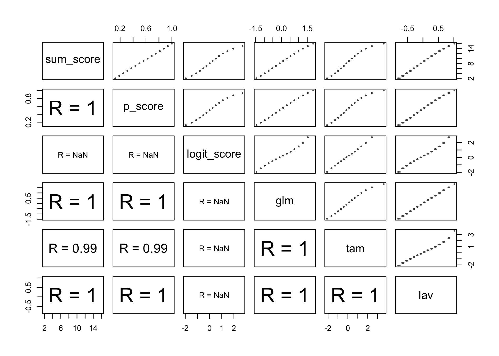<!-- -->

``` r
# -------------------------------------------------------
# correlation and scatter panel
# -------------------------------------------------------

number_ticks <- function(n) {function(limits) pretty(limits, n)}

library(ggplot2)
ggplot(data_scores, aes(x=sum_score, y=glm)) + 
geom_point() +
scale_y_continuous(breaks=number_ticks(5)) +
coord_cartesian(xlim = c(0, 16)) +
theme_classic() +
xlab('sum score') +
ylab('theta (glm)')
```

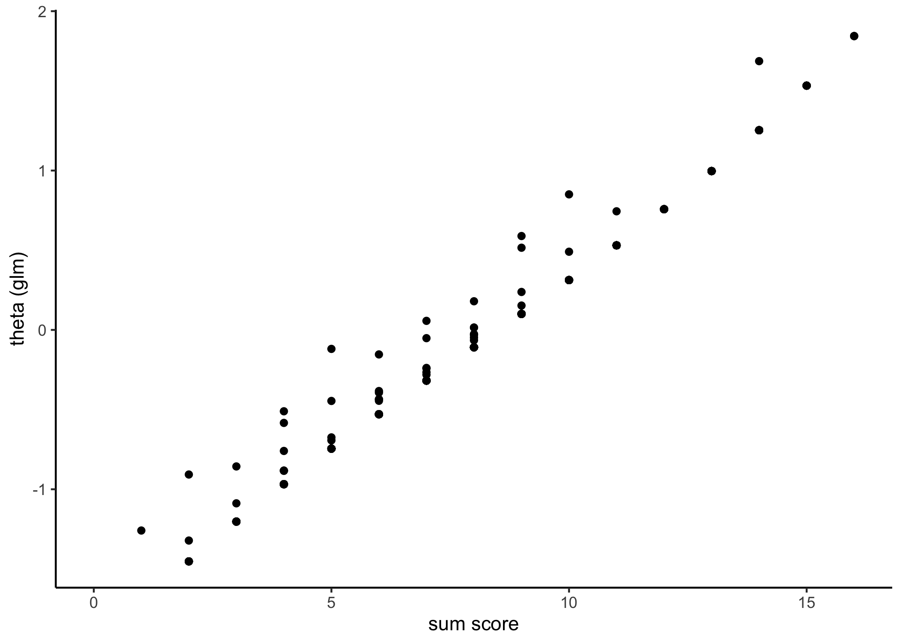<!-- -->

``` r
library(ggplot2)
ggplot(data_scores, aes(x=sum_score, y=tam)) + 
geom_point() +
scale_y_continuous(breaks=number_ticks(5)) +
coord_cartesian(xlim = c(0, 16)) +
theme_classic() +
xlab('sum score') +
ylab('theta (tam)')
```

<!-- -->

``` r
library(ggplot2)
ggplot(data_scores, aes(x=sum_score, y=lav)) + 
geom_point() +
scale_y_continuous(breaks=number_ticks(5)) +
coord_cartesian(xlim = c(0, 16)) +
theme_classic() +
xlab('sum score') +
ylab('theta (lavaan)')
```

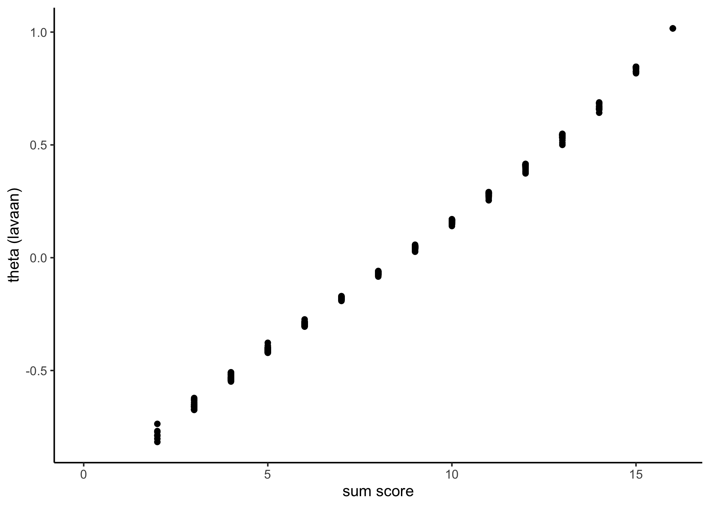<!-- -->

``` r
library(ggplot2)
ggplot(data_scores, aes(x=p_score, y=glm)) + 
geom_point() +
scale_y_continuous(breaks=number_ticks(5)) +
coord_cartesian(xlim = c(0, 1)) +
theme_classic() +
xlab('p score') +
ylab('theta (glm)')
```

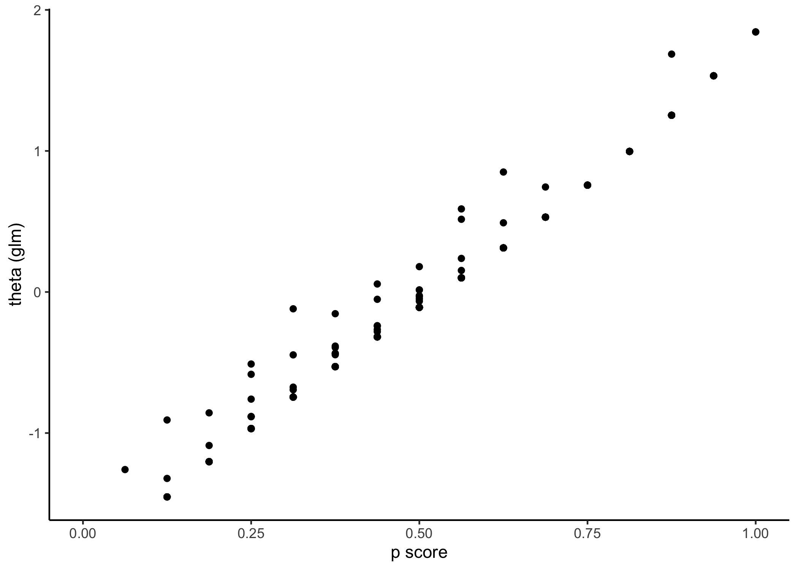<!-- -->

``` r
library(ggplot2)
ggplot(data_scores, aes(x=p_score, y=tam)) + 
geom_point() +
scale_y_continuous(breaks=number_ticks(5)) +
coord_cartesian(xlim = c(0, 1)) +
theme_classic() +
xlab('p score') +
ylab('theta (tam)')
```

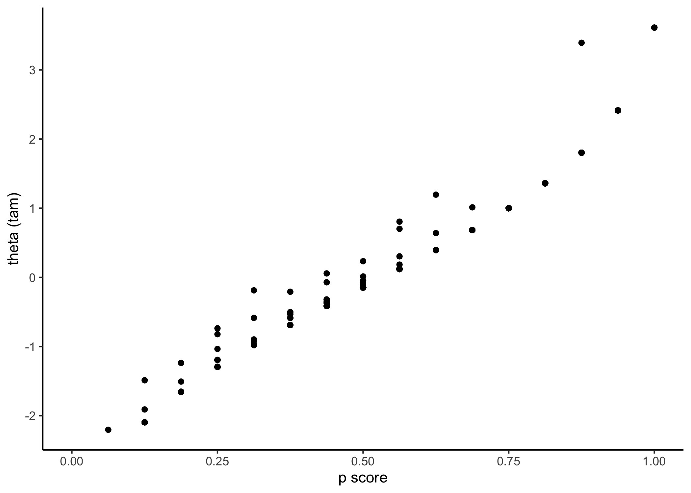<!-- -->

``` r
library(ggplot2)
ggplot(data_scores, aes(x=p_score, y=lav)) + 
geom_point() +
scale_y_continuous(breaks=number_ticks(5)) +
coord_cartesian(xlim = c(0, 1)) +
theme_classic() +
xlab('p score') +
ylab('theta (lavaan)')
```

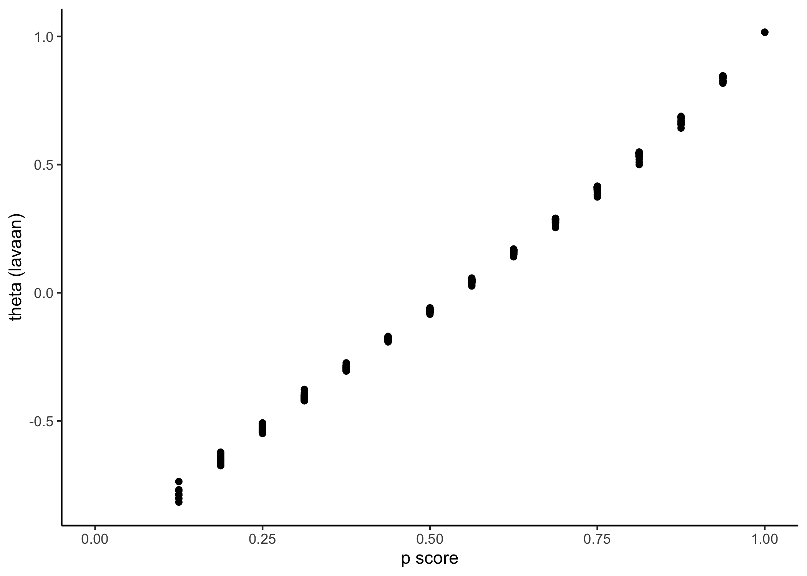<!-- -->

``` r
#--------------------------------------------------------------------
# fit rasch model
#--------------------------------------------------------------------

#------------------------------------------------
# p_score glm
#------------------------------------------------

specify_decimal <- function(x, k) format(round(x, k), nsmall=k)

# estimate correlation
cor <- with(data_scores, cor(glm, p_score, use = 'pairwise.complete.obs')) %>%
       specify_decimal(., 2) %>%
       stringr::str_replace_all(., '0.','.')

# define colours
light_colour <- '#3B6CA6'
bold_colour  <- '#21376D'

# draw plot
plot_1 <- ggplot(data_scores, aes(x = glm, y=p_score)) +
geom_point(alpha = 1/3, colour = light_colour) +
ylim(c(0,1)) +
xlim(c(-3,3)) +
theme(axis.text.y = element_text(size=6, colour = light_colour)) +
theme(axis.text.x = element_text(size=6, colour = light_colour)) +
theme(plot.title = element_text(hjust = 0.5)) +
theme(axis.ticks = element_blank())+
ylab('p score') +
xlab(expression('glm ' ~ hat(theta)[p])) +
theme(
panel.background = element_rect(fill = "white", colour = light_colour),
panel.grid.major.y = element_blank(),
panel.grid.minor.y = element_blank(),
panel.grid.major.x = element_blank(),
panel.grid.minor.x = element_blank(),
axis.title.y = element_text(colour = light_colour),
axis.title.x = element_text(colour = light_colour)
) + 
annotate('text', 
    x = -2, 
    y = .75,
    label = paste0('r = ', cor), 
    size = 7, 
    colour = light_colour)

#------------------------------------------------
# p_score glm
#------------------------------------------------

specify_decimal <- function(x, k) format(round(x, k), nsmall=k)

# estimate correlation
cor <- with(data_scores, cor(tam, p_score, use = 'pairwise.complete.obs')) %>%
       specify_decimal(., 2) %>%
       stringr::str_replace_all(., '0.','.')

# define colours
light_colour <- '#3B6CA6'
bold_colour  <- '#21376D'

# draw plot
plot_2 <- ggplot(data_scores, aes(x = tam, y=p_score)) +
geom_point(alpha = 1/3, colour = light_colour) +
ylim(c(0,1)) +
xlim(c(-3,3)) +
theme(axis.text.y = element_text(size=6, colour = light_colour)) +
theme(axis.text.x = element_text(size=6, colour = light_colour)) +
theme(plot.title = element_text(hjust = 0.5)) +
theme(axis.ticks = element_blank())+
ylab('p score') +
xlab(expression('tam ' ~ hat(theta)[p])) +
theme(
panel.background = element_rect(fill = "white", colour = light_colour),
panel.grid.major.y = element_blank(),
panel.grid.minor.y = element_blank(),
panel.grid.major.x = element_blank(),
panel.grid.minor.x = element_blank(),
axis.title.y = element_text(colour = light_colour),
axis.title.x = element_text(colour = light_colour)
) + 
annotate('text', 
    x = -2, 
    y = .75,
    label = paste0('r = ', cor), 
    size = 7, 
    colour = light_colour)


#------------------------------------------------
# p_score lav
#------------------------------------------------

specify_decimal <- function(x, k) format(round(x, k), nsmall=k)

# estimate correlation
cor <- with(data_scores, cor(lav, p_score, use = 'pairwise.complete.obs')) %>%
       specify_decimal(., 2)

# define colours
light_colour <- '#3B6CA6'
bold_colour  <- '#21376D'

# draw plot
plot_3 <- ggplot(data_scores, aes(x = lav, y=p_score)) +
geom_point(alpha = 1/3, colour = light_colour) +
ylim(c(0,1)) +
xlim(c(-3,3)) +
theme(axis.text.y = element_text(size=6, colour = light_colour)) +
theme(axis.text.x = element_text(size=6, colour = light_colour)) +
theme(plot.title = element_text(hjust = 0.5)) +
theme(axis.ticks = element_blank())+
ylab('p score') +
xlab(expression('lavaan ' ~ hat(theta)[p])) +
theme(
panel.background = element_rect(fill = "white", colour = light_colour),
panel.grid.major.y = element_blank(),
panel.grid.minor.y = element_blank(),
panel.grid.major.x = element_blank(),
panel.grid.minor.x = element_blank(),
axis.title.y = element_text(colour = light_colour),
axis.title.x = element_text(colour = light_colour)
) + 
annotate('text', 
    x = -2, 
    y = .75,
    label = paste0('r = ', cor), 
    size = 7, 
    colour = light_colour)


#------------------------------------------------
# display plot
#------------------------------------------------

plot_1 # glm vs sum score
```

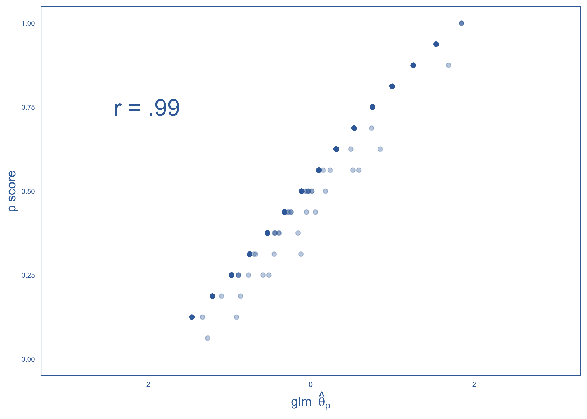<!-- -->

``` r
plot_2 # tam vs sum score
```

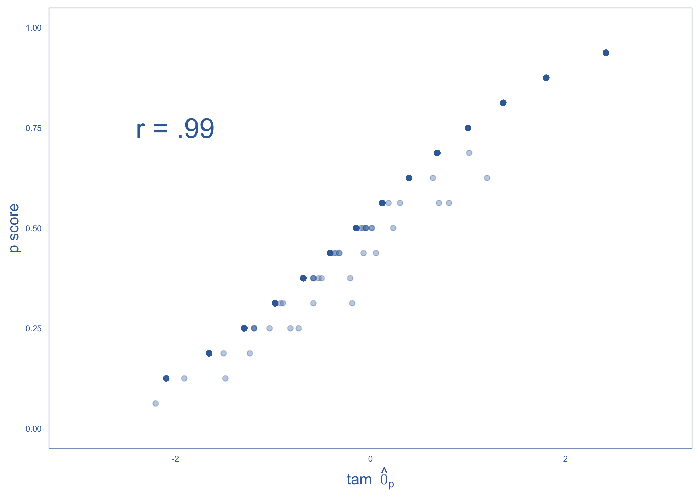<!-- -->

``` r
plot_3 # lav vs sum score
```

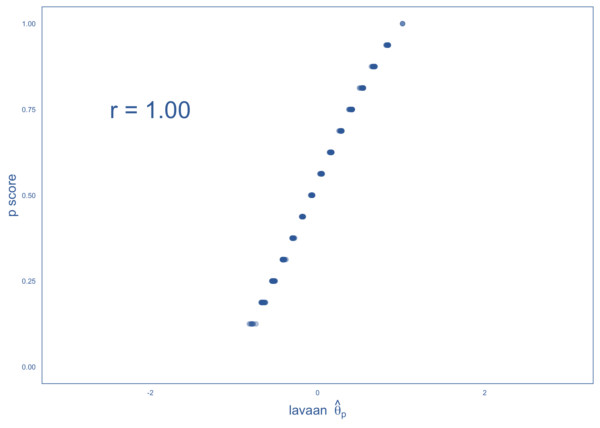<!-- -->

``` r
library(cowplot)
plot_grid(
  plot_1, 
  plot_2,
  plot_3,
  nrow = 1, ncol = 3)
```

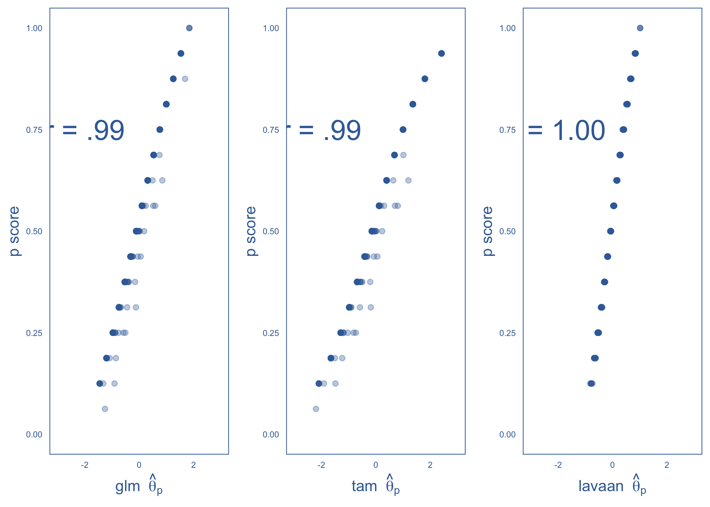<!-- -->

## Wright Map

``` r
#------------------------------------------------------------------------------
# import mplus estimates
#------------------------------------------------------------------------------

# ---------------------------------------- 
# extract delta parameters
# ---------------------------------------- 

delta_estimates <- tam_00 %>%
                   purrr::pluck('xsi') %>%
                   mutate(item = rownames(.)) %>%
                   rename(delta = xsi) %>%
                   rename(delta_se = se.xsi) %>%
                   mutate(e_se = delta/delta_se) %>%
                   dplyr::select(item, delta, delta_se, e_se)
                   


# ---------------------------------------- 
# display delta estimates
# ---------------------------------------- 

delta_estimates %>%
knitr::kable(., digits = 2)
```

|     | item | delta | delta_se |   e_se |
|:----|:-----|------:|---------:|-------:|
| d01 | d01  |  0.06 |     0.10 |   0.62 |
| d02 | d02  | -1.02 |     0.11 |  -9.67 |
| d03 | d03  | -1.38 |     0.11 | -12.26 |
| d04 | d04  | -1.18 |     0.11 | -10.88 |
| d05 | d05  | -0.24 |     0.10 |  -2.45 |
| d06 | d06  |  1.26 |     0.11 |  11.28 |
| d07 | d07  | -0.03 |     0.10 |  -0.35 |
| d08 | d08  | -0.41 |     0.10 |  -4.19 |
| d09 | d09  |  0.30 |     0.10 |   3.09 |
| d10 | d10  |  0.47 |     0.10 |   4.65 |
| d11 | d11  |  0.25 |     0.10 |   2.54 |
| d12 | d12  |  0.83 |     0.10 |   8.05 |
| d13 | d13  |  0.39 |     0.10 |   3.91 |
| d14 | d14  | -0.39 |     0.10 |  -3.90 |
| d15 | d15  | -0.89 |     0.10 |  -8.52 |
| d16 | d16  | -0.36 |     0.10 |  -3.62 |

``` r
# ----------------------------------------------- 
# item text
# ----------------------------------------------- 

item_table <- read.table(
text="
item item_text
d01  '[U] Organized Crime                        '
d02  '[U] Dealing With Opposition Groups         '
d03  '[U] Traffic Laws                           '
d04  '[U] Alcohol And Tobacco Sales To Minors    '
d05  '[U] Violence In Congress                   '
d06  '[U] Consequences Of La Dictorships         '
d07  '[U] Consititution Definition               '
d08  '[U] Equal Employment Opportunity           '
d09  '[U] Consequence Of La Voter Apathy         '
d10  '[U] Characteristic Of La Dictatorships     '
d11  '[U] Risk Situations For Democracy          '
d12  '[U] Democratic Leadership                  '
d13  '[U] Authoritarain Gov Charcteristic        '
d14  '[U] State Responsibility For Justice System'
d15  '[U] Indigenous Rights To Preserve Culture  '
d16  '[U] Voting As Democratic Process           '
",
header=TRUE, stringsAsFactors = FALSE)


item_table %>%
knitr::kable(., digits = 2)
```

| item | item_text                                     |
|:-----|:----------------------------------------------|
| d01  | \[U\] Organized Crime                         |
| d02  | \[U\] Dealing With Opposition Groups          |
| d03  | \[U\] Traffic Laws                            |
| d04  | \[U\] Alcohol And Tobacco Sales To Minors     |
| d05  | \[U\] Violence In Congress                    |
| d06  | \[U\] Consequences Of La Dictorships          |
| d07  | \[U\] Consititution Definition                |
| d08  | \[U\] Equal Employment Opportunity            |
| d09  | \[U\] Consequence Of La Voter Apathy          |
| d10  | \[U\] Characteristic Of La Dictatorships      |
| d11  | \[U\] Risk Situations For Democracy           |
| d12  | \[U\] Democratic Leadership                   |
| d13  | \[U\] Authoritarain Gov Charcteristic         |
| d14  | \[U\] State Responsibility For Justice System |
| d15  | \[U\] Indigenous Rights To Preserve Culture   |
| d16  | \[U\] Voting As Democratic Process            |

``` r
# ---------------------------------------- 
# display delta estimates
# ---------------------------------------- 

item_pos <- delta_estimates %>%
            arrange(desc(delta)) %>%
            mutate(x_pos = seq(1:nrow(.))) %>%            
            dplyr::select(item, x_pos) %>%
            dplyr::left_join(.,
            item_table, by = 'item')  %>%
            print
```

    ##    item x_pos                                   item_text
    ## 1   d06     1 [U] Consequences Of La Dictorships         
    ## 2   d12     2 [U] Democratic Leadership                  
    ## 3   d10     3 [U] Characteristic Of La Dictatorships     
    ## 4   d13     4 [U] Authoritarain Gov Charcteristic        
    ## 5   d09     5 [U] Consequence Of La Voter Apathy         
    ## 6   d11     6 [U] Risk Situations For Democracy          
    ## 7   d01     7 [U] Organized Crime                        
    ## 8   d07     8 [U] Consititution Definition               
    ## 9   d05     9 [U] Violence In Congress                   
    ## 10  d16    10 [U] Voting As Democratic Process           
    ## 11  d14    11 [U] State Responsibility For Justice System
    ## 12  d08    12 [U] Equal Employment Opportunity           
    ## 13  d15    13 [U] Indigenous Rights To Preserve Culture  
    ## 14  d02    14 [U] Dealing With Opposition Groups         
    ## 15  d04    15 [U] Alcohol And Tobacco Sales To Minors    
    ## 16  d03    16 [U] Traffic Laws

``` r
x_pos <- item_pos %>%
         dplyr::select(x_pos) %>%
         unique() %>%
         .$x_pos

item_text <- item_pos %>%
             dplyr::select(item_text) %>%
             .$item_text


# ---------------------------------------- 
# extract theta scores
# ---------------------------------------- 

theta_p <- tibble::as_tibble(TAM::tam.wle(tam_00)) %>%
           mutate(id_i = pid) %>%
           dplyr::select(id_i, theta) %>%
           dplyr::glimpse()
```

    ## Iteration in WLE/MLE estimation  1   | Maximal change  0.6312 
    ## Iteration in WLE/MLE estimation  2   | Maximal change  0.1772 
    ## Iteration in WLE/MLE estimation  3   | Maximal change  0.0058 
    ## Iteration in WLE/MLE estimation  4   | Maximal change  6e-04 
    ## Iteration in WLE/MLE estimation  5   | Maximal change  1e-04 
    ## ----
    ##  WLE Reliability= 0.68 
    ## Rows: 500
    ## Columns: 2
    ## $ id_i  <int> 1, 2, 3, 4, 5, 6, 7, 8, 9, 10, 11, 12, 13, 14, 15, 16, 17, 18, 1…
    ## $ theta <dbl> 2.41, -1.65, -0.41, -0.41, 0.12, -0.98, 1.36, 0.12, NA, 0.68, -0…

``` r
# -----------------------------------------------------------------------------
# make plot by parts
# -----------------------------------------------------------------------------


# ----------------------------------------------- 
# part 1
# ----------------------------------------------- 

library('ggpubr')
```

    ## 
    ## Attaching package: 'ggpubr'

    ## The following object is masked from 'package:cowplot':
    ## 
    ##     get_legend

``` r
p1 <- gghistogram(theta_p, 
      x = "theta", 
      fill = "grey90", 
      ggtheme = theme_bw()) + 
      xlim(-5, 5) +
      rremove('x.grid') +
      xlab('') + ylab(expression(theta[p]))

# ----------------------------------------------- 
# part 2
# ----------------------------------------------- 

scale_name <- 'Civic Knowledge (Latino american test, logit scores)'

library('ggpubr')
p2 <- ggdotchart(delta_estimates, x = "item", y = "delta",
   color = "black",
   rotate = TRUE,
   sorting = 'asc',
   ggtheme = theme_bw(),
   y.text.col = FALSE ) + 
   ylim(-5, 5) + 
   rremove('x.grid') +
   rremove('legend') +
   xlab(bquote(delta['1'] ~ "-" ~ delta['16'])) +
   ylab(scale_name) +
   geom_text(
    aes(
      label = as.character(item_text), 
      y = -5, 
      x = x_pos - .2),
    colour = "grey50",
    size = 3,
    hjust = 0
  )

# ----------------------------------------------- 
# plot both parts
# ----------------------------------------------- 


ggarrange(p1, p2, ncol = 1, nrow = 2, align = 'v', heights = c(1,2))
```

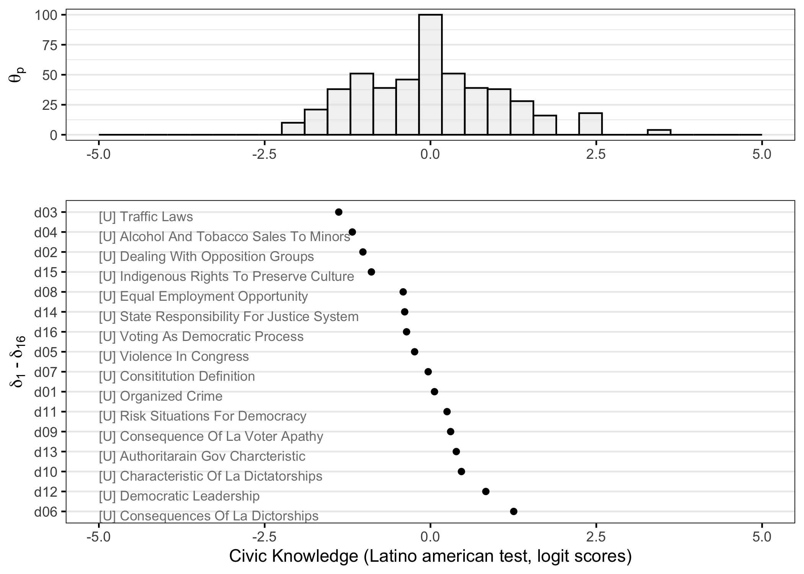<!-- -->

``` r
# ----------------------------------------------- 
# save plot
# ----------------------------------------------- 

ggsave('item_map_1.png',
     plot   = last_plot(), 
     width  = 16, 
     height = 16, 
     units  = "cm",
     dpi    = 800,
     scale  = 1.5)


# ----------------------------------------------- 
# save plot
# ----------------------------------------------- 

ggsave('item_map_2.png',
     plot   = last_plot(), 
     width  = 30, 
     height = 16, 
     units  = "cm",
     dpi    = 800,
     scale  = 1.5)
```
